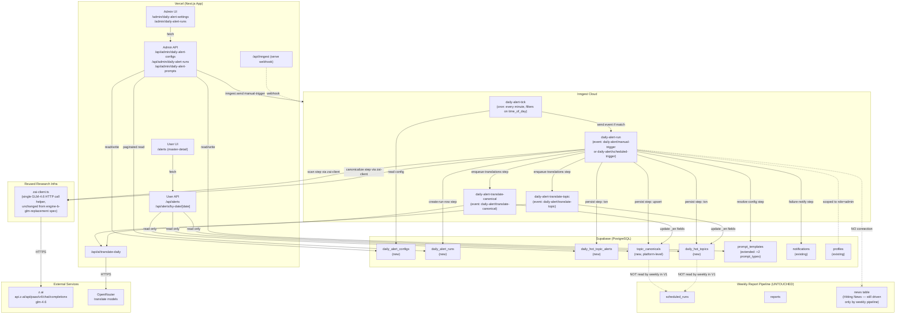
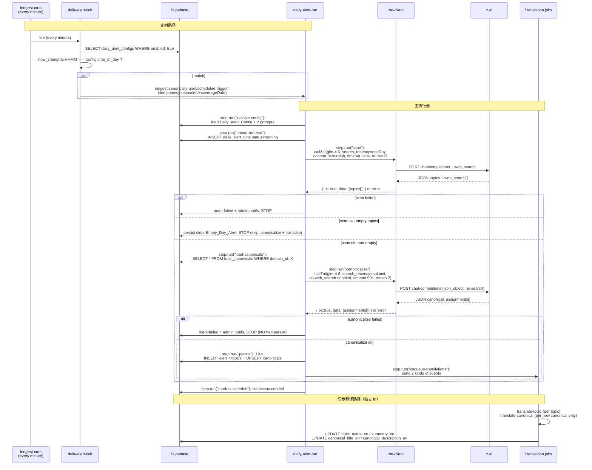
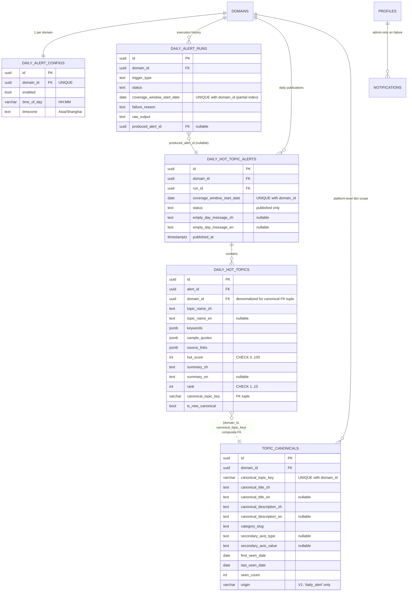

# 设计文档：每日热点话题预警 (Daily Hot-Topic Alert)

## 概述 (Overview)

本 feature 在雷达报告平台上新增一条**独立的、轻量的、自动发布的** 每日热点话题预警线，与现有的周 / 双周 Regular Radar Report **并行共存**。

三条设计主轴：

1. **完全独立于 Hitting News 与 `news` 表**。每日话题只写入新建的 `daily_hot_topic_alerts` / `daily_hot_topics` / `topic_canonicals` 三张表，**绝不**触碰 `news` 表、**绝不**给周报的 Hitting News pipeline 喂数据。`/alerts` 是唯一的用户可见承载面（Requirement 16.6 / 16.7 / PBT 16 / PBT 41）。
2. **平台级话题字典 `topic_canonicals`**。字典在 V1 只有一个 writer（daily pipeline），但表名无 `daily_` 前缀、带 `origin` 列且主键为 `(domain_id, canonical_topic_key)` 元组，为未来 weekly 集成 spec 做结构预留（Requirement 9.14 / 9.15）。`daily_hot_topics` 通过 `(domain_id, canonical_topic_key)` 组合外键引用字典行，**不用** `topic_canonical_id` 直连外键（PBT 44）。
3. **两阶段单引擎 pipeline**。Scan (GLM-4.6 `search_recency_filter='oneDay'`, `content_size='high'`) → Canonicalize (GLM-4.6 `search_recency_filter='noLimit'`, no web search needed) → Persist。两阶段在同一个 Inngest 函数的独立 `step.run` 中执行。**Canonicalization 失败整 run 中止，不半持久化**（Requirement 9.9 / PBT 15）。

**设计决策总结**：

1. **执行平台为 Inngest 函数**，不是 Vercel route handler —— 与 weekly pipeline 保持一致，规避 Vercel 10s / 60s serverless 执行上限。Scan step timeout 240s（Requirement 13.3），Canonicalize step timeout 90s（Requirement 13.4）。Principle 1 "time doesn't matter — user is offline" 在每日预警语义下稍微收紧：预警的时效价值按小时衰减，所以 auto-publish、无 draft gate（Requirement 6.2）；但 step-internal 重试与超时仍然宽松，失败比抢时间更昂贵。
2. **单引擎不做 cross-engine 合并**。Scan 结果直接通过 Zod 验证 → 直接进入 Canonicalization。没有双引擎融合、没有 synthesizer。理由：daily 预警的用途是"看一眼就知道今天哪些话题可能涨咨询"，不是取代周报的结构化叙事。单引擎 + 诚实的 confidence 信号（`hot_score` 直出）即可。
3. **Auto-publish on success**。daily 预警的时效价值不容忍 admin review gate；Canonicalization 也在同一个原子事务里完成，因此 `daily_hot_topic_alerts` 行在 INSERT 时 `status` 已经是 `'published'`（Requirement 6.1 / 6.2 / PBT 10）。
4. **Canonicalization 为独立第二 call**。不把分类指令塞进 Scan prompt，Principle 2 "prompt engineering is last resort" —— 字典检索 + 格式校验 + history contextualization 是完全独立的任务，它有自己的 Zod schema、自己的失败模式、自己的 prompt。比把所有东西塞进 scan prompt 更可靠。
5. **Canonical key 为字符串元组引用**。`daily_hot_topics.canonical_topic_key` 是一个 varchar 列；复合外键指向 `topic_canonicals(domain_id, canonical_topic_key)`。没有 `topic_canonical_id` uuid 直连 —— 这么做是为了让"canonical 行被 daily 首次创建，但语义上并不'属于'daily"的平台级语义落在 DB 结构里（Requirement 9.15 / PBT 44）。
6. **Bilingual 从第一天开始**。Daily_Hot_Topic 与 Topic_Canonical 同时持有 `_zh` / `_en` 字段对；中文是 source-of-truth，英文通过**两条独立的 async 翻译任务**回填（Principle 3）。Canonical-level 翻译只在**新建**canonical 时入队一次，复用时不再入队（Requirement 10.4 / 10.5）。
7. **Prompts 通过扩展 `prompt_templates` 存储**。复用迁移 011 的 CHECK-constraint-loosening 模式，加入两个新 `prompt_type` 值 `daily_scan_prompt` / `daily_canonicalization_prompt`，而不是新建一张小表。理由：RLS 策略已配好、admin UI 读写模式已有、表维护成本最小。
8. **`topic_canonicals.origin` 列为未来 weekly 集成预留**。V1 只写 `'daily_alert'`，CHECK 约束限制在 `{'daily_alert'}` 单值（PBT 43），**但列注释明确记录** `'weekly_report'` 为保留未来值。未来 spec 放开 CHECK 时不需要 schema 迁移（Requirement 9.14）。
9. **`/alerts` 为 client-side master-detail**。上半 7 行表（含 no-run 日）、下半可切换 detail pane、行点击**原地换渲染（不改路由）**（Requirement 8.2 / PBT 31）。选择 `'use client'` 是因为选中态是 UI 局部状态，没必要往 URL query param 上放（否则每次点击都要 router refresh，破坏 PBT 31 的"no route change"语义）。
10. **新 canonical 红徽标**，双位置渲染（Top-Topic Preview cell + Detail pane topic card），`is_new_canonical=true` 才出现，`false` 无徽标（Requirement 8.4 / 8.7 / PBT 32）。

## 架构 (Architecture)

### 高层组件图



**关键非连接（显式标注）**：

- `daily-alert-run` 函数的代码路径**不导入**、**不查询**、**不写入** `news` 表（Requirement 16.6 / PBT 16 / PBT 41）。
- `topic_canonicals` 表**在 V1 不被 weekly pipeline 读取**；表结构为 future spec 铺路（`origin` 列、列名无 `daily_` 前缀、PK 为 `(domain_id, canonical_topic_key)` 元组）但任何生产代码路径都没有 weekly → canonicals 的引用。

### 触发流程 (Sequence)



## 组件与接口 (Components and Interfaces)

### 1. Research 层：复用 `zai-client.ts`（零新增）

Daily Scan 与 Canonicalize 两步都调用已有的 `callZai()` helper（来自 `engine-b-glm-replacement` spec）。**不新建 engine 目录**、**不新建 loop 文件**。

调用配置差异：

| 调用 | `model` | `jsonMode` | web_search tool | `searchRecency` | `contentSize` | `timeoutMs` |
|---|---|---|---|---|---|---|
| Scan | `'glm-4.6'` | `true` | enabled (tools 注入) | `'oneDay'` | `'high'` | 240_000 |
| Canonicalize | `'glm-4.6'` | `true` | **disabled**（不传 tools 字段） | `'noLimit'`（即使传也无效，web_search 关闭） | n/a | 90_000 |

**重要**：Canonicalize 不需要 web search，也不应该 web search（Principle 2：字典检索是纯推理任务，加 search 只会引入不相关噪声）。这意味着 `callZai()` 需要支持一个 `enableWebSearch: boolean` 开关，否则它会永远注入 tools。**审查结果**：现有 `callZai()` 没有这个开关（来自 engine-b spec 的实现是 tools 总开启）—— 因此 Tasks 阶段将做一个最小扩展：给 `ZaiCallParams` 加一个 `enableWebSearch?: boolean`（default `true`，保持向后兼容），`false` 时省略 `tools` 字段。这是一个 ≤ 20 行的非破坏性改动，不影响 Engine B 调用方。

### 2. Inngest 函数层

**位置**：`src/lib/inngest/functions/`（与 weekly pipeline 同目录）

```
src/lib/inngest/functions/
├── generate-report.ts             # weekly (unchanged)
├── schedule-tick.ts               # weekly tick (unchanged)
├── determine-status.ts            # weekly (unchanged)
├── index.ts                       # exports functions array — ADD 4 new functions
├── daily-alert-tick.ts            # NEW — minute-granularity cron, fires event on match
├── daily-alert-run.ts             # NEW — main orchestrator
├── daily-alert-translate-topic.ts # NEW — per-topic async translation
└── daily-alert-translate-canonical.ts  # NEW — per-canonical async translation
```

#### `daily-alert-tick.ts`

```typescript
export const dailyAlertTick = inngest.createFunction(
  { id: 'daily-alert-tick', retries: 0 },
  { cron: 'TZ=Asia/Shanghai * * * * *' },  // every minute, Shanghai TZ
  async ({ step }) => {
    const configs = await step.run('fetch-enabled-daily-configs', async () =>
      fetchEnabledDailyConfigs() // SELECT * FROM daily_alert_configs WHERE enabled=true
    );

    const nowShanghai = toShanghai(new Date()); // { weekday, HHMM, YYYY-MM-DD }
    for (const config of configs) {
      if (config.time_of_day === nowShanghai.HHMM) {
        const coverageDate = computeCoverageDate(nowShanghai); // today - 1 day in Shanghai
        await step.sendEvent('enqueue-scheduled-run', {
          name: 'daily-alert/scheduled-trigger',
          data: {
            domainId: config.domain_id,
            triggerType: 'scheduled',
            coverageWindowStartDate: coverageDate, // 'YYYY-MM-DD'
            coverageWindowStartIso: `${coverageDate}T00:00:00+08:00`,
            coverageWindowEndIso:   `${coverageDate}T23:59:59+08:00`,
          },
        });
      }
    }
  }
);
```

**为什么用 tick + event，不用固定 cron**：`time_of_day` 是 admin 可编辑的，不能硬编码 cron 表达式。minute-granularity tick + `shouldFire` 判定与 weekly 的 `schedule-tick.ts` 完全同构（已验证在免费层额度内）。

#### `daily-alert-run.ts` (核心)

```typescript
export const dailyAlertRun = inngest.createFunction(
  {
    id: 'daily-alert-run',
    retries: 0, // retries are per-step
    idempotency: 'event.data.domainId + "-" + event.data.coverageWindowStartDate',
    concurrency: { limit: 3 },
  },
  [
    { event: 'daily-alert/scheduled-trigger' },
    { event: 'daily-alert/manual-trigger' },
  ],
  async ({ event, step }) => {
    const { domainId, triggerType, coverageWindowStartDate,
            coverageWindowStartIso, coverageWindowEndIso } = event.data;

    // Step 1: env-var fail-fast
    const zaiApiKey = process.env.ZAI_API_KEY ?? '';
    if (!zaiApiKey) {
      const runId = await step.run('create-run-row-missing-key', () =>
        insertDailyAlertRun({ domainId, triggerType, coverageWindowStartDate,
          coverageWindowStartIso, coverageWindowEndIso, status: 'failed',
          failure_reason: 'ZAI_API_KEY missing' })
      );
      await step.run('notify-admins-missing-key', () =>
        notifyAdminsOfFailure(runId, 'ZAI_API_KEY missing'));
      return;
    }

    // Step 2: resolve config + 2 prompts
    const { domainName, scanPrompt, canonPrompt } = await step.run(
      'resolve-config',
      () => fetchDomainAndDailyPrompts(domainId)
    );

    // Step 3: create-run-row (DB unique constraint guards double insert)
    const runId = await step.run('create-run-row', () =>
      insertDailyAlertRun({
        domainId, triggerType,
        coverageWindowStartDate, coverageWindowStartIso, coverageWindowEndIso,
        status: 'running',
      })
    );

    // Step 4: SCAN (step timeout 240s, retries 2 inside callZai)
    const scanResult = await step.run(
      'scan',
      { timeout: '5m', retries: 0 }, // callZai handles its own retries
      async () => runDailyScan({ scanPrompt, domainName, coverageWindowStartIso,
        coverageWindowEndIso, zaiApiKey, runId })
    );

    if (!scanResult.ok) {
      await finalizeRunAsFailed(step, runId, scanResult.failureReason, scanResult.rawOutput);
      return;
    }

    // Empty-day path — skip canonicalize, skip translate, still publish alert
    if (scanResult.topics.length === 0) {
      await step.run('persist-empty-day', () =>
        persistEmptyDayAlert({ runId, domainId, coverageWindowStartDate }));
      await step.run('mark-succeeded-empty', () =>
        markDailyAlertRunSucceeded(runId, /*topicCount=*/0, /*newCanonicalCount=*/0));
      return;
    }

    // Step 5: load existing canonicals (for canonicalize prompt payload)
    const existingCanonicals = await step.run('load-canonicals', () =>
      loadAllTopicCanonicalsForDomain(domainId)
    );

    // Step 6: CANONICALIZE (timeout 90s, retries 2 inside callZai)
    const canonResult = await step.run(
      'canonicalize',
      { timeout: '3m', retries: 0 },
      async () => runDailyCanonicalize({ canonPrompt, scannedTopics: scanResult.topics,
        existingCanonicals, domainName, zaiApiKey, runId })
    );

    if (!canonResult.ok) {
      // Per Req 9.9: aborting entire run, NO half-persist
      await finalizeRunAsFailed(step, runId, canonResult.failureReason, canonResult.rawOutput);
      return;
    }

    // Step 7: PERSIST (single DB transaction)
    const { alertId, newCanonicalKeys, topicIds } = await step.run('persist', () =>
      persistDailyAlertTransaction({
        runId, domainId, coverageWindowStartDate,
        scannedTopics: scanResult.topics,
        canonicalAssignments: canonResult.assignments,
        existingCanonicalKeys: new Set(existingCanonicals.map(c => c.canonical_topic_key)),
      })
    );

    // Step 8: enqueue translations (2 kinds — one event per topic, one event per new canonical)
    await step.run('enqueue-translations', async () => {
      for (const topicId of topicIds) {
        await inngest.send({
          name: 'daily-alert/translate-topic',
          data: { topicId, domainId },
        });
      }
      for (const key of newCanonicalKeys) {
        await inngest.send({
          name: 'daily-alert/translate-canonical',
          data: { domainId, canonicalTopicKey: key },
        });
      }
    });

    // Step 9: mark succeeded
    await step.run('mark-succeeded', () =>
      markDailyAlertRunSucceeded(runId,
        /*topicCount=*/scanResult.topics.length,
        /*newCanonicalCount=*/newCanonicalKeys.length)
    );
  }
);
```

**Step 总览（per run）**：

| Step | 作用 | Timeout | Retries | Notes |
|---|---|---|---|---|
| `create-run-row-missing-key` | env var fail-fast 时创建失败 run 行 | default | default | 仅 `ZAI_API_KEY missing` 路径 |
| `notify-admins-missing-key` | env var 失败时通知 | default | default | 同上 |
| `resolve-config` | 读取 domain + 2 prompts | default | default | |
| `create-run-row` | 插入 daily_alert_runs status=running | default | default | DB unique 约束双保险 |
| `scan` | Scan GLM-4.6 call | `'5m'` | 0（callZai 内部重试） | Req 13.3: ≥ 240s |
| `persist-empty-day` | empty-day 直接发布 | default | default | skip canonicalize + translate |
| `load-canonicals` | SELECT topic_canonicals WHERE domain_id=X | default | default | 若字典 ≥ 500 行仍全量加载，Req 9.13 |
| `canonicalize` | Canon GLM-4.6 call | `'3m'` | 0 | Req 13.4: ≥ 90s |
| `persist` | 单 TXN 写 alert + topics + upsert canonicals | default | default | 失败 → 整 run fail, no half-persist |
| `enqueue-translations` | 发送 topic-level + new-canonical translate events | default | default | |
| `mark-succeeded` / `mark-failed` | 更新 run 状态 | default | default | |

**幂等 key**：`{domainId}-{coverageWindowStartDate}`（Requirement 2.4 / 2.6 / PBT 2）。与 weekly 的 `{domainId}-{coverage_window_start}` 同构，但 coverage 的粒度是**日期字符串**而非 ISO timestamp，使"同一日当天被再次触发"在 Inngest 层直接去重。

**幂等 DB 层**：`daily_alert_runs` 有 partial unique index on `(domain_id, coverage_window_start_date) WHERE status IN ('queued','running','succeeded')`，等同 weekly 的设计。Retry 创建新行，原 failed 行保留。

#### `daily-alert-translate-topic.ts`

```typescript
export const dailyAlertTranslateTopic = inngest.createFunction(
  { id: 'daily-alert-translate-topic', retries: 3 },
  { event: 'daily-alert/translate-topic' },
  async ({ event, step }) => {
    const { topicId } = event.data;
    const topic = await step.run('fetch-topic', () => fetchDailyHotTopic(topicId));
    if (!topic || topic.topic_name_en !== null) return; // already translated or deleted

    const translated = await step.run('translate', () =>
      translatePair(topic.topic_name_zh, topic.summary_zh, 'en'));

    await step.run('write-back', () =>
      updateDailyHotTopicEn(topicId, translated.topic_name_en, translated.summary_en));
  }
);
```

#### `daily-alert-translate-canonical.ts`

```typescript
export const dailyAlertTranslateCanonical = inngest.createFunction(
  { id: 'daily-alert-translate-canonical', retries: 3 },
  { event: 'daily-alert/translate-canonical' },
  async ({ event, step }) => {
    const { domainId, canonicalTopicKey } = event.data;
    const canon = await step.run('fetch-canonical', () =>
      fetchTopicCanonical(domainId, canonicalTopicKey));
    if (!canon || canon.canonical_title_en !== null) return; // already translated

    const translated = await step.run('translate', () =>
      translatePair(canon.canonical_title_zh, canon.canonical_description_zh, 'en'));

    await step.run('write-back', () =>
      updateTopicCanonicalEn(domainId, canonicalTopicKey,
        translated.title_en, translated.description_en));
  }
);
```

### 3. Scan & Canonicalize helper 模块

**位置**：`src/lib/daily-alert/`（新目录，不污染 `research-engine/` 周报 loop）

```
src/lib/daily-alert/
├── index.ts                 # re-exports
├── types.ts                 # DailyAlertConfig, DailyAlertRun, DailyHotTopic, TopicCanonical, ... 纯 TS 类型
├── zod-schemas.ts           # ScanResponseSchema, CanonicalizeResponseSchema
├── coverage-window.ts       # computeCoverageDate, toShanghai helpers
├── substitute.ts            # placeholder substitution for daily prompts (whitelist)
├── scan.ts                  # runDailyScan({ scanPrompt, ... }) → { ok, topics[] | failureReason }
├── canonicalize.ts          # runDailyCanonicalize({ canonPrompt, scannedTopics, existingCanonicals, ... })
├── persist.ts               # persistDailyAlertTransaction(...) — single Supabase TXN
├── novelty.ts               # computeIsNewCanonical(assignment, existingKeys)
└── __tests__/
    ├── canonicalization.pbt.test.ts
    ├── coverage-window.pbt.test.ts
    ├── novelty-flag.pbt.test.ts
    ├── failure-modes.pbt.test.ts
    ├── empty-day.pbt.test.ts
    └── schemas.pbt.test.ts
```

**为什么不放在 `research-engine/` 下**：`research-engine/` 有"不准 import Supabase / Inngest / DB business modules"的严格隔离（PBT 13 from weekly spec）。daily-alert 的 helper 模块会：
- `scan.ts` 调 `zai-client.ts`（OK，research-engine 内部）
- `persist.ts` 调 Supabase service client（**不 OK** in research-engine）
- `canonicalize.ts` 调 `zai-client.ts` + 构造 prompt（混合）

把混合层放 `src/lib/daily-alert/` 保持 `research-engine/` 的纯净性。

### 4. `scan.ts` 接口

```typescript
export interface DailyScanInput {
  scanPrompt: string;              // from prompt_templates after placeholder substitution
  domainName: string;
  coverageWindowStartIso: string;
  coverageWindowEndIso: string;
  zaiApiKey: string;
  runId: string;                   // for errorContext breadcrumb
}

export interface DailyScanTopic {
  topic_name_zh: string;
  keywords: string[];              // 1–5
  sample_quotes: { text: string; source_label: string }[]; // 2–3
  source_links: { title: string; url: string; source_label: string; published_date: string | null }[]; // 3–10
  hot_score: number;               // 0–100 integer
  summary_zh: string;              // 80–200 chars
  rank: number;                    // 1–10, populated by engine
}

export type DailyScanResult =
  | { ok: true; topics: DailyScanTopic[]; rawContent: string; searchCount: number }
  | { ok: false; failureReason: string; rawOutput: string /* truncated 500 chars */ };

export async function runDailyScan(input: DailyScanInput): Promise<DailyScanResult>;
```

内部流程：
1. `substitutePromptVars(input.scanPrompt, { coverage_window_start, coverage_window_end, domain_name })` → string
2. `callZai({ model: 'glm-4.6', messages: [{role:'user', content: resolvedPrompt}], apiKey, timeoutMs: 240_000, jsonMode: true, searchRecency: 'oneDay', contentSize: 'high', enableWebSearch: true, errorContext: { engine: 'kimi' /* reused */, stage: 'daily-scan' } })` — 注：`errorContext.engine` 是现有 zai-client 的枚举，daily 借用 `'kimi'` 语义（不影响语义，只是 breadcrumb tag）；Tasks 阶段决定是否扩枚举（见 §K 开放项）。
3. 校验 `.ok=true` → `ScanResponseSchema.safeParse(data)` → Zod 校验（Req 4.3：schema 是权威，不是 prompt）
4. Per-topic validation：rank 范围、hot_score 范围、source_links 长度 ≥ 3（清洗后）；违规 topic 剔除并记入 debug 输出（Req 5.3 / 5.4 / PBT 5 / PBT 8）
5. 按 `hot_score` 降序，取 top 10（Req 4.5 / PBT 6）；为幸存 topic 重排 rank 为 1..N
6. 返回 `{ ok: true, topics: [...] }` 或映射错误类到 failure_reason：
   - `CreditsExhausted` → `'z.ai credits exhausted'`
   - `TimeoutError` → `'GLM timeout'`
   - `NetworkError` → `'GLM network error'`
   - `ServerError` → `'Daily scan: GLM 5xx'`
   - `MalformedResponse` → `'Daily alert: MalformedResponse'`（Req 4.10 / PBT 13）

### 5. `canonicalize.ts` 接口

```typescript
export interface DailyCanonicalizeInput {
  canonPrompt: string;
  scannedTopics: DailyScanTopic[];
  existingCanonicals: TopicCanonicalRow[]; // full list for this domain
  domainName: string;
  zaiApiKey: string;
  runId: string;
}

export interface CanonicalAssignment {
  scanned_topic_index: number;     // 0-based index into scannedTopics
  canonical_topic_key: string;     // matches regex ^[a-z0-9-]+(::[A-Za-z0-9-]+)?$
  is_new_canonical: boolean;
  // Populated only when is_new_canonical=true:
  canonical_title_zh?: string;     // ≤ 30 chars
  canonical_description_zh?: string; // 60–160 chars
  category_slug: string;
  secondary_axis_type: 'site' | 'category' | null;
  secondary_axis_value: string | null;
}

export type DailyCanonicalizeResult =
  | { ok: true; assignments: CanonicalAssignment[]; rawContent: string }
  | { ok: false; failureReason: string; rawOutput: string };

export async function runDailyCanonicalize(input: DailyCanonicalizeInput): Promise<DailyCanonicalizeResult>;
```

**关键点**：
- 严格 1 次 GLM call per run（Req 9.1）
- `enableWebSearch: false`（字典检索是纯推理）
- JSON schema 包含 `{ assignments: CanonicalAssignment[] }`
- **Key 规范化**：对每个 `canonical_topic_key` 先尝试 `normalizeKey(key)` —— trim + lowercase primary segment；若归一化后仍不匹配正则 `^[a-z0-9-]+(::[A-Za-z0-9-]+)?$`，整个 run fail with `'Canonicalization: malformed key'`（Req 9.10 / PBT 19）
- 失败映射全部进 `'Canonicalization failed'` 前缀 failure_reason（Req 9.9 / PBT 15）

### 6. `persist.ts` 接口

```typescript
export interface PersistInput {
  runId: string;
  domainId: string;
  coverageWindowStartDate: string; // 'YYYY-MM-DD' Asia/Shanghai
  scannedTopics: DailyScanTopic[];
  canonicalAssignments: CanonicalAssignment[];
  existingCanonicalKeys: Set<string>;
}

export interface PersistOutput {
  alertId: string;
  topicIds: string[];             // for translate-topic fan-out
  newCanonicalKeys: string[];     // for translate-canonical fan-out
}

export async function persistDailyAlertTransaction(input: PersistInput): Promise<PersistOutput>;
```

内部实现：单一 Supabase RPC 函数 `persist_daily_alert`（SQL function，见 §B 迁移）。在一个 DB transaction 中：
1. INSERT `daily_hot_topic_alerts` (status='published', published_at=now())
2. For each new canonical (`is_new_canonical=true`): INSERT `topic_canonicals` ON CONFLICT DO NOTHING — 防止并发 run 重复插入
3. For each existing canonical referenced by this run: UPDATE `topic_canonicals` SET `last_seen_date=coverageDate`, `seen_count = seen_count + count_in_this_run`（Req 9.6 / 9.7）
4. INSERT N rows into `daily_hot_topics` with `canonical_topic_key` + `is_new_canonical`
5. 返回 `alertId`、`topicIds[]`、`newCanonicalKeys[]`

如果任一 INSERT 失败 → RPC 整体 rollback → Inngest step 抛错 → 函数进入 `finalizeRunAsFailed('Persistence failed')`（Req 6.4）。

### 7. `/alerts` 页面组件树

**`AlertsPage` (client)**：因为主-从选择态是 UI 局部状态，且 Req 8.2 / PBT 31 要求行点击"no route change"，`'use client'` 自然。

```
AlertsPage (client component)
├── useState: selectedDate (string, 'YYYY-MM-DD')
├── useSWR: /api/alerts?window_end_date=today → { overview: [{date, topic_count, top_topic_preview, status, preview_topic_novelty[]}, ...] }
├── SevenDayOverviewTable
│   ├── rows: overview[].map(o => <OverviewRow selected={o.date===selectedDate} onClick={() => setSelectedDate(o.date)} ... />)
│   └── Top-Topic Preview cell: <TopicPreviewList topics={o.top_topic_preview} novelty={o.preview_topic_novelty} />
│       └── each topic: {topic_name}{is_new ? <NoveltyBadge/> : null}
├── PageControls
│   └── "View older days" button → shifts window_end_date -7 days, updates both table and selectedDate=newest-row-of-new-window
└── DayDetailPane (keyed on selectedDate so it remounts on switch)
    ├── useSWR: /api/alerts/by-date/{selectedDate} → Daily_Hot_Topic_Alert | null
    ├── empty-day branch: render empty_day_message (i18n fallback)
    ├── no-run branch: render "No daily hot-topic alert was generated for this day."
    └── topics branch:
        └── topics.map(t => <TopicCard
                              topic={t}
                              canonical={t.canonical}       // joined on server side
                              showRetranslateActions={isAdmin} />)
            ├── rank + topic_name(+ NoveltyBadge if t.is_new_canonical)
            ├── CanonicalClassLine (label: "类别" / "Class" + canonical_title + canonical_description)
            ├── hot_score chip
            ├── keywords (inline)
            ├── summary (zh or en with fallback)
            ├── sample_quotes.map(<SampleQuote text source_label />) — no URL
            └── source_links.map(<SourceLink title url source_label />)
```

**数据获取策略**：SWR。repo 现有页面（`/reports/page.tsx`、`/news/page.tsx` 等）使用的是直接 `supabase` SDK fetch + useState，但 daily-alert 的 master-detail 在用户切换行时需要频繁 refetch 单日 detail —— SWR 的 cache + key-based revalidation 更合适。选择理由：ROI 高于保持一致性（当前页面都是单一数据源，daily-alert 是双数据源 overview+detail，SWR 原生处理这种场景）。Tasks 阶段会在 `package.json` 确认 `swr` 是否已依赖（高概率已依赖，因为 Next.js 模板推荐）；若缺则添加。

**Bilingual fallback 逻辑**（Req 8.11 / PBT 34 / PBT 35）：

```typescript
// src/lib/daily-alert/i18n-fallback.ts
export function resolveText(
  zh: string | null | undefined,
  en: string | null | undefined,
  lang: 'zh' | 'en'
): { text: string; needsFallbackIndicator: boolean } {
  if (lang === 'zh') return { text: zh ?? '', needsFallbackIndicator: false };
  if (en && en.trim().length > 0) return { text: en, needsFallbackIndicator: false };
  return { text: zh ?? '', needsFallbackIndicator: true };
}
```

Component wraps：

```tsx
const { text, needsFallbackIndicator } = resolveText(topic.topic_name_zh, topic.topic_name_en, i18n.language);
return <>{text}{needsFallbackIndicator && <span className="text-xs text-gray-500 ml-2">(Chinese original)</span>}</>;
```

**Keyboard navigation**：P2 polish，不在 V1 实现清单中。

### 8. `/admin/daily-alert-runs` 页面

```
/admin/daily-alert-runs
├── Server wrapper: server component that checks admin role, 403 if not
├── DailyAlertRunsTable (client)
│   ├── Columns: Run ID (short), Triggered At (Shanghai), Trigger Type,
│   │             Status, Coverage Date, Topic Count, New-Canonical Count,
│   │             Alert Link (if succeeded), Failure Reason, Actions
│   ├── Pagination: 20 rows / page
│   └── Row actions: "Retry" (for failed only), "View Raw Output" (modal)
└── RetryConfirmModal / RawOutputModal
```

### 9. `/admin/daily-alert-settings` 页面

```
/admin/daily-alert-settings
├── Cadence section
│   ├── Domain: Account Health (V1 fixed)
│   ├── [✓] Enabled
│   ├── Time of Day: [HH:MM picker] (Asia/Shanghai)
│   ├── [ Save ]
│   └── "Trigger Now" button → confirm modal → POST manual-trigger
│
├── Prompts section
│   ├── daily_scan_prompt
│   │   ├── Large textarea, monospace
│   │   ├── Required placeholders: {coverage_window_start} {coverage_window_end}
│   │   ├── Optional: {domain_name}
│   │   ├── [ Reset to default ]
│   │   └── [ Save ]
│   └── daily_canonicalization_prompt
│       ├── Large textarea, monospace
│       ├── Required placeholders: {scanned_topics_json} {existing_canonicals_json}
│       ├── Optional: {domain_name}
│       ├── [ Reset to default ]
│       └── [ Save ]
```

## 数据模型 (Data Models)

### ER 扩展



### 新增表 DDL

#### 1. `daily_alert_configs`

```sql
CREATE TABLE daily_alert_configs (
  id UUID PRIMARY KEY DEFAULT gen_random_uuid(),
  domain_id UUID NOT NULL UNIQUE REFERENCES domains(id) ON DELETE CASCADE,
  enabled BOOLEAN NOT NULL DEFAULT false,
  time_of_day VARCHAR(5) NOT NULL DEFAULT '06:00'
    CHECK (time_of_day ~ '^(0[0-9]|1[0-9]|2[0-3]):[0-5][0-9]$'),
  timezone TEXT NOT NULL DEFAULT 'Asia/Shanghai'
    CHECK (timezone = 'Asia/Shanghai'),  -- V1 pin
  created_at TIMESTAMPTZ NOT NULL DEFAULT now(),
  updated_at TIMESTAMPTZ NOT NULL DEFAULT now()
);

COMMENT ON TABLE daily_alert_configs IS
  'Daily hot-topic alert schedule configuration. Separate from schedule_configs '
  'so daily + weekly schedules coexist per domain (Requirement 16.1).';
COMMENT ON COLUMN daily_alert_configs.timezone IS
  'V1 pinned to Asia/Shanghai. Widen if multi-region support becomes needed.';
```

#### 2. `daily_alert_runs`

```sql
CREATE TABLE daily_alert_runs (
  id UUID PRIMARY KEY DEFAULT gen_random_uuid(),
  domain_id UUID NOT NULL REFERENCES domains(id) ON DELETE CASCADE,
  trigger_type TEXT NOT NULL
    CHECK (trigger_type IN ('scheduled', 'manual')),
  status TEXT NOT NULL DEFAULT 'queued'
    CHECK (status IN ('queued', 'running', 'succeeded', 'failed')),
  coverage_window_start_date DATE NOT NULL,
  coverage_window_start TIMESTAMPTZ NOT NULL,
  coverage_window_end TIMESTAMPTZ NOT NULL,
  produced_alert_id UUID REFERENCES daily_hot_topic_alerts(id) ON DELETE SET NULL,
  topic_count INTEGER,                      -- populated on succeeded (may be 0 for empty-day)
  new_canonical_count INTEGER,              -- populated on succeeded
  failure_reason TEXT,
  raw_output TEXT,                          -- truncated to 500 chars for failures
  triggered_at TIMESTAMPTZ NOT NULL DEFAULT now(),
  completed_at TIMESTAMPTZ
);

-- Idempotency: at most 1 queued/running/succeeded run per (domain, date).
-- Retries insert a new row; original failed row preserved for audit.
CREATE UNIQUE INDEX idx_daily_alert_runs_idempotency
  ON daily_alert_runs (domain_id, coverage_window_start_date)
  WHERE status IN ('queued', 'running', 'succeeded');

CREATE INDEX idx_daily_alert_runs_domain_triggered
  ON daily_alert_runs (domain_id, triggered_at DESC);

CREATE INDEX idx_daily_alert_runs_status
  ON daily_alert_runs (status);

COMMENT ON TABLE daily_alert_runs IS
  'Execution history of the daily-alert pipeline. Independent from scheduled_runs '
  '(weekly report table). One run per (domain, coverage_window_start_date), '
  'subject to partial unique index.';
COMMENT ON COLUMN daily_alert_runs.coverage_window_start_date IS
  'The previous Asia/Shanghai calendar day (YYYY-MM-DD). The dedup key.';
COMMENT ON COLUMN daily_alert_runs.raw_output IS
  'Truncated to ~500 chars on failure; retained indefinitely for the 10 most '
  'recent failures, may be shortened for older rows (Requirement 7.5).';
```

#### 3. `daily_hot_topic_alerts`

```sql
CREATE TABLE daily_hot_topic_alerts (
  id UUID PRIMARY KEY DEFAULT gen_random_uuid(),
  domain_id UUID NOT NULL REFERENCES domains(id) ON DELETE CASCADE,
  run_id UUID NOT NULL REFERENCES daily_alert_runs(id) ON DELETE CASCADE,
  coverage_window_start_date DATE NOT NULL,
  status TEXT NOT NULL DEFAULT 'published'
    CHECK (status = 'published'),              -- Requirement 6.2: no draft, ever
  empty_day_message_zh TEXT,
  empty_day_message_en TEXT,
  published_at TIMESTAMPTZ NOT NULL DEFAULT now(),
  created_at TIMESTAMPTZ NOT NULL DEFAULT now(),
  UNIQUE (domain_id, coverage_window_start_date)  -- Requirement 2.6 + PBT 2
);

CREATE INDEX idx_daily_hot_topic_alerts_domain_date
  ON daily_hot_topic_alerts (domain_id, coverage_window_start_date DESC);

COMMENT ON TABLE daily_hot_topic_alerts IS
  'One published alert per (domain, day). Status is always published (never draft). '
  'Empty-day alerts carry an empty_day_message_* and have zero child daily_hot_topics.';
COMMENT ON COLUMN daily_hot_topic_alerts.status IS
  'Invariant: always "published". CHECK enforces this. Auto-publish-on-success '
  'is a hard product decision (Requirement 6.2).';
```

#### 4. `daily_hot_topics`

```sql
CREATE TABLE daily_hot_topics (
  id UUID PRIMARY KEY DEFAULT gen_random_uuid(),
  alert_id UUID NOT NULL REFERENCES daily_hot_topic_alerts(id) ON DELETE CASCADE,
  domain_id UUID NOT NULL REFERENCES domains(id) ON DELETE CASCADE,
  topic_name_zh TEXT NOT NULL CHECK (char_length(topic_name_zh) BETWEEN 1 AND 40),
  topic_name_en TEXT,
  keywords JSONB NOT NULL,                    -- array of 1-5 Chinese strings
  sample_quotes JSONB NOT NULL,               -- array of 2-3 {text, source_label}
  source_links JSONB NOT NULL,                -- array of 3-10 {title, url, source_label, published_date}
  hot_score INTEGER NOT NULL
    CHECK (hot_score BETWEEN 0 AND 100),
  summary_zh TEXT NOT NULL
    CHECK (char_length(summary_zh) BETWEEN 1 AND 400),  -- generous upper bound; app-layer targets 80-200
  summary_en TEXT,
  rank INTEGER NOT NULL CHECK (rank BETWEEN 1 AND 10),
  canonical_topic_key VARCHAR(120) NOT NULL,
  is_new_canonical BOOLEAN NOT NULL,
  created_at TIMESTAMPTZ NOT NULL DEFAULT now(),
  -- Composite FK enforces the (domain_id, canonical_topic_key) tuple reference.
  -- This is the key design choice per Requirement 9.15 / PBT 44: no topic_canonical_id column.
  FOREIGN KEY (domain_id, canonical_topic_key)
    REFERENCES topic_canonicals (domain_id, canonical_topic_key)
    ON DELETE RESTRICT,                       -- prevent accidental canonical deletion
  UNIQUE (alert_id, rank)                     -- rank is contiguous per alert (PBT 33)
);

CREATE INDEX idx_daily_hot_topics_alert ON daily_hot_topics (alert_id);
CREATE INDEX idx_daily_hot_topics_domain_canonical
  ON daily_hot_topics (domain_id, canonical_topic_key);
CREATE INDEX idx_daily_hot_topics_keywords_gin
  ON daily_hot_topics USING GIN (keywords);

COMMENT ON TABLE daily_hot_topics IS
  'One topic row within a Daily_Hot_Topic_Alert. References topic_canonicals via '
  'the composite (domain_id, canonical_topic_key) FK tuple — not via a direct UUID '
  'because topic_canonicals is platform-level and not daily-owned (Requirement 9.15).';
COMMENT ON COLUMN daily_hot_topics.sample_quotes IS
  'Array of 2-3 {text, source_label}. No per-quote URL — topic-level source_links '
  'is the single authoritative evidence list (Requirement 5.2 / PBT 7).';
```

#### 5. `topic_canonicals` (platform-level)

```sql
CREATE TABLE topic_canonicals (
  id UUID PRIMARY KEY DEFAULT gen_random_uuid(),
  domain_id UUID NOT NULL REFERENCES domains(id) ON DELETE CASCADE,
  canonical_topic_key VARCHAR(120) NOT NULL
    CHECK (canonical_topic_key ~ '^[a-z0-9-]+(::[A-Za-z0-9-]+)?$'),
  canonical_title_zh TEXT NOT NULL CHECK (char_length(canonical_title_zh) BETWEEN 1 AND 30),
  canonical_title_en TEXT,
  canonical_description_zh TEXT NOT NULL
    CHECK (char_length(canonical_description_zh) BETWEEN 30 AND 400),  -- generous bounds
  canonical_description_en TEXT,
  category_slug TEXT NOT NULL
    CHECK (category_slug ~ '^[a-z0-9-]+$'),
  secondary_axis_type TEXT
    CHECK (secondary_axis_type IS NULL OR secondary_axis_type IN ('site', 'category')),
  secondary_axis_value TEXT,
  first_seen_date DATE NOT NULL,
  last_seen_date DATE NOT NULL,
  seen_count INTEGER NOT NULL DEFAULT 1 CHECK (seen_count >= 1),
  origin VARCHAR(16) NOT NULL DEFAULT 'daily_alert'
    CHECK (origin IN ('daily_alert')),        -- V1: only daily_alert. Widen in future spec.
  created_at TIMESTAMPTZ NOT NULL DEFAULT now(),
  updated_at TIMESTAMPTZ NOT NULL DEFAULT now(),
  UNIQUE (domain_id, canonical_topic_key),    -- Requirement 9.11 / PBT 20
  -- secondary-axis consistency: if type set, value set; if type null, value null
  CHECK ((secondary_axis_type IS NULL AND secondary_axis_value IS NULL)
      OR (secondary_axis_type IS NOT NULL AND secondary_axis_value IS NOT NULL))
);

CREATE INDEX idx_topic_canonicals_domain_last_seen
  ON topic_canonicals (domain_id, last_seen_date DESC);
CREATE INDEX idx_topic_canonicals_origin
  ON topic_canonicals (origin);               -- supports future "show me only weekly-born canonicals"

COMMENT ON TABLE topic_canonicals IS
  'Platform-level topic canonical dictionary. Named without "daily_" prefix '
  'intentionally — in V1 only the daily-alert pipeline writes here, but the '
  'table is positioned for future weekly-report integration (Requirement 9.14, 9.15). '
  'Future integration will add rows with origin=''weekly_report'' without schema change '
  'beyond loosening the CHECK constraint on origin.';
COMMENT ON COLUMN topic_canonicals.canonical_topic_key IS
  'Format: {category_slug} or {category_slug}::{secondary_axis_value}. '
  'The primary discriminator of a canonical class within a domain. '
  'Immutable once created — reused across days via INSERT ... ON CONFLICT DO NOTHING.';
COMMENT ON COLUMN topic_canonicals.origin IS
  'Which platform product first created this canonical. V1 emits only ''daily_alert''. '
  'Reserved future value: ''weekly_report'' — will be enabled by a follow-up spec that '
  'integrates the weekly-report pipeline with this dictionary. The CHECK constraint '
  'must be widened at that time via an ALTER TABLE migration.';
COMMENT ON COLUMN topic_canonicals.secondary_axis_type IS
  '"site" for marketplace-specific canonicals (e.g. ::BR, ::CA). '
  '"category" for product-category-specific canonicals (e.g. ::toys-battery). '
  'NULL for topics with no obvious sub-axis.';
```

#### 6. `prompt_templates` extension

```sql
-- Loosen CHECK constraint to accept 2 new prompt_type values.
-- Pattern: follows migration 011_refactor_prompts_v3.sql (drop-add CHECK, insert new rows).
ALTER TABLE prompt_templates
  DROP CONSTRAINT IF EXISTS prompt_templates_prompt_type_check;

ALTER TABLE prompt_templates
  ADD CONSTRAINT prompt_templates_prompt_type_check
  CHECK (prompt_type IN (
    'engine_a_hot_radar', 'engine_b_hot_radar',
    'shared_deep_dive', 'synthesizer_prompt',
    'daily_scan_prompt', 'daily_canonicalization_prompt'
  ));
```

**为什么用 `prompt_templates` 扩展而不是新表**：
1. RLS 策略（admin-full-access）已配好，复用省一整条策略
2. Admin UI 读写模式（`/api/admin/prompt-templates`-style）在已有 spec 中存在，daily 端点可直接复刻
3. 维护负担：两类 prompts 合并一表，admin 只需记住"一张表 + prompt_type 字段"而不是两张表
4. 无语义冲突：`(domain_id, prompt_type)` UNIQUE 已存在，daily 两个新类型自然插入

### RLS 策略（新表）

```sql
-- daily_alert_configs: admin full access, team_member zero access
ALTER TABLE daily_alert_configs ENABLE ROW LEVEL SECURITY;
CREATE POLICY "Admins full access to daily_alert_configs"
  ON daily_alert_configs FOR ALL
  USING (EXISTS (SELECT 1 FROM profiles WHERE id = auth.uid() AND role = 'admin'))
  WITH CHECK (EXISTS (SELECT 1 FROM profiles WHERE id = auth.uid() AND role = 'admin'));

-- daily_alert_runs: same
ALTER TABLE daily_alert_runs ENABLE ROW LEVEL SECURITY;
CREATE POLICY "Admins full access to daily_alert_runs"
  ON daily_alert_runs FOR ALL
  USING (EXISTS (SELECT 1 FROM profiles WHERE id = auth.uid() AND role = 'admin'))
  WITH CHECK (EXISTS (SELECT 1 FROM profiles WHERE id = auth.uid() AND role = 'admin'));

-- daily_hot_topic_alerts: authenticated users can SELECT published alerts
ALTER TABLE daily_hot_topic_alerts ENABLE ROW LEVEL SECURITY;
CREATE POLICY "Any authenticated user can view published alerts"
  ON daily_hot_topic_alerts FOR SELECT
  USING (auth.uid() IS NOT NULL AND status = 'published');
CREATE POLICY "Admins can manage daily_hot_topic_alerts"
  ON daily_hot_topic_alerts FOR ALL
  USING (EXISTS (SELECT 1 FROM profiles WHERE id = auth.uid() AND role = 'admin'))
  WITH CHECK (EXISTS (SELECT 1 FROM profiles WHERE id = auth.uid() AND role = 'admin'));

-- daily_hot_topics: readable by any authenticated user (follows parent alert visibility)
ALTER TABLE daily_hot_topics ENABLE ROW LEVEL SECURITY;
CREATE POLICY "Any authenticated user can view daily_hot_topics"
  ON daily_hot_topics FOR SELECT
  USING (auth.uid() IS NOT NULL);
CREATE POLICY "Admins can manage daily_hot_topics"
  ON daily_hot_topics FOR ALL
  USING (EXISTS (SELECT 1 FROM profiles WHERE id = auth.uid() AND role = 'admin'))
  WITH CHECK (EXISTS (SELECT 1 FROM profiles WHERE id = auth.uid() AND role = 'admin'));

-- topic_canonicals: same as daily_hot_topics (readable by authenticated, admin writes)
ALTER TABLE topic_canonicals ENABLE ROW LEVEL SECURITY;
CREATE POLICY "Any authenticated user can view topic_canonicals"
  ON topic_canonicals FOR SELECT
  USING (auth.uid() IS NOT NULL);
CREATE POLICY "Admins can manage topic_canonicals"
  ON topic_canonicals FOR ALL
  USING (EXISTS (SELECT 1 FROM profiles WHERE id = auth.uid() AND role = 'admin'))
  WITH CHECK (EXISTS (SELECT 1 FROM profiles WHERE id = auth.uid() AND role = 'admin'));
```

Inngest functions 使用 Supabase **service role key** 绕过 RLS 做写入（与 weekly pipeline 同模式）。


## API 路由 (API Routes)

所有 admin 路由共用 helper `requireAdmin(request)` —— 基于现有 weekly admin endpoints 模式。失败返回 401（未认证）或 403（已认证但非 admin）。Next.js 16 route handlers、`NextResponse`、dynamic params `Promise<{ ... }>`。

### 1. `GET /api/admin/daily-alert-configs`

- Auth: admin only
- Query: 无（V1 固定 Account Health domain，从 seed 读唯一行）
- Response 200: `{ id, domain_id, enabled, time_of_day, timezone, updated_at }`
- Response 404: 若无配置行（正常情况下 migration 018 会 seed 一行，故 404 应极少发生）

### 2. `PUT /api/admin/daily-alert-configs`

- Auth: admin only
- Body Zod:
  ```typescript
  z.object({
    enabled: z.boolean(),
    time_of_day: z.string().regex(/^(0[0-9]|1[0-9]|2[0-3]):[0-5][0-9]$/),
  })
  ```
- Response 200: updated row
- Response 400: `{ error: 'Invalid time_of_day format' }` 等
- Updates `daily_alert_configs` using service-role client so the 60s propagation clause (Requirement 1.4) is satisfied by the next tick naturally

### 3. `POST /api/admin/daily-alert-runs/trigger`

- Auth: admin only
- Body: `{}`（domain 从默认 Account Health 推导；多 domain 支持 out-of-scope V1）
- Logic:
  1. Compute `coverageWindowStartDate` from now
  2. Check `daily_alert_runs` for (domain, date) with status ∈ {queued, running} → 返回 409 `{ error: 'A run is already in progress for this coverage date' }`（Req 3.4）
  3. `inngest.send('daily-alert/manual-trigger', { domainId, triggerType: 'manual', coverageWindowStartDate, ...iso })`
  4. Return 202 `{ message: 'Run queued', coverageWindowStartDate }`

### 4. `GET /api/admin/daily-alert-runs?page=1`

- Auth: admin only
- Response 200: `{ rows: DailyAlertRunRow[], page, total_count, page_size: 20 }`
- Rows sorted by `triggered_at DESC` (Req 11.1, mirrors weekly scheduled_runs listing)
- Each row joined with `daily_hot_topic_alerts` to populate `topic_count` and `new_canonical_count` from `daily_alert_runs` columns directly (these are populated at `mark-succeeded` step)

### 5. `POST /api/admin/daily-alert-runs/[id]/retry`

- Auth: admin only  
- Params: `id: Promise<{ id: string }>` (Next.js 16 pattern)
- Logic:
  1. Load original run by `id`; must exist AND have `status = 'failed'`（else 400）
  2. Reuse original `coverage_window_start_date`
  3. Check partial unique index (re-check for race): 若同 (domain, date) 已有 queued/running/succeeded → 409
  4. `inngest.send('daily-alert/manual-trigger', { ... })` with new idempotency key (event-level idempotency is same; Inngest would dedup within 24h, but original row is now `failed` so partial index allows new insert)
  5. Return 202 `{ newRunQueued: true, newCoverageDate }`
- **Note**: Original failed run is **not deleted** (PBT 25, same invariant as weekly retry).

### 6. `GET /api/admin/daily-alert-prompts`

- Auth: admin only
- Response 200: `{ daily_scan_prompt: '...', daily_canonicalization_prompt: '...', defaults: { daily_scan_prompt: '...', daily_canonicalization_prompt: '...' } }`
- Defaults are hardcoded constants in `src/lib/daily-alert/prompt-defaults.ts` — used for "Reset to default" action + also imported by migration 017 seeder (via PL/pgSQL `$$...$$` literal)

### 7. `PUT /api/admin/daily-alert-prompts/[prompt_type]`

- Auth: admin only
- Params: `prompt_type: 'daily_scan_prompt' | 'daily_canonicalization_prompt'`
- Body Zod: `z.object({ template_text: z.string().min(50) })`
- Placeholder validation (before UPSERT):
  - `daily_scan_prompt`: must contain `{coverage_window_start}` AND `{coverage_window_end}`; else 400 listing missing placeholders (Req 12.5 / PBT 27)
  - `daily_canonicalization_prompt`: must contain `{scanned_topics_json}` AND `{existing_canonicals_json}`; else 400 (Req 12.6 / PBT 28)
- UPSERT into `prompt_templates` keyed on `(domain_id, prompt_type)`
- Response 200: `{ updated: true }`

### 8. `GET /api/alerts?window_end_date=YYYY-MM-DD`

- Auth: any authenticated user
- Query: `window_end_date` (optional, defaults to today-1 Asia/Shanghai); computes window = `[end-6 .. end]` (7 calendar days)
- Response 200:
  ```typescript
  {
    window: { startDate: string; endDate: string };
    overview: Array<{
      date: string;           // YYYY-MM-DD
      weekday: string;        // 'Monday' | '星期一' — ui-side re-resolves
      status: 'published' | 'failed' | 'no-run';
      topic_count: number | null;  // null for no-run
      top_topic_preview: Array<{
        topic_name_zh: string;
        topic_name_en: string | null;
        is_new_canonical: boolean;
      }>;                          // top 1-3 by rank, empty for empty-day / no-run
    }>;
  }
  ```
- Implementation: single SQL query that LEFT JOINs `daily_hot_topic_alerts` with a generated 7-day date series; subquery extracts top-3 topics per alert. Failures drawn from `daily_alert_runs` where `status='failed'` and no alert row exists.

### 9. `GET /api/alerts/by-date/[date]`

- Auth: any authenticated user
- Params: `date: 'YYYY-MM-DD'`
- Response 200 (three shapes):
  - Published with topics:
    ```typescript
    {
      kind: 'published';
      alert: { id, published_at, coverage_window_start_date };
      topics: Array<DailyHotTopicFull>; // joined with canonical fields
    }
    ```
  - Published empty-day:
    ```typescript
    {
      kind: 'empty-day';
      alert: { id, published_at, empty_day_message_zh, empty_day_message_en };
    }
    ```
  - No run:
    ```typescript
    { kind: 'no-run' }
    ```
- `DailyHotTopicFull` joins topic + canonical by `(domain_id, canonical_topic_key)`:
  ```typescript
  interface DailyHotTopicFull extends DailyHotTopic {
    canonical: {
      canonical_topic_key: string;
      canonical_title_zh: string;
      canonical_title_en: string | null;
      canonical_description_zh: string;
      canonical_description_en: string | null;
    };
  }
  ```

### 10. `POST /api/admin/alerts/[topic_id]/re-translate-topic`

- Auth: admin only
- Params: `topic_id`
- Logic: `inngest.send('daily-alert/translate-topic', { topicId: topic_id, domainId })`; also clear `topic_name_en` and `summary_en` to null so the job treats it as un-translated
- Response 202

### 11. `POST /api/admin/alerts/canonical/[canonical_topic_key]/re-translate`

- Auth: admin only
- Params: `canonical_topic_key` (URL-encoded; `::` becomes `%3A%3A`)
- Logic: `inngest.send('daily-alert/translate-canonical', { domainId, canonicalTopicKey })`; clear `_en` fields
- Response 202

### 共享 admin 鉴权 helper

```typescript
// src/lib/daily-alert/require-admin.ts
export async function requireAdmin(request: NextRequest): Promise<
  { ok: true; userId: string } | { ok: false; status: 401 | 403; error: string }
> {
  const supabase = createSupabaseServerClient(); // cookie-based SSR client
  const { data: { user } } = await supabase.auth.getUser();
  if (!user) return { ok: false, status: 401, error: 'Not authenticated' };
  const { data: profile } = await supabase.from('profiles')
    .select('role').eq('id', user.id).limit(1).maybeSingle();
  if (profile?.role !== 'admin') return { ok: false, status: 403, error: 'Admin access required' };
  return { ok: true, userId: user.id };
}
```

## UI 组件细化 (UI Components)

### `/alerts` page structure

```tsx
// src/app/(main)/alerts/page.tsx
'use client';

export default function AlertsPage() {
  const { t, i18n } = useTranslation();
  const [windowEndDate, setWindowEndDate] = useState<string>(() => computeDefaultEndDate());
  const [selectedDate, setSelectedDate] = useState<string | null>(null);
  const { data: overview } = useSWR<AlertsOverviewResponse>(
    `/api/alerts?window_end_date=${windowEndDate}`,
    fetcher
  );

  // Default-select newest row on load / window shift (PBT 30)
  useEffect(() => {
    if (overview?.overview && overview.overview.length > 0 && selectedDate === null) {
      setSelectedDate(overview.overview[0].date);
    }
  }, [overview, selectedDate]);

  return (
    <div className="flex flex-col gap-6 p-6">
      <h1 className="text-2xl font-semibold">{t('alerts.title')}</h1>
      <SevenDayOverviewTable
        overview={overview?.overview ?? []}
        selectedDate={selectedDate}
        onSelect={setSelectedDate}
        lang={i18n.language as 'zh' | 'en'}
      />
      <PageShiftControls
        windowEndDate={windowEndDate}
        onShift={(newEnd) => { setWindowEndDate(newEnd); setSelectedDate(null); }}
      />
      {selectedDate && (
        <DayDetailPane
          key={selectedDate}         // remount per date change for clean SWR cache
          date={selectedDate}
          lang={i18n.language as 'zh' | 'en'}
        />
      )}
    </div>
  );
}
```

### 关键子组件

#### `SevenDayOverviewTable`

- Props: `{ overview: OverviewRow[], selectedDate: string | null, onSelect: (date: string) => void, lang }`
- Render: `<table>` with 5 columns (Date+Weekday / Topic Count / Top-Topic Preview / Status / visual selection indicator via row `bg-blue-50` when selected)
- Row `onClick={() => onSelect(row.date)}` + `aria-selected` + keyboard `onKeyDown` (space/enter) — basic keyboard navigation for P2 polish (documented, implemented in V1 as low-cost nice-to-have)

#### `TopicPreviewList`

```tsx
function TopicPreviewList({ topics, lang }: { topics: PreviewTopic[]; lang: 'zh'|'en' }) {
  if (topics.length === 0) return <span className="text-gray-400">—</span>;
  return (
    <ul className="flex flex-wrap gap-2">
      {topics.map((t, i) => {
        const name = resolveText(t.topic_name_zh, t.topic_name_en, lang);
        return (
          <li key={i} className="inline-flex items-center gap-1">
            <span className="truncate max-w-[200px]">{name.text}</span>
            {t.is_new_canonical && <NoveltyBadge />}
          </li>
        );
      })}
    </ul>
  );
}
```

#### `NoveltyBadge` — reusable, used in BOTH overview preview and detail pane

```tsx
export function NoveltyBadge() {
  const { t } = useTranslation();
  return (
    <span className="inline-flex items-center px-1.5 py-0.5 rounded text-xs font-medium
                     bg-red-100 text-red-800 border border-red-200"
          aria-label={t('alerts.novelty.aria')}>
      {t('alerts.novelty.label')} {/* zh: '新', en: 'NEW' */}
    </span>
  );
}
```

Translation keys:
- `alerts.novelty.label` → `zh: '新'`, `en: 'NEW'`
- `alerts.novelty.aria` → `zh: '首次出现的话题类别'`, `en: 'First time this topic class appears'`

#### `DayDetailPane`

```tsx
function DayDetailPane({ date, lang }: { date: string; lang: 'zh'|'en' }) {
  const { data, isLoading } = useSWR<DayDetailResponse>(
    `/api/alerts/by-date/${date}`, fetcher
  );
  if (isLoading) return <SkeletonPane />;
  if (!data) return null;
  if (data.kind === 'no-run')    return <NoRunPlaceholder date={date} />;
  if (data.kind === 'empty-day') return <EmptyDayDisplay alert={data.alert} lang={lang} />;
  return (
    <section className="space-y-6">
      {data.topics.map((topic) => (
        <TopicCard key={topic.id} topic={topic} lang={lang} />
      ))}
    </section>
  );
}
```

#### `TopicCard`

Renders per Requirement 8.7 order：rank + topic_name (+ NoveltyBadge) → CanonicalClassLine → hot_score chip → keywords → summary → sample_quotes → source_links → (admin-only) retry-translate buttons.

#### `CanonicalClassLine`

```tsx
function CanonicalClassLine({ canonical, lang }: { canonical: TopicFull['canonical']; lang: 'zh'|'en' }) {
  const { t } = useTranslation();
  const title = resolveText(canonical.canonical_title_zh, canonical.canonical_title_en, lang);
  const desc  = resolveText(canonical.canonical_description_zh, canonical.canonical_description_en, lang);
  return (
    <div className="text-sm text-gray-600 border-l-2 border-gray-300 pl-3">
      <span className="font-medium">{t('alerts.canonical.label')}</span>
      {' · '}
      <span>{title.text}</span>
      {title.needsFallbackIndicator && <FallbackIndicator />}
      <p className="mt-1">{desc.text}</p>
      {desc.needsFallbackIndicator && <FallbackIndicator />}
    </div>
  );
}
```

i18n key `alerts.canonical.label` → `zh: '类别'`, `en: 'Class'`

#### `SampleQuote`

```tsx
function SampleQuote({ quote }: { quote: { text: string; source_label: string } }) {
  return (
    <blockquote className="border-l-4 border-blue-200 pl-4 italic text-gray-700">
      "{quote.text}"
      <footer className="text-xs not-italic text-gray-500 mt-1">— {quote.source_label}</footer>
    </blockquote>
  );
}
```

Note: no URL. Per Requirement 5.2 / PBT 7 the evidence URLs live in `source_links` only.

#### `SourceLinkList`

```tsx
function SourceLinkList({ links }: { links: Array<{ title: string; url: string; source_label: string; published_date: string | null }> }) {
  return (
    <ul className="space-y-1">
      {links.map((l) => (
        <li key={l.url}>
          <a href={l.url} target="_blank" rel="noopener noreferrer"
             className="text-blue-600 hover:underline">
            {l.title}
          </a>
          <span className="text-xs text-gray-500 ml-2">
            — {l.source_label}{l.published_date ? ` · ${l.published_date}` : ''}
          </span>
        </li>
      ))}
    </ul>
  );
}
```

### 主导航更新

`src/components/MainNav.tsx`（或等价文件）在已登录用户视图中新增：

- Top-level link: **"预警 / Alerts"** → `/alerts` — visible to all authenticated users
- Admin sub-nav additions:
  - "每日预警设置 / Daily Alert Settings" → `/admin/daily-alert-settings`
  - "每日预警历史 / Daily Alert Runs" → `/admin/daily-alert-runs`

## 默认 Prompts（最重要部分）

两个 prompt 由 migration 017/018 seed，与代码中的 `prompt-defaults.ts` 保持同步。遵循迁移 014 的 goal-oriented 风格：角色驱动、反幻觉明确、字段分层清晰，**无** desperate warnings、无人为配额、无 all-caps 威胁。

### `daily_scan_prompt`

```
# 角色
你是亚马逊中国卖家账户健康领域的**每日热点话题侦察员**。

# 使命
在 {coverage_window_start} 至 {coverage_window_end}（Asia/Shanghai 前一自然日
00:00–23:59）这一 24 小时窗口内，扫描中国跨境卖家公开社交媒体渠道，
识别最可能在未来几天驱动卖家向 Amazon 支持团队升级咨询的热点话题。
你的输出将被 CN-seller support team 用作当日的预警简报。

# 工作前提：精确、诚实、可追溯
你不是在写周报 —— 你是在做"早期预警"。读者拿到你的输出就要判断
今天是否需要额外准备支持资源、调整支持话术。因此：

1. **日内热度优先**：只关心 24 小时内观察到的真实讨论。历史议题如果
   今天没有新增讨论，不要进榜。
2. **诚实宁可空**：目标 Top 10，但如果今天真实观察到的优质信号只有
   3 条，就返回 3 条。凑数的预警没有价值。
3. **每条必须有原话与外链**：`sample_quotes` 是卖家口气的 verbatim
   片段（2–3 条）；`source_links` 是至少 3 条可点开的外部 URL（直接
   来自 web_search 工具返回的结果）。两者都不得编造。

# 搜索深度：由你决定
使用 web search 工具扫描 24 小时内的讨论。搜索次数、关键词轮换、
终止时机由你根据信号质量自行判断。基线现实：中国跨境卖家社区每天
都有账户 / Listing / 合规讨论，如果首轮信号稀薄，请换关键词再搜。

# 数据源优先范围（非封闭清单）
- 社媒：小红书、抖音、B 站（跨境博主）、微博
- 论坛：知无不言、卖家之家
- 公众号：微信跨境电商公号（服务商 + 个人 KOL）
- 跨境专业媒体：雨果网、亿恩网、AMZ123、跨境知道 等
- 海外讨论：Reddit r/AmazonSeller（关注中国卖家相关议题）

# 输出字段 Schema

每个 topic 严格按以下字段：
{
  "rank":           <int, 1..10, 由你按 hot_score 降序指派>,
  "topic_name_zh":  <string, ≤40 字, 当日的、具体的话题标题>,
  "keywords":       <1..5 个中文关键词字符串数组>,
  "sample_quotes":  <2..3 个对象, 每个 {"text": <verbatim ≤200 字>,
                    "source_label": <平台标签例如 "小红书"、"知无不言">}>,
  "source_links":   <3..10 个对象, 每个 {"title": <页面标题>,
                    "url": <https://...>, "source_label": <平台标签>,
                    "published_date": <"YYYY-MM-DD" 或 null>}>,
  "hot_score":      <int, 0..100, 你对该话题驱动卖家升级咨询的可能性
                    的估计。高 = 讨论量大 + 传播快 + 情绪偏负面>,
  "summary_zh":     <string, 80–200 字, 一段话概括该话题当日讨论方向、
                    卖家痛点、误区（如有）>
}

# 反幻觉
- `sample_quotes[*].text`、`source_links[*].url`、具体数字、具体地域、
  具体店铺规模 —— 100% 必须来自本次 web search 的真实返回。严禁编造。
- 如果本次搜索覆盖不到某字段的证据，该字段留空（空字符串 / 空数组）
  或让整个 topic 不入榜 —— 不要靠概括性套话补齐。
- prompt 中出现的渠道名仅作参考，不要在输出引用除非搜索真的命中。

# 输出格式
只返回合法 JSON，不要 markdown 围栏：
{
  "topics": [ ...最多 10 条, 按 hot_score 降序 ]
}

本日真实信号不足 3 条时可以返回 `{"topics": []}` —— 系统会正确处理
为"今日无显著热点"的空日预警。
```

### `daily_canonicalization_prompt`

```
# 角色
你是亚马逊中国卖家账户健康领域的**话题归类员**。

# 使命
把今天扫描到的每个热点话题分类到一个"canonical class"下。目的是：
- 让跨日重复讨论的同一类问题共享一个统一的类别名与类别描述
- 让今天**真正新出现的类别**被系统识别出来，在 UI 上打"新"标记
- 让类别字典稳定地沉淀下来，成为平台级的问题分类资产

你是字典维护员，不是搜索员。**不需要 web search**，你的全部依据来自
两个输入列表。

# 输入

## 今日扫描到的话题（scanned_topics）
{scanned_topics_json}

每条含 `topic_name_zh`、`summary_zh`、`keywords`、`scanned_topic_index`
（0-based）。

## 本 domain 历史上已有的类别（existing_canonicals）
{existing_canonicals_json}

每条含 `canonical_topic_key`、`canonical_title_zh`、`canonical_description_zh`、
`category_slug`、`secondary_axis_type`、`secondary_axis_value`。

# 分类粒度：问题类别 + 子领域（B-level）

两个话题属于**同一 canonical** 当且仅当它们描述的是**同一种问题在同一
功能子领域下的变体**。举例：
- "账户健康评分算法更新" + "账户健康评分新阈值引发卖家困惑"
  → 同 canonical，key = `account-health-score-rules`
- "账户健康申诉审理超时"（同域但不同子领域）
  → 新 canonical，key = `account-health-appeal-process`

当话题**明显**针对某个具体站点或品类时，加一个次级轴：
- "KYC 巴西站二次验证"
  → key = `kyc-verification::BR`（`secondary_axis_type='site'`，value='BR'）
- "玩具锂电池合规"
  → key = `product-compliance::toys-battery`（`secondary_axis_type='category'`,
  value='toys-battery'）
- "账户健康评分新阈值"（无站点无品类暗示）
  → key = `account-health-score-rules`（`secondary_axis_type=null`）

**不要过度使用次级轴**。只有话题文本里**明显**提到 marketplace 名
（US / UK / DE / BR / CA 等）或具体产品品类（玩具、电池、食品、化妆品
等）时才加。大部分话题不需要次级轴。

# Key 格式（强制）
`category_slug` 或 `category_slug::secondary_axis_value`。
- `category_slug`：小写、连字符分隔的英文 slug（`[a-z0-9-]+`）
- `secondary_axis_value`：大写 ISO 市场代码（`BR`、`CA`、`US`、`UK` 等）
  或小写连字符 slug（`toys-battery` 等）

# 对每个 scanned topic 的决策流程

1. 与 existing_canonicals 比对。**语义相似** 且 **粒度一致**
   （问题类别 + 子领域重合） → 复用该 canonical_topic_key。
2. 否则 → 提出新 key。

# 输出字段

对每个 scanned_topic_index，给出一条 assignment：

## 复用已有 key（is_new_canonical=false）
{
  "scanned_topic_index": <int>,
  "canonical_topic_key": <existing key, 原样返回>,
  "is_new_canonical": false,
  "category_slug": <同 existing 的 category_slug>,
  "secondary_axis_type": <同 existing>,
  "secondary_axis_value": <同 existing>
  // canonical_title_zh 与 canonical_description_zh **留空**
  // （系统会沿用已有字典行的中文字段，不需要你再生成）
}

## 新建 key（is_new_canonical=true）
{
  "scanned_topic_index": <int>,
  "canonical_topic_key": <new key, 符合上述格式>,
  "is_new_canonical": true,
  "category_slug": <对应 slug>,
  "secondary_axis_type": <"site" | "category" | null>,
  "secondary_axis_value": <string | null, 与 type 配对>,
  "canonical_title_zh": <string, ≤30 字, 该类别的稳定中文标题,
                        不含当日具体事件色彩, 描述"这类问题是什么">,
  "canonical_description_zh": <string, 60–160 字, 描述该类别问题的
                              典型卖家场景与根因, 跨日保持稳定,
                              不指向任何单次事件>
}

# 反幻觉
- 新建 key 的 `category_slug` 和 `canonical_title_zh` / `canonical_description_zh`
  必须基于 scanned_topic 的内容推断，不能引入 scanned_topic 未提到的概念。
- 不要把今天的具体事件细节（具体政策通知、具体日期、具体店铺 ID）塞进
  `canonical_description_zh` —— 类别描述是跨日稳定的类别级抽象。

# 输出格式
只返回合法 JSON，不要 markdown 围栏：
{
  "assignments": [
    ...对每个 scanned_topic_index 一条, 与输入的 topic 数量完全一致
  ]
}
```

**为什么两个 prompt 都是 goal-oriented 而非规则堆**：遵循 `.kiro/specs/goal-oriented-prompt-rewrite/` 的原则 —— 任务目标 + 反幻觉作为硬约束，搜索策略留给 AI 自主判断。这种 altitude 在 GLM-4.6 上已被 daily scan 的前身（未命名的手工 prompt）验证为高可靠。

## TypeScript 类型定义

位置：`src/types/daily-alert.ts`（新文件），与 Supabase 生成类型解耦，但字段名与 DB schema 严格一致以便 ad-hoc 类型断言时直接传递。

```typescript
// src/types/daily-alert.ts

// ══════════ DB Row Types ══════════

export interface DailyAlertConfigRow {
  id: string;
  domain_id: string;
  enabled: boolean;
  time_of_day: string;            // 'HH:MM'
  timezone: 'Asia/Shanghai';
  created_at: string;
  updated_at: string;
}

export interface DailyAlertRunRow {
  id: string;
  domain_id: string;
  trigger_type: 'scheduled' | 'manual';
  status: 'queued' | 'running' | 'succeeded' | 'failed';
  coverage_window_start_date: string; // 'YYYY-MM-DD'
  coverage_window_start: string;      // ISO
  coverage_window_end: string;        // ISO
  produced_alert_id: string | null;
  topic_count: number | null;
  new_canonical_count: number | null;
  failure_reason: string | null;
  raw_output: string | null;
  triggered_at: string;
  completed_at: string | null;
}

export interface DailyHotTopicAlertRow {
  id: string;
  domain_id: string;
  run_id: string;
  coverage_window_start_date: string;
  status: 'published';
  empty_day_message_zh: string | null;
  empty_day_message_en: string | null;
  published_at: string;
  created_at: string;
}

export interface DailyHotTopicRow {
  id: string;
  alert_id: string;
  domain_id: string;
  topic_name_zh: string;
  topic_name_en: string | null;
  keywords: string[];
  sample_quotes: Array<{ text: string; source_label: string }>;
  source_links: Array<{ title: string; url: string; source_label: string; published_date: string | null }>;
  hot_score: number;
  summary_zh: string;
  summary_en: string | null;
  rank: number;
  canonical_topic_key: string;
  is_new_canonical: boolean;
  created_at: string;
}

export interface TopicCanonicalRow {
  id: string;
  domain_id: string;
  canonical_topic_key: string;
  canonical_title_zh: string;
  canonical_title_en: string | null;
  canonical_description_zh: string;
  canonical_description_en: string | null;
  category_slug: string;
  secondary_axis_type: 'site' | 'category' | null;
  secondary_axis_value: string | null;
  first_seen_date: string;
  last_seen_date: string;
  seen_count: number;
  origin: 'daily_alert';             // V1 literal
  created_at: string;
  updated_at: string;
}

// ══════════ GLM Response Zod Schemas ══════════

import { z } from 'zod';

export const ScanSampleQuoteSchema = z.object({
  text: z.string().min(1).max(200),
  source_label: z.string().min(1).max(50),
});

export const ScanSourceLinkSchema = z.object({
  title: z.string().min(1),
  url: z.string().url(),
  source_label: z.string().min(1).max(50),
  published_date: z.string().nullable(),
});

export const ScanTopicSchema = z.object({
  rank: z.number().int().min(1).max(10),
  topic_name_zh: z.string().min(1).max(40),
  keywords: z.array(z.string().min(1)).min(1).max(5),
  sample_quotes: z.array(ScanSampleQuoteSchema).min(2).max(3),
  source_links: z.array(ScanSourceLinkSchema).min(3).max(10),
  hot_score: z.number().int().min(0).max(100),
  summary_zh: z.string().min(1).max(400),
});

export const ScanResponseSchema = z.object({
  topics: z.array(ScanTopicSchema).max(10),
});

export type ScanResponse = z.infer<typeof ScanResponseSchema>;
export type ScanTopic = z.infer<typeof ScanTopicSchema>;

// Canonicalize response
const KEY_REGEX = /^[a-z0-9-]+(::[A-Za-z0-9-]+)?$/;

const CanonicalAssignmentReuseSchema = z.object({
  scanned_topic_index: z.number().int().nonnegative(),
  canonical_topic_key: z.string().regex(KEY_REGEX),
  is_new_canonical: z.literal(false),
  category_slug: z.string().regex(/^[a-z0-9-]+$/),
  secondary_axis_type: z.enum(['site', 'category']).nullable(),
  secondary_axis_value: z.string().nullable(),
});

const CanonicalAssignmentNewSchema = z.object({
  scanned_topic_index: z.number().int().nonnegative(),
  canonical_topic_key: z.string().regex(KEY_REGEX),
  is_new_canonical: z.literal(true),
  category_slug: z.string().regex(/^[a-z0-9-]+$/),
  secondary_axis_type: z.enum(['site', 'category']).nullable(),
  secondary_axis_value: z.string().nullable(),
  canonical_title_zh: z.string().min(1).max(30),
  canonical_description_zh: z.string().min(30).max(400),
});

export const CanonicalAssignmentSchema = z.discriminatedUnion('is_new_canonical', [
  CanonicalAssignmentReuseSchema,
  CanonicalAssignmentNewSchema,
]);

export const CanonicalizeResponseSchema = z.object({
  assignments: z.array(CanonicalAssignmentSchema),
});

export type CanonicalAssignment = z.infer<typeof CanonicalAssignmentSchema>;
export type CanonicalizeResponse = z.infer<typeof CanonicalizeResponseSchema>;

// ══════════ API Payload Types ══════════

export interface AlertsOverviewResponse {
  window: { startDate: string; endDate: string };
  overview: Array<{
    date: string;
    weekday: string;
    status: 'published' | 'failed' | 'no-run';
    topic_count: number | null;
    top_topic_preview: Array<{
      topic_name_zh: string;
      topic_name_en: string | null;
      is_new_canonical: boolean;
    }>;
  }>;
}

export type DayDetailResponse =
  | { kind: 'no-run' }
  | { kind: 'empty-day'; alert: { id: string; published_at: string; empty_day_message_zh: string | null; empty_day_message_en: string | null } }
  | { kind: 'published'; alert: { id: string; published_at: string; coverage_window_start_date: string }; topics: DailyHotTopicFull[] };

export interface DailyHotTopicFull extends DailyHotTopicRow {
  canonical: {
    canonical_topic_key: string;
    canonical_title_zh: string;
    canonical_title_en: string | null;
    canonical_description_zh: string;
    canonical_description_en: string | null;
    secondary_axis_type: 'site' | 'category' | null;
    secondary_axis_value: string | null;
  };
}
```

**与 `src/types/database.ts` 的关系**：`src/types/database.ts` 是 Supabase generated 类型的兜底；Tasks 阶段将扩展它以包含 5 个新表 `Row`/`Insert`/`Update`（与 weekly 表 `schedule_configs` / `scheduled_runs` / `prompt_templates` 等价模式）。`src/types/daily-alert.ts` 是更窄、业务化的类型（GLM schema、API payload、UI props）。两者互不取代 —— 数据层用 database 类型，业务/UI 层用 daily-alert 类型。

## Correctness Properties

*A property is a characteristic or behavior that should hold true across all valid executions of a system — essentially, a formal statement about what the system should do. Properties serve as the bridge between human-readable specifications and machine-verifiable correctness guarantees.*

The authoritative list of correctness properties for this feature is the **47-item numbered list in `requirements.md` § "Correctness Properties (for Property-Based Testing)"**. The prework pass (run via the `prework` tool before writing this section) confirmed:

- 42 of 47 are PROPERTY-classified (PBT-suitable, pure-or-DB-mockable, cost-effective to iterate 100+ times)
- 2 are SMOKE-classified (step timeout constants per Req 13.3/13.4 — one-off config reads, not iterative; `ZAI_API_KEY` absence from client bundles per Req 14.1 — static bundle grep). These are implemented as single Vitest assertions, not PBT.
- 3 are architectural / supporting invariants (Req 13.1 routing layer, Req 10.5 translate-failure tolerance, Req 16.4 concurrency coexistence) whose value is covered by other numbered properties — no separate PBT needed.
- 0 are EXAMPLE- or INTEGRATION-only. All 47 are testable as PBT or subsumable by a PBT generator's edge-case coverage.

**No redundancy requires merging.** The reflection pass identified three pairs that superficially look redundant (23↔24, 27↔28, 34↔35) but each pair exercises a distinct code path, generator distribution, or DOM location that would be lost if merged. Per-property traceability from requirements → tests is preserved.

Each property is traceable via its requirement references in `requirements.md`. The mapping from property number → test file + generator/mock strategy is enumerated in §"Correctness Properties → Test Fixtures Mapping" below.

**Property annotation format** (used in every test file header):

```typescript
// Feature: daily-hot-topic-alert, Property {N}: {one-line summary}
// Validates: Requirements {X.Y, X.Z} (per requirements.md)
```

**Property test configuration**:

- Library: `fast-check` (TypeScript), reused from weekly report pipeline
- Minimum iterations per property test: `fc.assert(property, { numRuns: 100 })`
- Each of the 42 PBT-classified properties is implemented with a **single** property-based test (not spread across multiple tests), consistent with the weekly spec's precedent
- Parametric test factoring (`describe.each([...])`) is used for logically identical validations across different endpoints (e.g. 45/46/47 auth denials) but each numbered property still owns one `test.prop` / `test()` entry for traceability

**Dual testing approach**:

- **Unit tests** (Vitest): specific examples — admin UI render snapshots, API route 400/403 paths, single-day happy-path E2E through Inngest dev server
- **Property tests** (fast-check): 42 numbered properties above — universal invariants
- **Integration smoke test**: one end-to-end trigger → DB verification per the Operational Checklist § Smoke Test (not a numbered property, operational gate only)

## 失败处理矩阵 (Failure Handling Matrix)

| 失败模式 | 检测代码 | `failure_reason` | `raw_output` | 是否持久化 alert | 通知 admins? |
|---|---|---|---|---|---|
| `ZAI_API_KEY` 缺失 | 函数入口 env check | `ZAI_API_KEY missing` (PBT 14) | 无 | 否 | 是 |
| Scan GLM 402（credits） | `errorClass === 'CreditsExhausted'` | `z.ai credits exhausted` (PBT 13) | 无（402 无 body 价值） | 否 | 是 |
| Scan GLM 5xx / timeout after retries | `errorClass ∈ {ServerError, TimeoutError}` | `Daily scan: GLM 5xx` 或 `GLM timeout` | response body (≤ 500 chars) | 否 | 是 |
| Scan GLM network error | `errorClass === 'NetworkError'` | `GLM network error` | error.message (≤ 500 chars) | 否 | 是 |
| Scan GLM 返回 malformed JSON | Zod parse 失败 | `Daily alert: MalformedResponse` | truncated response (≤ 500) | 否 | 是 |
| Canonicalize GLM call 失败（任何 error class） | same as above but on canon step | `Canonicalization failed: {sub_reason}` | canon raw (≤ 500) | **否**（整 run 中止，no half-persist; Req 9.9 / PBT 15） | 是 |
| Canonicalize key 归一化后仍不合规 | regex check post-normalize | `Canonicalization: malformed key (got: <truncated key>)` | canon raw (≤ 500) | 否 | 是 |
| Persistence DB TXN 失败 | RPC 抛错 | `Persistence failed: {pg_error_message}` | serialized scan+canon outputs (≤ 500) | 否（TXN rollback 保证） | 是 |
| Topic-translate job fails | Inngest retries exhausted (3) | — (不标记 run 为 failed，只 log) | — | alert 已持久化保持 | 否（Principle 3: bilingual 不达标不 block 主 pipeline） |
| Canonical-translate job fails | 同上 | — | — | 同上 | 否 |

**failure notification 格式**（Req 7.1）：

```typescript
{
  user_id: <each admin's id>,
  domain_id: <domain>,
  type: 'news',                     // reuse existing enum value; future migration may add 'daily_alert_failure'
  title: '每日预警运行失败',
  summary: `每日预警于 ${triggeredAt} 运行失败：${failure_reason}`,
  reference_id: <run_id>,
  is_read: false,
}
```

**小心**：`notifications.type` CHECK 约束当前只接受 `'report' | 'news'`（见 `src/types/database.ts`）。V1 复用 `'news'` 作为通知类型（即 breadcrumb 语义稍松，但不破坏 schema）；导航 `reference_id` → `/admin/daily-alert-runs?focus={run_id}` 的路由由前端处理。Tasks 可选添加 `'daily_alert_failure'` 新 enum 值（迁移 016 中放开 CHECK），但这是一个**小品味决策**，V1 取"不扩 enum，复用 'news'"以最小化迁移面。

## Correctness Properties → Test Fixtures Mapping

下面把 requirements.md 的 47 个 properties 映射到 PBT 测试文件与 fixture 要求。所有 PBT 测试位于 `src/lib/daily-alert/__tests__/`，使用 `fast-check` + Vitest，每项至少 100 iterations。

### 分组

- **coverage-window.pbt.test.ts** — 时区、日界、幂等 key (covers PBT 1, 2, 37)
- **empty-day.pbt.test.ts** — 空日语义 (PBT 11, 17)
- **failure-modes.pbt.test.ts** — 失败路径命名 (PBT 12, 13, 14, 15, 18)
- **schemas.pbt.test.ts** — Zod 往返、字段范围 (PBT 5, 6, 7, 8, 9, 33)
- **canonicalization.pbt.test.ts** — canonical key 规范化 + 共享描述不变量 (PBT 19, 20, 21, 22, 25, 26)
- **novelty-flag.pbt.test.ts** — is_new_canonical 正确性 (PBT 23, 24, 32, 42, 43, 44)
- **config.pbt.test.ts** — config 校验路径 (PBT 3, 4, 27, 28, 38, 39)
- **auth.pbt.test.ts** — 非 admin 拒绝 (PBT 45, 46, 47)
- **ui-master-detail.pbt.test.ts** (@testing-library/react) — 7-day 窗口 + 选中态 + 红徽标 + 翻译 fallback (PBT 29, 30, 31, 32, 34, 35, 36, 40)
- **isolation.pbt.test.ts** — 与 weekly / news 表隔离 (PBT 10, 16, 41)

### 映射表

| # | Property (short) | Test file | Pure? | Inputs generated | Mocked |
|---|---|---|---|---|---|
| 1 | Coverage window 24h minus 1s | coverage-window | pure | Asia/Shanghai trigger times | — |
| 2 | Trigger idempotency | coverage-window + DB | DB | duplicate events | Supabase test client |
| 3 | Disabled → zero scheduled runs | config | DB | config rows | Supabase + Inngest event spy |
| 4 | Manual works on disabled | config | DB | manual events | same |
| 5 | hot_score ∈ [0,100] | schemas | pure | random ints incl. out-of-range | — |
| 6 | Topic cap ≤ 10 | schemas | pure | long topic arrays | — |
| 7 | sample_quotes shape | schemas | pure | Zod-invalid sample_quotes | — |
| 8 | source_links ∈ [3,10] + valid URLs | schemas | pure | random link arrays | — |
| 9 | Schema round-trip | schemas | pure | Valid ScanTopic → JSONB → re-read | — |
| 10 | Auto-publish invariant | isolation (DB) | DB | succeeded runs | Supabase |
| 11 | Empty-day shape | empty-day | DB | runs with 0 topics | Supabase + zai-client mock |
| 12 | Failed run → zero alert rows | failure-modes | DB | simulated failures | Supabase + zai-client mock |
| 13 | `z.ai credits exhausted` | failure-modes | pure | error class = CreditsExhausted | zai-client mock returns 402 |
| 14 | `ZAI_API_KEY missing` | failure-modes | pure | missing env | process.env spy |
| 15 | `Canonicalization failed` | failure-modes | pure | canon errors | zai-client mock on canon step |
| 16 | Zero news writes | isolation (DB) | DB | any daily run | Supabase + news table observer |
| 17 | Zero publish notifications | isolation (DB) | DB | succeeded runs | Supabase |
| 18 | Admin notifications on failure | failure-modes + DB | DB | failed runs × N admins | Supabase |
| 19 | Canonical key regex | canonicalization | pure | random keys via arbitrary | — |
| 20 | (domain_id, key) unique | canonicalization (DB) | DB | concurrent upserts | Supabase unique constraint |
| 21 | Same-day shared canonical description | canonicalization + UI | DB+UI | topics sharing a key | RTL |
| 22 | Cross-day shared description | canonicalization + UI | DB+UI | topics across dates | RTL |
| 23 | Novelty flag correctness | novelty-flag | pure | scan + existing sets | — |
| 24 | First-ever topic is new | novelty-flag | pure | empty existing set | — |
| 25 | seen_count integrity | canonicalization (DB) | DB | sequence of runs | Supabase |
| 26 | Secondary-axis presence | canonicalization | pure | random axis combos | — |
| 27 | scan prompt placeholder enforce | config (API) | API | missing placeholders | Supertest-style fetch |
| 28 | canon prompt placeholder enforce | config (API) | API | same | same |
| 29 | Alerts page 7 rows, reverse chron | ui-master-detail | UI | 7-day windows, varying fill | SWR mock |
| 30 | Default-selected newest row | ui-master-detail | UI | window with N published days | same |
| 31 | Master-detail in-place switch | ui-master-detail | UI | row click | window.location spy |
| 32 | New-badge in preview + detail | ui-master-detail | UI | is_new_canonical variants | RTL |
| 33 | Topic rank contiguous | schemas | pure | arrays of topics | — |
| 34 | Bilingual fallback — topic | ui-master-detail | UI | _en null / not null | RTL |
| 35 | Bilingual fallback — canonical | ui-master-detail | UI | same | same |
| 36 | Team_member zero admin controls | ui-master-detail | UI | role=team_member session | RTL + auth context mock |
| 37 | TZ-independent scheduling | coverage-window | pure | host TZ varying | date-fns-tz snapshot |
| 38 | Daily vs weekly config isolation | isolation (DB) | DB | concurrent writes | Supabase |
| 39 | Daily vs weekly run isolation | isolation (DB) | DB | in-flight runs | same |
| 40 | Weekly routes still work | isolation (E2E) | E2E | visit weekly routes | Playwright smoke |
| 41 | Weekly Hitting News unaffected | isolation (DB+spy) | DB | weekly run after daily deploy | news table row diff |
| 42 | Canonical table is platform-level | schemas (static) | static | — | table-introspection query |
| 43 | origin = 'daily_alert' in V1 | canonicalization (DB) | DB | all topic_canonical inserts | Supabase CHECK |
| 44 | Reference by key tuple, not row id | schemas (static) | static | — | INFORMATION_SCHEMA query |
| 45 | Auth — config | auth (API) | API | non-admin session | fetch |
| 46 | Auth — manual trigger | auth (API) | API | same | same |
| 47 | Auth — prompts | auth (API) | API | same | same |

**Pure vs DB vs UI**：
- **Pure** — no Supabase, no fetch; pure function tests run fast, no fixtures
- **DB** — local Supabase `supabase start` instance, fixtures seeded per test
- **UI** — React Testing Library, SWR / useSWR mocked via `swr` cache provider
- **API** — Next.js route handler invoked directly with mocked Request/cookies
- **Static** — check DB schema via `INFORMATION_SCHEMA` SELECTs, verifies DDL shape

**Tag format**（每个测试文件头部）：

```typescript
// Feature: daily-hot-topic-alert, Property 23: Novelty flag correctness
// Feature: daily-hot-topic-alert, Property 24: First-ever-topic-for-domain is new
```

## Bilingual & Translation Path

### 复用 vs 新建 endpoint

**方案**：新建一个专用端点 `POST /api/ai/translate-daily`（而非复用 `/api/ai/translate-report`）。

**理由**：
- `/api/ai/translate-report` 接受的是 `ReportContent` 整个 JSON，其 prompt 描述的 schema 是 `{title, dateRange, modules: [{topTopics, markdown, ...}]}` —— 与 daily 的 `{ topic_name_zh, summary_zh }` 或 `{ canonical_title_zh, canonical_description_zh }` 完全不同
- Principle 3: translation layer sits *after* generation；复用错误的 prompt 会用到周报风格的 block 字段指令，对 daily 小片段翻译质量不利
- 实现成本低：新端点 ≤ 60 行，复用 OpenRouter client pattern

### `POST /api/ai/translate-daily`

Request:
```typescript
{
  kind: 'topic' | 'canonical';
  zh_primary: string;       // topic_name_zh 或 canonical_title_zh
  zh_secondary: string;     // summary_zh 或 canonical_description_zh
}
```

Response:
```typescript
{
  en_primary: string;
  en_secondary: string;
}
```

Prompt（精简版）：

```
You are translating content for a Chinese seller account-health daily alert platform.

Input:
- kind = {kind}
- zh_primary = {zh_primary}
- zh_secondary = {zh_secondary}

Translate to English. Keep terminology:
- "账户健康" = "Account Health"
- "Listing 下架" = "Listing takedown"
- "申诉" = "appeal"
- "卖家" = "seller"
- Marketplace codes (BR, CA, US, UK, DE) stay as-is

Return JSON exactly:
{
  "en_primary":   <translation of zh_primary>,
  "en_secondary": <translation of zh_secondary>
}
```

### 翻译任务幂等性

`daily-alert-translate-topic` 和 `daily-alert-translate-canonical` 都有"already translated → skip"早退（见 §Inngest 函数 §2）。这保证：
- Retry trigger 不会重复翻译已填充的行
- Re-translate admin action 必须**先**把 `_en` 字段置 null 才会重跑 —— 由 `POST /api/admin/alerts/[topic_id]/re-translate-topic` 在发事件前 UPDATE `topic_name_en = NULL, summary_en = NULL`

## Migrations

按顺序在 `supabase/migrations/` 下新增：

| File | Purpose |
|---|---|
| `015_create_daily_alert_tables.sql` | CREATE 5 new tables (`daily_alert_configs`, `daily_alert_runs`, `daily_hot_topic_alerts`, `daily_hot_topics`, `topic_canonicals`) + indexes + column COMMENTs + `persist_daily_alert` PL/pgSQL function |
| `016_create_daily_alert_rls.sql` | ENABLE RLS + 5 × 2 policies (admin + public-select pattern per §B) |
| `017_extend_prompt_templates_for_daily.sql` | ALTER CHECK constraint on `prompt_templates.prompt_type` to admit the two new values, INSERT 2 default rows for Account Health domain |
| `018_seed_daily_alert_defaults.sql` | INSERT default `daily_alert_configs` row for Account Health domain with `enabled=false`, `time_of_day='06:00'` |

**为什么 splitting into 4 files**：与现有 migration 体系对齐 —— weekly 方面有 `006_create_schedule_configs.sql` → `007_create_prompt_templates.sql` → `008_seed_prompt_templates.sql`(deprecated by 010) → `009_scheduled_runs_rls.sql` 的先表后 RLS 后 seed 模式。保持节奏一致。

## Deployment & Operational Checklist

部署以下清单供 user 手动执行：

### 一次性
1. **数据库迁移**：在 Supabase SQL Editor 依次运行 `015_*.sql`、`016_*.sql`、`017_*.sql`、`018_*.sql`
   - 017 依赖 011（CHECK constraint 当前是 `engine_a_hot_radar` / `engine_b_hot_radar` / `shared_deep_dive` / `synthesizer_prompt`），017 会 DROP 后重加入两个新值
   - 018 依赖 005 (Account Health domain 已 seed)
2. **Inngest Resync**：部署后访问 Inngest dashboard → Apps → 选当前 app → 点 **Resync** —— 4 个新函数 (`daily-alert-tick` / `daily-alert-run` / `daily-alert-translate-topic` / `daily-alert-translate-canonical`) 才能被识别
3. **环境变量**：无新增。`ZAI_API_KEY` 已经由 weekly pipeline (engine-b-glm-replacement spec) 配置。验证方式：`Vercel Dashboard → Project → Settings → Environment Variables`，确认 Production + Preview 都有 `ZAI_API_KEY`
4. **功能开关**：`/admin/daily-alert-settings` → `Enabled ☑` → `Time of Day: 06:00` → `Save`

### 冒烟测试（开启后立即做）
1. 在 `/admin/daily-alert-settings` 点 **"Trigger Now"** → confirm → 应看到 toast "Run queued for coverage date YYYY-MM-DD"
2. 在 Inngest dashboard → Events 看到 `daily-alert/manual-trigger` 被 ingested → Functions 页看到 `daily-alert-run` 一次执行
3. 在 Supabase SQL Editor:
   ```sql
   SELECT id, status, topic_count, new_canonical_count, failure_reason, triggered_at
   FROM daily_alert_runs
   ORDER BY triggered_at DESC LIMIT 1;
   ```
   预期：status=`succeeded`（或 `failed` + 具体 reason；若 failed 需按失败处理矩阵排障）
4. 打开 `/alerts` → 应看到今天的 row 在表格顶部 + 详情面板显示 N 个话题（或 empty-day message）
5. （Bilingual 回填延时验证）等 1–2 分钟后刷新 `/alerts` → 切到 English → topic_name 应该已是英文（若仍是中文 + `(Chinese original)` indicator，说明 translate job 还在跑或失败 —— 检查 `daily-alert-translate-topic` function runs）

### 失败时排障
- `daily_alert_runs.failure_reason` 文本是最关键线索，对照本文档 §I 失败处理矩阵
- `daily_alert_runs.raw_output` 截断到 500 字符存的是 GLM 原始响应或 canonicalize engine 输入 —— 可定位字段级问题
- 如果 `/alerts` 为空但 `daily_alert_runs` 有 succeeded 行：可能是 `/api/alerts` 的窗口计算或 RLS 拦截 —— 在 SQL Editor 用 service role key 验证 `daily_hot_topic_alerts` 实际数据

## Open Items for Tasks Phase

只有低优先级 / 细节级项目延期，无设计决策重开：

1. `zai-client.ts` 扩展支持 `enableWebSearch: boolean`（§3 节已说明，≤ 20 行非破坏性改动）
2. `errorContext.engine` 枚举是否扩充 `'daily-scan' | 'daily-canon'`（vs 复用 `'kimi'` 作 breadcrumb）—— 影响仅为 trace 可读性
3. `swr` 依赖是否已在 `package.json` —— Tasks 首步确认并在缺失时 `npm install swr`
4. `notifications.type` 的 `'news'` 复用 vs 扩展 `'daily_alert_failure'` —— 以 admin notification 链接路由简易度决定
5. `persist_daily_alert` RPC 的具体 PL/pgSQL 实现细节（语法、异常处理、返回 JSONB 结构）
6. 主导航 i18n key 的具体命名（`nav.alerts` 等）

设计决策均已锁定。就绪进入 Tasks 阶段。
