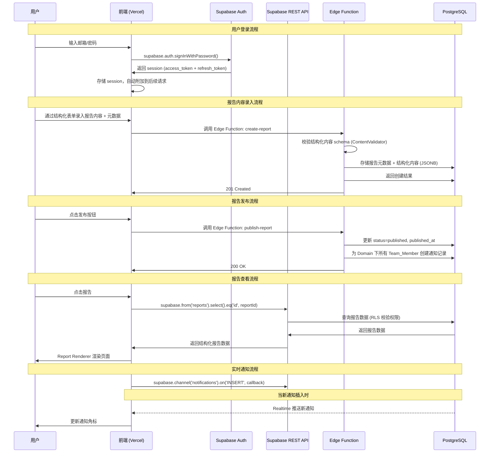
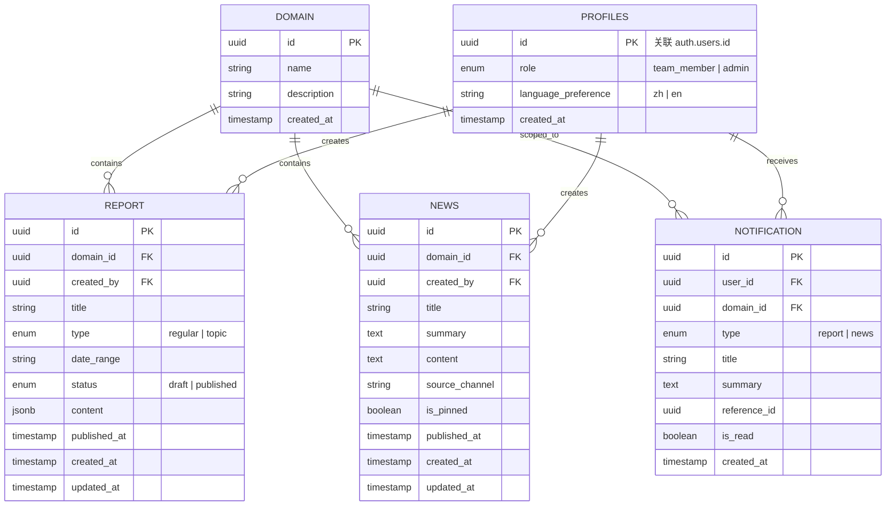

# 设计文档：雷达报告平台 (Radar Report Platform)

## 概述 (Overview)

雷达报告平台是一个基于 Web 的内部工具，用于替代当前基于邮件分发的亚马逊中国卖家账户健康雷达报告流程。平台采用 Serverless 全托管架构：前端使用 Next.js (App Router) + React + TypeScript 部署到 Vercel，后端使用 Supabase（托管 PostgreSQL + 自动生成 REST API + 内置认证 + 实时订阅）。

核心能力包括：
- 结构化报告内容录入与渲染（保留 Amazon 品牌样式）
- 报告管理（内容录入、草稿、发布）
- 热点新闻管理
- Dashboard 汇总视角（含趋势图表）
- 多 Domain 隔离（Account Health 为首个 Domain）
- 中英文界面切换
- 基于角色的访问控制（Team_Member / Admin）
- 站内通知系统（基于 Supabase Realtime 实时推送）

### 设计决策

1. **Vercel + Supabase 全托管架构**：无需维护服务器，前端部署到 Vercel（`git push` 自动部署），后端使用 Supabase 托管 PostgreSQL + 自动 REST API，免费层即可满足团队内部使用需求
2. **去除 Express 后端**：使用 `@supabase/supabase-js` SDK 从前端直接访问 Supabase，无需独立的 API 服务层。复杂业务逻辑（内容校验、发布通知创建）通过 Supabase Edge Functions（Deno 运行时）实现
3. **Supabase Auth 替代自定义 JWT**：使用 Supabase 内置认证（邮箱/密码登录、会话管理），通过 Row Level Security (RLS) 策略实现数据库层面的权限控制，无需手动实现 JWT 中间件
4. **结构化文字内容直接录入**：Admin 通过结构化表单直接输入报告文字内容（表格、分析区块、引用等），内容以 JSON 格式存储在数据库 JSONB 字段中
5. **多 Domain 数据隔离**：所有核心实体（报告、新闻、通知）均关联 `domain_id`，通过 RLS 策略和查询参数实现隔离
6. **Supabase Realtime 通知**：使用 Supabase Realtime 订阅 notifications 表变更，实现实时通知推送，替代前端轮询
7. **i18n 方案**：使用 `react-i18next`，界面文本通过 JSON 语言包管理，报告内容本身不翻译（保持英文原文）

## 架构 (Architecture)

```mermaid
graph TB
    subgraph Vercel["Vercel (前端 + Serverless)"]
        subgraph Frontend["Next.js App Router"]
            Dashboard[Dashboard 主视角]
            ReportViewer[Report Viewer 报告查看器]
            ReportArchive[Report Archive 报告归档]
            HittingNews[Hitting News 热点新闻]
            AdminPanel[Admin Panel 管理面板]
            ContentEditor[Content Editor 内容编辑器]
            LangSwitcher[Language Switcher]
            NotificationUI[Notification UI]
        end
    end

    subgraph Supabase["Supabase (后端全托管)"]
        SupaAuth[Supabase Auth<br/>邮箱/密码认证]
        SupaREST[Auto REST API<br/>PostgREST]
        SupaRealtime[Realtime<br/>实时订阅]
        EdgeFunctions[Edge Functions<br/>Deno 运行时]
        subgraph DB["PostgreSQL (托管)"]
            Tables[(domains, profiles,<br/>reports, news,<br/>notifications)]
            RLS[Row Level Security<br/>策略]
            FTS[全文搜索<br/>tsvector/tsquery]
        end
    end

    Frontend -->|@supabase/supabase-js| SupaAuth
    Frontend -->|SDK 查询/写入| SupaREST
    Frontend -->|订阅通知变更| SupaRealtime
    SupaREST --> DB
    SupaRealtime --> DB
    EdgeFunctions --> DB
    ContentEditor -->|结构化JSON| EdgeFunctions
    EdgeFunctions -->|内容校验 + 通知创建| Tables
    RLS -->|权限控制| Tables
```

### 请求流程



## 组件与接口 (Components and Interfaces)

### 前端组件

#### 1. Dashboard 组件

- 展示当前 Domain 下的近期 Regular Report 列表
- 展示最新一期 Module 1 / Module 2 总结表
- Trend_View 图表组件（使用 Recharts 渲染折线图/柱状图）
- 点击报告跳转到详情页

#### 2. ReportViewer 组件
- 接收结构化报告数据，渲染为 Amazon 品牌样式页面
- 支持模块间 Tab 导航
- Regular Report：固定渲染 4 个模块（封号趋势、下架商品、教育方案、工具反馈）
- Topic Report：根据 `modules` 数组动态渲染

#### 3. ReportArchive 组件
- 报告列表（时间倒序）
- 类型筛选（常规/专题）
- 关键词搜索（通过 Supabase RPC 调用 PostgreSQL 全文搜索）
- 分页

#### 4. HittingNews 组件
- 新闻列表（置顶优先，时间倒序）
- 新闻详情页
- 来源渠道标签

#### 5. AdminPanel 组件
- 报告内容录入（通过 Content Editor 结构化表单）
- 报告草稿管理
- 新闻 CRUD
- Domain 管理

#### 6. ContentEditor 组件
- 按模块提供结构化输入表单（表格编辑器、分析区块编辑器、引用区块编辑器、风险指标编辑器等）
- 支持动态添加/删除模块
- 实时预览功能：Admin 可在编辑时预览渲染效果
- 表格编辑器支持行列动态增减
- 内容校验：提交前检查必填字段

#### 7. NotificationUI 组件
- 导航栏通知图标 + 未读角标
- 通知下拉列表
- 点击跳转到对应内容
- 基于 Supabase Realtime 订阅实时更新

#### 8. LanguageSwitcher 组件
- 中/英文切换按钮
- 持久化语言偏好到 localStorage + 用户 profiles 表

### Supabase 数据访问层

前端通过 `@supabase/supabase-js` SDK 直接访问 Supabase，无需独立 API 层。

#### 认证（Supabase Auth）
```typescript
// 登录
supabase.auth.signInWithPassword({ email, password })
// 登出
supabase.auth.signOut()
// 获取当前用户
supabase.auth.getUser()
// 监听认证状态变化
supabase.auth.onAuthStateChange(callback)
```

#### 数据查询（Supabase Client SDK）
```typescript
// 报告列表（RLS 自动过滤权限）
supabase.from('reports').select('*').eq('domain_id', domainId).eq('status', 'published').order('published_at', { ascending: false })

// 报告详情
supabase.from('reports').select('*').eq('id', reportId).single()

// 新闻列表（置顶优先 + 时间倒序）
supabase.from('news').select('*').eq('domain_id', domainId).order('is_pinned', { ascending: false }).order('published_at', { ascending: false })

// 通知列表
supabase.from('notifications').select('*').eq('user_id', userId).order('created_at', { ascending: false })

// 未读通知计数
supabase.from('notifications').select('id', { count: 'exact' }).eq('user_id', userId).eq('is_read', false)

// Domain 列表
supabase.from('domains').select('*')
```

#### 全文搜索（Supabase RPC）
```typescript
// 报告搜索 — 调用 PostgreSQL 函数
supabase.rpc('search_reports', { search_query: keyword, domain_filter: domainId })
```

#### Supabase Realtime（通知订阅）
```typescript
// 订阅当前用户的新通知
supabase.channel('user-notifications')
  .on('postgres_changes', {
    event: 'INSERT',
    schema: 'public',
    table: 'notifications',
    filter: `user_id=eq.${userId}`
  }, (payload) => {
    // 更新通知列表和未读角标
  })
  .subscribe()
```

### Supabase Edge Functions

用于处理需要服务端逻辑的复杂操作（内容校验、发布时批量创建通知等）。Edge Functions 使用 Deno 运行时，部署在 Supabase 基础设施上。

#### create-report Edge Function
- 接收结构化报告 JSON + 元数据
- 调用 ContentValidator 校验内容 schema
- 校验 Regular Report 必须包含 4 个模块
- 校验 Topic Report 至少包含 1 个模块
- 校验通过后存储到 reports 表
- 返回创建结果或校验错误

#### publish-report Edge Function
- 更新报告 status 为 published，设置 published_at
- 查询该 Domain 下所有 Team_Member
- 为每个 Team_Member 创建通知记录
- 返回发布结果

#### create-news Edge Function
- 校验必填字段（标题、正文、来源渠道、domain_id）
- 存储到 news 表
- 返回创建结果

#### publish-news Edge Function
- 查询该 Domain 下所有 Team_Member
- 为每个 Team_Member 创建通知记录
- 返回发布结果

### 服务层（前端 + Edge Functions 共用逻辑）

#### ContentValidator 服务

负责校验 Admin 提交的结构化报告内容是否符合预期的 JSON Schema。此逻辑在 Edge Function 中执行（服务端校验），前端也可复用做客户端预校验。

校验策略：
- 校验报告内容 JSON 是否符合 `ReportContent` schema
- 校验 Regular Report 必须包含 4 个固定模块
- 校验 Topic Report 至少包含 1 个模块
- 校验每个模块内的必填字段（标题、内容区块等）
- 校验表格数据的行列一致性

```typescript
interface ReportContent {
  title: string;
  dateRange: string;
  modules: ReportModule[];
}

interface ReportModule {
  title: string;
  subtitle?: string;
  tables: ReportTable[];
  analysisSections: AnalysisSection[];
  highlightBoxes: HighlightBox[];
}

interface ReportTable {
  headers: string[];
  rows: TableRow[];
}

interface TableRow {
  cells: TableCell[];
}

interface TableCell {
  text: string;
  badge?: { text: string; level: 'high' | 'medium' | 'low' };
}

interface AnalysisSection {
  title: string;
  quotes: Quote[];
  keyPoints: KeyPoint[];
}

interface Quote {
  text: string;
  source: string;
}

interface KeyPoint {
  label: string;
  content: string;
  impactTags: string[];
}

interface HighlightBox {
  title: string;
  content: string;
}
```

#### ReportRenderer 服务（前端）

将 `ReportContent` 结构化 JSON 数据渲染为 React 组件，应用 Amazon 品牌样式：
- CSS 变量保持一致：`--amazon-primary: #232f3e`, `--amazon-accent: #ff9900`, `--amazon-secondary: #146eb4`
- 卡片式布局、表格样式、分析区块、引用区块等组件化渲染
- Tab 导航对应 `modules` 数组
- 数据来源为数据库中存储的结构化 JSON

#### SearchService（PostgreSQL RPC 函数）

- 报告搜索：基于 PostgreSQL 全文搜索（`tsvector` / `tsquery`）
- 通过 Supabase RPC 调用数据库函数
- 搜索范围：报告标题 + 结构化内容中的文本字段
- 支持中英文分词

## 数据模型 (Data Models)

### ER 图



### 表结构详细说明

#### domains 表
| 字段 | 类型 | 说明 |
|------|------|------|
| id | UUID | 主键 |
| name | VARCHAR(100) | Domain 名称，如 "Account Health" |
| description | TEXT | Domain 描述 |
| created_at | TIMESTAMPTZ | 创建时间，默认 `now()` |

#### profiles 表（扩展 Supabase auth.users）

Supabase Auth 管理用户认证（邮箱、密码哈希、会话），`profiles` 表存储应用层用户信息。通过数据库触发器在新用户注册时自动创建 profile 记录。

| 字段 | 类型 | 说明 |
|------|------|------|
| id | UUID | 主键，关联 `auth.users.id` |
| role | TEXT | `team_member` 或 `admin`，默认 `team_member` |
| language_preference | VARCHAR(2) | `zh` 或 `en`，默认 `zh` |
| created_at | TIMESTAMPTZ | 创建时间，默认 `now()` |

> 注意：账户锁定由 Supabase Auth 内置的速率限制机制处理，无需在 profiles 表中维护 `failed_login_attempts` 和 `locked_until` 字段。

#### reports 表
| 字段 | 类型 | 说明 |
|------|------|------|
| id | UUID | 主键，默认 `gen_random_uuid()` |
| domain_id | UUID | 外键，关联 domains |
| created_by | UUID | 外键，关联 auth.users |
| title | VARCHAR(500) | 报告标题 |
| type | TEXT | `regular` 或 `topic` |
| date_range | VARCHAR(100) | 报告时间段，如 "Feb 01 to Mar 03, 2026" |
| status | TEXT | `draft` 或 `published` |
| content | JSONB | 结构化报告内容（ReportContent JSON） |
| published_at | TIMESTAMPTZ | 发布时间 |
| created_at | TIMESTAMPTZ | 创建时间，默认 `now()` |
| updated_at | TIMESTAMPTZ | 更新时间，默认 `now()` |
| search_vector | TSVECTOR | 全文搜索向量（触发器自动生成） |

#### news 表
| 字段 | 类型 | 说明 |
|------|------|------|
| id | UUID | 主键，默认 `gen_random_uuid()` |
| domain_id | UUID | 外键，关联 domains |
| created_by | UUID | 外键，关联 auth.users |
| title | VARCHAR(500) | 新闻标题 |
| summary | TEXT | 新闻摘要 |
| content | TEXT | 新闻正文 |
| source_channel | VARCHAR(100) | 来源渠道 |
| is_pinned | BOOLEAN | 是否置顶，默认 false |
| published_at | TIMESTAMPTZ | 发布时间，默认 `now()` |
| created_at | TIMESTAMPTZ | 创建时间，默认 `now()` |
| updated_at | TIMESTAMPTZ | 更新时间，默认 `now()` |

#### notifications 表
| 字段 | 类型 | 说明 |
|------|------|------|
| id | UUID | 主键，默认 `gen_random_uuid()` |
| user_id | UUID | 外键，关联 auth.users |
| domain_id | UUID | 外键，关联 domains |
| type | TEXT | `report` 或 `news` |
| title | VARCHAR(500) | 通知标题 |
| summary | TEXT | 通知摘要 |
| reference_id | UUID | 关联的报告或新闻 ID |
| is_read | BOOLEAN | 是否已读，默认 false |
| created_at | TIMESTAMPTZ | 创建时间，默认 `now()` |

### Row Level Security (RLS) 策略

RLS 策略替代 Express 中间件实现数据库层面的权限控制：

```sql
-- profiles: 用户只能读取自己的 profile，Admin 可读取所有
ALTER TABLE profiles ENABLE ROW LEVEL SECURITY;
CREATE POLICY "Users can view own profile" ON profiles FOR SELECT USING (auth.uid() = id);
CREATE POLICY "Users can update own profile" ON profiles FOR UPDATE USING (auth.uid() = id);

-- reports: 所有认证用户可读取已发布报告，Admin 可 CRUD 所有报告
ALTER TABLE reports ENABLE ROW LEVEL SECURITY;
CREATE POLICY "Anyone can view published reports" ON reports FOR SELECT USING (status = 'published');
CREATE POLICY "Admins can view all reports" ON reports FOR SELECT USING (
  EXISTS (SELECT 1 FROM profiles WHERE id = auth.uid() AND role = 'admin')
);
CREATE POLICY "Admins can insert reports" ON reports FOR INSERT WITH CHECK (
  EXISTS (SELECT 1 FROM profiles WHERE id = auth.uid() AND role = 'admin')
);
CREATE POLICY "Admins can update reports" ON reports FOR UPDATE USING (
  EXISTS (SELECT 1 FROM profiles WHERE id = auth.uid() AND role = 'admin')
);
CREATE POLICY "Admins can delete reports" ON reports FOR DELETE USING (
  EXISTS (SELECT 1 FROM profiles WHERE id = auth.uid() AND role = 'admin')
);

-- news: 所有认证用户可读取，Admin 可 CRUD
ALTER TABLE news ENABLE ROW LEVEL SECURITY;
CREATE POLICY "Anyone can view news" ON news FOR SELECT USING (true);
CREATE POLICY "Admins can manage news" ON news FOR ALL USING (
  EXISTS (SELECT 1 FROM profiles WHERE id = auth.uid() AND role = 'admin')
);

-- notifications: 用户只能读取和更新自己的通知
ALTER TABLE notifications ENABLE ROW LEVEL SECURITY;
CREATE POLICY "Users can view own notifications" ON notifications FOR SELECT USING (auth.uid() = user_id);
CREATE POLICY "Users can update own notifications" ON notifications FOR UPDATE USING (auth.uid() = user_id);

-- domains: 所有认证用户可读取，Admin 可创建
ALTER TABLE domains ENABLE ROW LEVEL SECURITY;
CREATE POLICY "Anyone can view domains" ON domains FOR SELECT USING (true);
CREATE POLICY "Admins can create domains" ON domains FOR INSERT WITH CHECK (
  EXISTS (SELECT 1 FROM profiles WHERE id = auth.uid() AND role = 'admin')
);
```

### 数据库函数

```sql
-- 全文搜索函数
CREATE OR REPLACE FUNCTION search_reports(search_query TEXT, domain_filter UUID)
RETURNS SETOF reports AS $$
  SELECT * FROM reports
  WHERE domain_id = domain_filter
    AND status = 'published'
    AND search_vector @@ plainto_tsquery('english', search_query)
  ORDER BY ts_rank(search_vector, plainto_tsquery('english', search_query)) DESC;
$$ LANGUAGE sql STABLE;

-- 自动创建 profile 触发器
CREATE OR REPLACE FUNCTION handle_new_user()
RETURNS TRIGGER AS $$
BEGIN
  INSERT INTO profiles (id, role, language_preference)
  VALUES (NEW.id, 'team_member', 'zh');
  RETURN NEW;
END;
$$ LANGUAGE plpgsql SECURITY DEFINER;

CREATE TRIGGER on_auth_user_created
  AFTER INSERT ON auth.users
  FOR EACH ROW EXECUTE FUNCTION handle_new_user();

-- search_vector 自动更新触发器
CREATE OR REPLACE FUNCTION update_report_search_vector()
RETURNS TRIGGER AS $$
BEGIN
  NEW.search_vector := to_tsvector('english', COALESCE(NEW.title, '') || ' ' || COALESCE(NEW.content::text, ''));
  RETURN NEW;
END;
$$ LANGUAGE plpgsql;

CREATE TRIGGER report_search_vector_update
  BEFORE INSERT OR UPDATE ON reports
  FOR EACH ROW EXECUTE FUNCTION update_report_search_vector();
```


## 正确性属性 (Correctness Properties)

*属性（Property）是指在系统所有有效执行中都应成立的特征或行为——本质上是对系统应做什么的形式化陈述。属性是人类可读规范与机器可验证正确性保证之间的桥梁。*

### Property 1: 报告内容存储往返一致性

*For any* 有效的 `ReportContent` JSON 数据，通过 Edge Function 存储到 Supabase 后，再通过 SDK 查询返回的 `content` 字段应与原始输入完全一致（JSON 深度相等）。

**Validates: Requirements 4.1, 5.1**

### Property 2: 报告列表数据完整性

*For any* 已发布报告，在报告列表查询结果中，每份报告都应包含 `title`、`type`、`published_at`、`date_range` 四个字段且均不为空。

**Validates: Requirements 1.1, 2.4**

### Property 3: 报告模块结构正确性

*For any* Regular Report，渲染器应产出恰好 4 个模块 Tab；*For any* Topic Report，渲染器应产出与 `content.modules` 数组长度相等的模块 Tab。

**Validates: Requirements 1.4, 1.5, 1.6**

### Property 4: 报告归档时间排序

*For any* 报告归档列表查询结果，返回的报告应按 `published_at` 严格降序排列（即对于相邻的两份报告，前一份的 `published_at` 应大于等于后一份）。

**Validates: Requirements 2.1**

### Property 5: 报告类型筛选正确性

*For any* 类型筛选参数（`regular` 或 `topic`），返回的所有报告的 `type` 字段应与筛选参数完全匹配。

**Validates: Requirements 2.2**

### Property 6: 报告搜索召回

*For any* 已发布报告，若其 `title` 或 `content` 中包含某关键词，则以该关键词搜索时，该报告应出现在搜索结果中。

**Validates: Requirements 2.3**

### Property 7: 新闻列表数据完整性

*For any* 新闻列表中的新闻条目，都应包含 `title`、`summary`、`source_channel`、`published_at` 四个字段且均不为空。

**Validates: Requirements 3.2**

### Property 8: 新闻排序规则

*For any* 新闻列表查询结果，置顶新闻（`is_pinned=true`）应排在非置顶新闻之前；在相同置顶状态内，应按 `published_at` 降序排列。

**Validates: Requirements 3.4, 8.4**

### Property 9: 报告元数据必填校验

*For any* 报告创建请求，若缺少 `title`、`type`、`date_range`、`domain_id` 中的任何一个字段，系统应拒绝该请求并返回校验错误。

**Validates: Requirements 4.2, 12.4**

### Property 10: 报告发布状态转换

*For any* 处于草稿状态的报告，执行发布操作后，其 `status` 应变为 `published`，`published_at` 应不为空，且该报告应出现在公开报告列表中。

**Validates: Requirements 4.3, 4.4**

### Property 11: 无效报告内容拒绝

*For any* 不符合 `ReportContent` schema 的 JSON 数据（缺少必填字段、类型错误、表格行列不一致等），ContentValidator 应拒绝该数据并返回包含字段路径和原因的结构化错误信息。

**Validates: Requirements 4.5, 5.5**

### Property 12: Regular Report 模块数量校验

*For any* Regular Report 类型的报告内容，若 `modules` 数组长度不等于 4，ContentValidator 应拒绝该内容。

**Validates: Requirements 4.5**

### Property 13: 渲染器内容完整性

*For any* 有效的 `ReportContent` JSON 数据，ReportRenderer 渲染后的输出应包含输入数据中的所有文字内容（表格单元格文本、分析标题、引用文本、关键要点等），不丢失任何数据。

**Validates: Requirements 5.3, 5.4**

### Property 14: 未认证请求拒绝

*For any* 受保护的 Supabase 数据表查询，在无有效 session（未登录）的情况下，RLS 策略应拒绝访问，返回空结果或错误。

**Validates: Requirements 6.1, 6.3**

### Property 15: 角色权限隔离

*For any* Team_Member 角色的用户，尝试对 `reports`、`news` 表执行 INSERT、UPDATE、DELETE 操作时，RLS 策略应拒绝该操作。

**Validates: Requirements 6.4**

### Property 16: 账户锁定机制

*For any* 用户账户，连续 5 次输入错误密码后，Supabase Auth 应在后续登录尝试中返回速率限制错误，阻止登录。

**Validates: Requirements 6.5**

### Property 17: 新闻必填字段校验

*For any* 新闻创建请求，若缺少 `title`、`content`、`source_channel`、`domain_id` 中的任何一个字段，系统应拒绝该请求并返回校验错误。

**Validates: Requirements 8.1, 12.5**

### Property 18: 新闻删除生效

*For any* 已删除的新闻，后续的新闻列表查询结果中不应包含该新闻。

**Validates: Requirements 8.3**

### Property 19: 语言包完整性

*For any* 翻译键，`zh.json` 和 `en.json` 语言包中都应存在该键且对应的值不为空字符串。

**Validates: Requirements 9.2**

### Property 20: 语言偏好持久化往返

*For any* 语言偏好值（`zh` 或 `en`），保存到 profiles 表后重新查询应返回相同的值。

**Validates: Requirements 9.3**

### Property 21: 发布事件通知创建

*For any* 报告或新闻的发布事件，系统应为该 Domain 下的每个 Team_Member 创建一条通知记录，且通知的 `type`、`title`、`reference_id` 字段正确填充。

**Validates: Requirements 10.1, 10.2**

### Property 22: 未读通知计数准确性

*For any* 用户，未读通知计数应等于该用户 notifications 表中 `is_read=false` 的记录数。

**Validates: Requirements 10.3**

### Property 23: 通知时间排序

*For any* 用户的通知列表查询结果，通知应按 `created_at` 严格降序排列。

**Validates: Requirements 10.4**

### Property 24: Dashboard 模块总结表提取

*For any* Domain 下存在已发布 Regular Report 的情况，Dashboard 返回的 Module 1 和 Module 2 总结表数据应与最新一期 Regular Report 的 `content.modules[0]` 和 `content.modules[1]` 数据一致。

**Validates: Requirements 11.3, 11.4**

### Property 25: 趋势数据跨期覆盖

*For any* 指定时间范围内的已发布 Regular Report 集合，趋势数据应覆盖该范围内的所有报告（数据点数量等于报告数量）。

**Validates: Requirements 11.5**

### Property 26: Dashboard 自动更新

*For any* 新发布的 Regular Report，发布后 Dashboard 查询返回的最新报告数据应反映该新报告的内容。

**Validates: Requirements 11.7**

### Property 27: 跨 Domain 数据隔离

*For any* 两个不同的 Domain，Domain A 下创建的报告和新闻不应出现在 Domain B 的查询结果中，反之亦然。

**Validates: Requirements 12.3, 12.7**

### Property 28: 新 Domain 初始化

*For any* 新创建的 Domain，查询该 Domain 下的报告列表、新闻列表和 Dashboard 数据应均返回空结果。

**Validates: Requirements 12.6**

### Property 29: 报告详情完整性

*For any* 已发布报告，详情查询应返回完整的 `content` 字段（非空），且 `content.modules` 数组长度应与报告类型一致（regular=4，topic≥1）。

**Validates: Requirements 1.2, 1.6**

### Property 30: 新闻详情完整性

*For any* 新闻条目，详情查询应返回完整的 `content` 字段且不为空。

**Validates: Requirements 3.3**

## 错误处理 (Error Handling)

### 认证错误

| 错误场景 | 处理方式 |
|----------|----------|
| 未登录访问受保护页面 | Next.js middleware 重定向到 `/login` |
| Session 过期 | `supabase.auth.onAuthStateChange` 检测到 `SIGNED_OUT` 事件，重定向到登录页 |
| 登录密码错误 | 显示 "邮箱或密码错误" 提示 |
| 速率限制（多次失败登录） | 显示 "登录尝试过多，请稍后再试" 提示 |

### 权限错误

| 错误场景 | 处理方式 |
|----------|----------|
| Team_Member 访问 Admin 页面 | 前端路由守卫显示 "权限不足" 提示 |
| Team_Member 尝试写操作 | RLS 拒绝，Supabase SDK 返回错误，前端 Toast 提示 |

### 数据校验错误

| 错误场景 | 处理方式 |
|----------|----------|
| 报告内容不符合 schema | ContentValidator 返回 `ContentValidationError`，包含字段路径和原因 |
| 缺少必填元数据 | Edge Function 返回 400 错误，前端表单高亮缺失字段 |
| Regular Report 模块数量不为 4 | ContentValidator 拒绝，提示 "常规报告必须包含恰好 4 个模块" |

### 网络与服务错误

| 错误场景 | 处理方式 |
|----------|----------|
| Supabase 服务不可用 | 前端显示 "服务暂时不可用，请稍后重试" Toast |
| Edge Function 执行超时 | 返回 504 错误，前端提示重试 |
| Realtime 连接断开 | 自动重连，重连期间回退到手动刷新 |

### 渲染错误

| 错误场景 | 处理方式 |
|----------|----------|
| 报告 JSON 结构异常 | ReportRenderer 显示降级视图（格式化 JSON 文本） |
| 图表数据为空 | Trend_View 显示 "暂无趋势数据" 占位符 |

## 测试策略 (Testing Strategy)

### 测试框架

- **单元测试 + 属性测试**: Vitest + fast-check
- **组件测试**: @testing-library/react
- **E2E 测试**（可选）: Playwright

### 双重测试方法

本项目采用单元测试与属性测试互补的双重测试策略：

- **单元测试**: 验证具体示例、边界情况和错误条件。避免编写过多单元测试，属性测试已覆盖大量输入场景。
- **属性测试**: 验证跨所有输入的通用属性。每个属性测试至少运行 100 次迭代。

### 属性测试配置

- 使用 `fast-check` 库（TypeScript 属性测试库）
- 每个属性测试至少 100 次迭代（`fc.assert(property, { numRuns: 100 })`）
- 每个属性测试必须以注释引用设计文档中的属性编号
- 标签格式: **Feature: radar-report-platform, Property {number}: {property_text}**
- 每个正确性属性由一个属性测试实现

### 测试分层

| 层级 | 测试类型 | 工具 | 覆盖范围 |
|------|----------|------|----------|
| ContentValidator | 属性测试 | fast-check | Property 1, 9, 11, 12 |
| ReportRenderer | 属性测试 | fast-check + @testing-library/react | Property 3, 13 |
| 数据查询层 | 属性测试 | fast-check + Supabase test client | Property 2, 4, 5, 6, 7, 8, 29, 30 |
| 通知服务 | 属性测试 | fast-check | Property 21, 22, 23 |
| 认证与权限 | 属性测试 | fast-check + Supabase Auth | Property 14, 15, 16 |
| Domain 隔离 | 属性测试 | fast-check | Property 27, 28 |
| Dashboard | 属性测试 | fast-check | Property 24, 25, 26 |
| i18n | 属性测试 | fast-check | Property 19, 20 |
| 状态转换 | 属性测试 | fast-check | Property 10, 17, 18 |
| 前端组件 | 单元测试 | @testing-library/react | 组件渲染、用户交互 |
| 集成测试 | 单元测试 | Vitest | API 调用链路、错误处理 |

### 测试环境

- 使用 Supabase 本地开发环境（`supabase start`）运行集成测试
- 属性测试中的数据库操作使用测试专用 Supabase 项目或本地实例
- 前端组件测试使用 mock Supabase client
