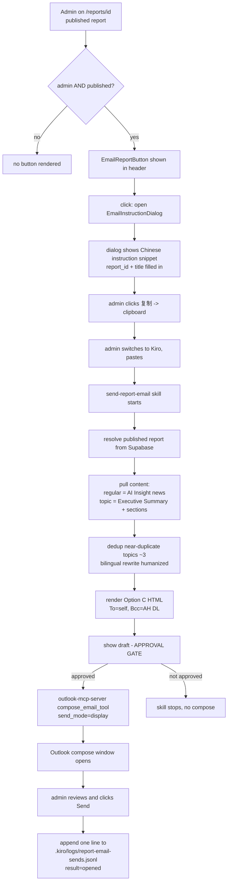

# Design Document

## Overview

This feature emails a published Radar Report to internal AMs from the admin's own desktop Outlook. It replaces an earlier server-side design (Resend + Inngest fan-out + a `report_email_sends` audit table + RLS) that was abandoned during prototyping. The earlier approach hit two walls: deliverability to `@amazon.com` inboxes from an external sender requires domain verification and still risks spam filtering, and a server-side audit table added schema, RLS, and ops surface for a channel that one admin triggers a few times a week. The shipped approach removes all of that. The email leaves from the admin's own mailbox as their `@amazon.com` identity — internal Exchange to internal Exchange — so it lands in the inbox with no domain to verify and no third-party service in the path.

The work has two halves.

**Half 1 — the `send-report-email` skill (already built).** A Kiro skill drives the send from inside Kiro: resolve a published report from Supabase, pull its content, dedup and rewrite it into a bilingual newspaper email, show the draft for approval, open it in Outlook through the local `outlook-mcp-server` MCP, and let the admin click Send. The skill is the source of truth at `~/.kiro/skills/send-report-email/SKILL.md`. This design summarizes it and records the decisions behind it; it does not redefine it.

**Half 2 — the platform trigger button (to be built).** A small admin-only affordance on the report detail page that hands the report to the skill. It is purely frontend: it renders a fixed Chinese instruction snippet with the report id and title filled in, and copies it to the clipboard. The admin pastes it into Kiro and the skill takes over. No backend, no database, no migration, no Inngest, no Resend.

The two halves connect by copy-paste, not by a fully automatic web→Kiro link. That decision and its mechanism are in Design Decisions.

## Architecture

### The two halves and the trigger flow

```
PLATFORM (Next.js, deployed)                 KIRO (local, on the admin's machine)
┌─────────────────────────────┐              ┌──────────────────────────────────────┐
│ /reports/[id]               │              │ send-report-email skill                │
│   EmailReportButton         │   copy /     │   1. resolve published report (Supabase)│
│   (admin + published only)  │   paste      │   2. pull content (AI Insight / sections)│
│     └ EmailInstructionDialog│ ───────────▶ │   3. dedup + bilingual rewrite          │
│         instruction snippet │  instruction │   4. draft Option C HTML                │
│         + 复制 (clipboard)   │   snippet    │   5. APPROVAL GATE                      │
└─────────────────────────────┘              │   6. outlook-mcp-server compose         │
   frontend only, no backend                 │      (send_mode=display)                │
                                              │   7. user clicks Send; append intent log│
                                              └──────────────────────────────────────┘
                                                        │ compose_email_tool
                                                        ▼
                                              ┌──────────────────────────────────────┐
                                              │ Desktop Outlook (must be running)      │
                                              │   compose window, To=self, Bcc=AH DL   │
                                              │   admin reviews → clicks Send          │
                                              └──────────────────────────────────────┘
```

The platform side is one button and one dialog. Everything that touches a report, an email body, or Outlook runs locally inside Kiro and the admin's Outlook. The platform never sees an email.

### End-to-end flow



### Why this shape

The platform's job is reduced to identifying the report and phrasing the request. That is the only thing the web page can reliably do, because the browser cannot reach into Kiro to start a skill (see Design Decisions). Everything that needs the report content, the dedup logic, the bilingual rewrite, and Outlook lives where those capabilities already exist — inside Kiro and the local Outlook. This keeps the platform change tiny and reversible, and keeps the email logic in the skill where it was built and validated.

## Components and Interfaces

### 1. Trigger button + dialog (platform, frontend only — to build)

Lives with the report detail route. The viewer is a client component (`ReportViewerClient.tsx`) that already holds the full report row (so `report.status` is available) and can read `useRole().isAdmin`. Two new client components:

- `EmailReportButton.tsx` — rendered in the report detail header next to the existing "Export PDF" button. Renders only when `useRole().isAdmin === true` and `report.status === 'published'` (Req 1.1–1.4). Reuses the existing role hook and the existing report status field; introduces no new auth. Opens the dialog (Req 1.5). Likely path: `src/components/report/EmailReportButton.tsx`.
- `EmailInstructionDialog.tsx` — a modal following the platform's existing hand-rolled modal pattern (`ViewRawOutputModal.tsx`: backdrop click + Esc close, body-scroll lock, `navigator.clipboard.writeText`, copied-state confirmation). The repo has no shadcn `Dialog` primitive yet; matching the existing modal pattern is the smaller change and keeps one modal idiom in the codebase. The dialog shows the rendered instruction snippet and a single primary "复制" button. Likely path: `src/components/report/EmailInstructionDialog.tsx`.

The instruction snippet is a pure function of `report_id` and `title`:

```
用 send-report-email skill 把报告 {report_id}（{title}）发邮件出去，
收件人默认 radar-report-ah@amazon.com，其他收件人我待会儿告诉你
```

The snippet body is a fixed Chinese string (it is an instruction to the skill, which operates in the admin's working language); the dialog chrome — title, copy button label, copied confirmation, close — goes through `t()` so the UI honors the zh/en switch (Req 2.6, Principle 3). New i18n keys land under a `reports.emailReport.*` namespace in `src/locales/{en,zh}.ts`.

Wiring: `EmailReportButton` is dropped into the header actions row in `ReportViewerClient.tsx`, beside the print button. No change to `page.tsx` or `loaders.ts` — the data they already load is enough.

### 2. The `send-report-email` skill (Kiro, already built — documented here)

Source of truth: `~/.kiro/skills/send-report-email/SKILL.md`. Summary of its contract:

- **Resolve** a published report by id from Supabase using the service role (keys read from `.env.local` at runtime, never committed). Only `status = 'published'` is eligible. `type` (`regular` / `topic`) selects the layout.
- **Pull content.** Regular: AI Insight news rows for the report's domain, deduped to ~3 distinct topics. Topic: Executive Summary opening as the lead, remaining module titles as the section list.
- **Draft.** Rewrite (humanize) into the Option C template. Chrome English, news items bilingual. Adaptive layout by item count.
- **Approval gate.** Show the recipient list, subject, and a body sample per language; wait for explicit approval. Never compose before approval.
- **Compose.** One `compose_email_tool` call with `send_mode="display"`: `To` = sender, `Bcc` = AH DL + extras, no `Cc`. Opens the compose window; the admin clicks Send.
- **Log.** Append one line per compose to `.kiro/logs/report-email-sends.jsonl` with `result: "opened"`.

The default model is one email Bcc'd to the DL with a generic "Hi team" greeting. A per-person individual-send mode exists as an explicit exception (resolve each address from `auth.users`, one compose per recipient).

### 3. outlook-mcp-server MCP (local, already built — documented here)

A local win32COM server bridging Kiro to the running desktop Outlook (cloned from `marlonluo2018/outlook-mcp-server` to `~/.kiro/mcp-servers/`, configured in `.kiro/settings/mcp.json`). It was patched in three places to support this flow:

- **`html=True` default** on `compose_email_tool` — the Option C body is HTML; the upstream default was plain text.
- **`bcc_email` param** — upstream had no Bcc; the default DL flow needs Bcc so the recipient list is not exposed.
- **`send_mode` param** — `"display"` (open compose window, used by this flow), `"draft"` (save to Drafts), `"send"` (send immediately, not used here). The skill always passes `"display"` so the admin performs the actual send.

Runtime prerequisite: desktop Outlook must be running (the win32COM bridge drives the live Outlook process). The skill checks `Get-Process OUTLOOK` and fails fast if absent.

### 4. The Option C HTML/VML template (already built — referenced here)

Locked, Outlook-safe layout defined in SKILL.md. Table-based, all inline styles, no flexbox/SVG/external images. Structure: dark masthead (`#1a1a2e`) with an orange middot; warm intro line; numbered items table (orange `#ff9900` rank number + English headline + English line + Chinese line); a `#fff7ec` CTA band; a simplified disclaimer. Spot color `#ff9900` matches the platform's Amazon-orange accent.

The CTA must render as a rounded button in the Outlook Word engine, which ignores `border-radius`. The fix is the VML dual-path:

```html
<!--[if mso]>
<v:roundrect xmlns:v="urn:schemas-microsoft-com:vml" href="{URL}"
  style="height:44px;v-text-anchor:middle;width:220px;" arcsize="18%" stroke="f" fillcolor="#ff9900">
  <w:anchorlock/>
  <center style="color:#ffffff;font-family:Arial,sans-serif;font-size:14px;font-weight:bold;">Read the full edition</center>
</v:roundrect>
<![endif]-->
<!--[if !mso]><!-- -->
<a href="{URL}" style="display:inline-block;background-color:#ff9900;color:#ffffff;
  font-family:{SANS};font-size:14px;font-weight:700;text-decoration:none;
  padding:13px 28px;border-radius:8px;">Read the full edition</a>
<!--<![endif]-->
```

The `<html>` tag carries `xmlns:v` and `xmlns:o`, and `<head>` carries the MSO `PixelsPerInch` `OfficeDocumentSettings` block, or VML does not render. `{URL}` is `https://radar-report-platform.vercel.app/reports/{report_id}`.

## Data Models

There is no new database table, no migration, no RLS change. This is a deliberate departure from the abandoned design, which added a `report_email_sends` table with per-recipient audit rows and RLS policies.

**Decision (logged):** the send happens entirely on the admin's machine through their own Outlook, so there is no server-side event to audit and no multi-user read model to protect with RLS. The only persistence is the local intent log:

`.kiro/logs/report-email-sends.jsonl` — one JSON line per compose:

```json
{"ts":"…","report_id":"…","report_title":"…","recipient":"name <email>","language":"en|zh","result":"opened|failed","error":null}
```

`result` is `"opened"` (not `"sent"`) because the skill opens the compose window and the admin clicks Send — the skill cannot truthfully claim delivery. A JSONL append-only log is the right weight for an MVP that one admin triggers a few times a week; if usage grows or an auditable trail is ever required, a table is a clean future addition, but it is not earned now.

## Design Decisions

**Local Outlook over Resend.** Email leaves from the admin's own Outlook as `chenliua@amazon.com`, internal Exchange to internal Exchange. Why: this lands in `@amazon.com` inboxes with no domain verification and no spam-filter risk, which an external sender cannot guarantee. It also removes the third-party dependency (Resend), the `from`-domain verification step, and the server-side send path entirely. Cost: the send is manual (the admin clicks Send) and requires desktop Outlook running on a Windows machine — acceptable for a single-admin, low-volume channel.

**Copy-paste over a web→Kiro deep-link.** The trigger is a copied instruction string the admin pastes into Kiro, not a one-click link that launches the skill. Why: there is no public Kiro entry point that lets a web URL inject an agent prompt and run a skill. Kiro's `kiro://` protocol exposes exactly five authorities — `kiro.oauth`, `kiro.mcp`, `kiro.powers`, `kiro.repo`, `kiro.resume-session` — and none of them inject a prompt or run a skill. Full automation would require building and distributing a custom VS Code extension that every admin installs, which is a separate software project. The `kiro chat` CLI can run a prompt headlessly, but a browser cannot invoke a local CLI from its sandbox. Copy-paste is the pragmatic MVP: one button, one paste. (Recorded as a Future Consideration to revisit if Kiro exposes a prompt-injection entry point.)

**display-mode over auto-send.** The skill always calls `compose_email_tool` with `send_mode="display"` and never `"send"`. Why: the admin reviews the rendered email in Outlook and controls what actually leaves their mailbox. The compose tool is not auto-approved. This keeps a human in the loop for an outbound message that carries the admin's identity.

**Default Bcc-to-DL over per-person fan-out.** The default is one email with `To` = self and `Bcc` = `radar-report-ah@amazon.com`. Why: the DL is the real audience, Bcc avoids exposing a long recipient list and avoids reply-all fan-out, and one compose is far less friction than N. Per-person individual sends remain available as an explicit exception when the admin wants named greetings.

**No audit table.** The only persistence is the local JSONL intent log. Why: with the send happening on the admin's machine there is no server event to record and no multi-user data to guard with RLS. A JSONL log is enough for the MVP; a table is a clean later addition if an auditable trail is ever needed.

**Frontend-only trigger.** The platform change is one button + one dialog that generates and copies a string. Why: the browser cannot do more than identify the report and phrase the request, so adding backend, a table, or an integration would be surface with no payoff. Keeping it frontend-only makes the change tiny and trivially reversible.

**Match the existing modal pattern, not a new shadcn Dialog.** The repo has no shadcn `Dialog` primitive; it uses hand-rolled modals (`ViewRawOutputModal`, `ConfirmModal`). Why: reusing that idiom (backdrop/Esc close, scroll lock, clipboard copy) is the smaller change and avoids introducing a new primitive for one dialog.

## Correctness Properties

Full property-based testing is not warranted here. The platform change is a visibility predicate plus a deterministic string-build-and-copy; the email logic lives in the already-validated skill, not in platform code. Two invariants are worth stating — both are validated by the example tests in Testing Strategy, not by a PBT harness.

### Property 1: Visibility predicate

The trigger button renders if and only if `useRole().isAdmin === true` AND `report.status === 'published'`. For every other combination of role and status it renders nothing.

**Validates: Requirements 1.1, 1.2, 1.3, 1.4**

### Property 2: Snippet fidelity on copy

The text written to the clipboard equals the rendered instruction snippet exactly, with the current report's `report_id` and `title` substituted and the default DL address present. The copy action never mutates or truncates the snippet.

**Validates: Requirements 2.1, 2.2, 2.4**

## Error Handling

The platform surface has almost no failure modes by design — no network call, no backend, no async work. The ones that exist:

- **Clipboard write fails / unavailable.** `navigator.clipboard.writeText` can reject (permissions, insecure context). Catch it and leave the snippet visible and selectable in the read-only block so the admin can copy manually; do not show a hard error. Mirrors the swallow-and-continue pattern in `ViewRawOutputModal`.
- **Missing report fields.** `report_id` and `title` come from the already-loaded report row, so they are present whenever the button renders. No empty-state handling is needed on the platform side.

Everything downstream of the paste is the skill's responsibility and is handled there (fail-fast checks documented in SKILL.md and summarized in Requirements):

- Report not published → skill stops, no compose (Req 4.2).
- Ambiguous or missing `report_id` → skill lists candidates and asks (Req 4.4).
- Desktop Outlook not running → skill stops and tells the admin to open Outlook (Req 9.2).
- Compose call fails → intent log line written with `result: "failed"` and the error (Req 10.3).

## Testing Strategy

Proportional to the change: this is a small frontend addition plus an already-validated skill, not a backend. No property-based tests are warranted.

**Platform trigger button (to build):**

- Visibility gating — render the report detail header with the four combinations of `{role: admin | team_member} × {status: published | draft}` and assert the button appears only for `admin + published` (Req 1.1–1.3).
- No-new-auth — confirm the button reads `useRole().isAdmin` and `report.status`, not a new check (Req 1.4).
- Instruction snippet — assert the rendered snippet contains the exact `report_id` and `title` for the current report and the default DL address (Req 2.1, 2.2).
- Clipboard — clicking "复制" calls `navigator.clipboard.writeText` with the exact snippet and shows the copied confirmation (Req 2.3, 2.4). Clipboard is mockable in the test environment.
- Dismissal — backdrop click, Esc, and the close control all close the dialog (Req 2.5).
- i18n — dialog chrome strings resolve through `t()` in both zh and en (Req 2.6).
- Build + diagnostics — `getDiagnostics` on the new files returns zero errors and `npm run build` passes before declaring done.

**Skill end-to-end (already validated manually):** the skill + MCP were validated by hand and are not re-tested by this spec. What was confirmed: the compose window opens in desktop Outlook with `To` = sender and `Bcc` = the AH DL; the Option C body renders correctly in the Outlook Word engine including the VML rounded CTA button; the bilingual news items render with English headline/line and Chinese line; the intent log gains one `result: "opened"` line per compose. Re-validation, if the template changes, is the same manual check: open a compose for a known published report and eyeball the Outlook render.

## Manual Activation Steps

These are environment side effects code cannot satisfy. They apply to the already-built Half 1 and are stated so verification is honored.

- **MCP reconnect after source patches.** The `outlook-mcp-server` was patched (html default, `bcc_email`, `send_mode`). Kiro must reconnect the MCP for the patched server to load; `RADAR_MCP_RELOAD` in `.kiro/settings/mcp.json` is bumped to force a reconnect.
- **Desktop Outlook must be running.** The win32COM bridge drives the live Outlook process. If Outlook is closed, the skill fails fast and tells the admin to open it.
- **Supabase service-role access.** The skill reads `SUPABASE_SERVICE_ROLE_KEY` and `NEXT_PUBLIC_SUPABASE_URL` from `.env.local` at runtime to resolve the report and its content.

The Half 2 trigger button has no manual activation step beyond a normal platform deploy.
