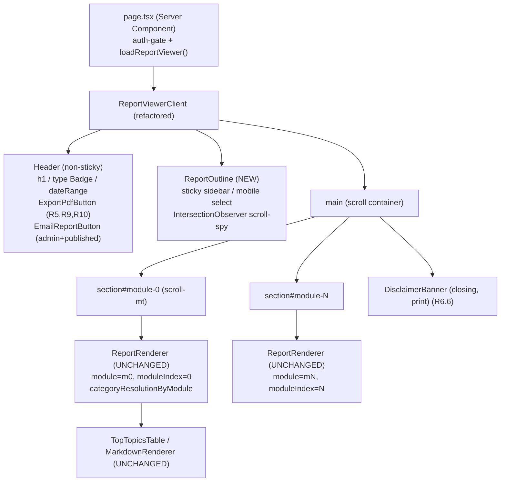

# Design Document

## Overview

This feature reshapes the report viewer at `/reports/[id]` from a **tab-switch model**
(one module mounted at a time) into a **Quip / Notion-style three-zone reading layout**
(sticky left outline + one scrolling body with every module mounted at once), and in doing
so fixes the long-standing "export captures only the active tab" bug. The two sub-features
are coupled by one fact: once every `Report_Module` is in the DOM simultaneously, the
existing `window.print()` Export PDF naturally captures the whole report. The layout change
is the enabler for the export fix — there is no separate export engine to build.

The change is a **client-side presentational refactor of `ReportViewerClient.tsx`** plus one
new presentational component (`ReportOutline`) and an extension of the existing `@media print`
block in `globals.css`. It touches **no data layer**: the server component
(`page.tsx`), the loader (`loaders.ts`), Supabase, the API surface, and the report schema are
all unchanged. The per-module `categoryResolutionByModule` memo — which today resolves each
module's `topTopics` ranks to canonical categories — is **preserved verbatim** and simply fed
to every module's `ReportRenderer` instead of only the active one.

Scope anchors (from requirements R1–R12):

- **R1–R4** — readability + the sticky-outline / scroll-jump / scroll-spy reading layout that
  replaces `ModuleTabs`, applied uniformly to both `regular` (4 canonical modules) and
  `topic` (1–N modules) reports with no per-type fork.
- **R3** — the structured `Top_Topics_Table` (severity Badge, cross-engine confirmation tick)
  is rendered by the existing `TopTopicsTable`/`ReportRenderer`, unchanged; it now appears in
  every module rather than only the open tab.
- **R5–R8, R12** — Export PDF via `window.print()`, full-report completeness, bilingual
  fidelity, on-screen fidelity, and sub-second responsiveness.
- **R9** — best-effort filename via a `document.title` swap around the print call.
- **R10** — export busy / ready / error states on the Export_Control.
- **R11** — export availability by report status and role.

Visual and interaction target: the approved prototype
`prototype/report-view-quip-layout.html` (sticky 240px sidebar, `IntersectionObserver`
scroll-spy at `rootMargin: '-76px 0px -65% 0px'`, severity badges, colored callouts, and a
`@media print` block). This design translates that prototype into React while reusing every
existing renderer.

## Architecture

### The shift

```
BEFORE (tab model)                      AFTER (quip layout)
─────────────────────                   ──────────────────────────────
header                                  header (non-sticky, scrolls away)
  ModuleTabs  ── activeTab state          ReportOutline ── sticky, scroll-spy
main                                     main (one scroll container)
  DisclaimerBanner                         section#module-0  ReportRenderer(m0)
  ReportRenderer(modules[activeTab])       section#module-1  ReportRenderer(m1)
  // only ONE module in the DOM            section#module-N  ReportRenderer(mN)
                                           // EVERY module in the DOM at once
                                           closing Disclaimer (print)
```

The root cause of the per-theme-only export is `activeModule = modules[activeTab]` — only the
selected module is ever mounted. Replacing tab-switching with all-sections-mounted is what
makes a single `window.print()` capture the full report (R6.2).

### Component tree



Single source of truth for the section list: `ReportViewerClient` derives
`sections: Section[]` **once** from `displayContent.modules` and passes the same array to both
`ReportOutline` (for the outline entries + scroll-spy targets) and the body (for the
`<section id>` anchors). The outline and the body cannot drift because they read the same
derived list and the same `id` scheme (`module-${i}`).

### What does NOT change

- `page.tsx`, `loaders.ts`, `ReportViewerData`, Supabase queries, RLS — untouched (UI-only).
- `ReportRenderer.tsx`, `MarkdownRenderer.tsx`, `TopTopicsTable.tsx`, `BlockRenderer.tsx`,
  `DisclaimerBanner.tsx` — untouched; they already render a single module/table/disclaimer.
  The refactor calls `ReportRenderer` once per module in a loop.
- `categoryResolutionByModule` memo — preserved exactly; already keyed by module index, so it
  already supports all modules.
- `EmailReportButton` — stays in the header with its existing `isAdmin && published` gate.
- Language resolution via `getDisplayReportContent/Title/DateRange` — unchanged.

## Components and Interfaces

### `ReportViewerClient` (refactored)

The file to change. Concrete diffs:

- **Remove** `activeTab` state, `setActiveTab`, `activeModule`, the `ModuleTabs` import/usage,
  and the now-unused `void router` placeholder.
- **Keep** the `categoryResolutionByModule` `useMemo` verbatim, the `ErrorBoundary` class, the
  `parseTopTopicRank` helper, and the `renderError` JSON fallback.
- **Derive sections once** and reuse for outline + anchors:

  ```ts
  const sections = useMemo<Section[]>(
    () => modules.map((m, i) => ({ id: `module-${i}`, title: m.title })),
    [modules]
  );
  ```

- **Header** (no longer sticky — it scrolls away like the prototype; only the 56px site nav
  stays fixed during scroll): renders `h1` (displayTitle), type `Badge`, dateRange, the new
  `ExportPdfButton`, and `EmailReportButton`. The `ModuleTabs` block is deleted.
- **Outline + body** replace the single-module render:

  ```tsx
  {sections.length > 1 && <ReportOutline sections={sections} />}
  <main /* scroll-mt handled per-section */>
    {modules.map((m, i) => (
      <section key={i} id={`module-${i}`} className="scroll-mt-[76px]">
        <ErrorBoundary onError={() => {/* per-section flag, see Error Handling */}}>
          <ReportRenderer
            module={m}
            moduleIndex={i}
            categoryResolutionByModule={categoryResolutionByModule}
          />
        </ErrorBoundary>
      </section>
    ))}
    <DisclaimerBanner className="print-only mt-8" />   {/* closing legal notice in PDF, R6.6 */}
  </main>
  ```

- **Layout grid**: desktop two-column `lg:grid lg:grid-cols-[240px_1fr] lg:gap-10`; below the
  `lg` breakpoint the grid collapses to one column and `ReportOutline` renders its mobile
  dropdown instead of the sidebar (R4.7). Reuses the design-system `max-w-7xl` page container
  already provided by `(main)/layout.tsx`.

`Section` type (the only new in-memory shape):

```ts
export interface Section {
  id: string;    // `module-${index}`
  title: string; // module.title in the Viewed_Language
}
```

### `ReportOutline` — NEW component (`src/components/report/ReportOutline.tsx`)

Self-contained sidebar outline that owns scroll-spy, active highlight, scroll-jump, and the
mobile collapse. The body stays "dumb" — it only renders anchored sections and never needs to
know the active id.

```ts
export interface ReportOutlineProps {
  sections: Section[];
}
```

Behavior:

- **Desktop sidebar** (`hidden lg:block`): sticky at `top-[76px]`, `max-h-[calc(100vh-96px)]`
  with `overflow-y-auto`. Lists each section as a clickable entry: rank number + title in the
  Viewed_Language (titles already come from `displayContent`, so no extra i18n) plus a
  "Sections" label via a new `t('report.outline.label')` key. (R2.1, R4.1–R4.3)
- **Active highlight** reuses the `ModuleTabs` active visual — a **2px primary** marker — here
  rendered as `border-l-2 border-primary` + `bg-primary-soft` on the active entry (matches the
  prototype's `.outline-list li a.active`). (R2.5, R4.6)
- **Scroll-spy (`IntersectionObserver`)**: on mount (in `useEffect`, after the body has
  painted), resolve each `section.id` via `document.getElementById`, observe the resolved
  elements, and set an internal `activeId` to the id of the intersecting section. Uses
  `rootMargin: '-76px 0px -65% 0px'` and `threshold: 0`, copied from the prototype. Rationale:
  the top inset (`-76px`) discounts the 56px sticky site nav plus breathing room so a section
  only counts as "in view" once it clears the nav; the bottom inset (`-65%`) shrinks the active
  zone to roughly the top third of the viewport so the highlighted entry is the section the
  reader is actually reading, not whichever one last touched the bottom edge. Guard against
  null elements (a section that failed to render). Disconnect on unmount.
- **Scroll-jump**: clicking an entry calls
  `document.getElementById(id)?.scrollIntoView({ behavior: 'smooth' })`. `scroll-margin-top:
  76px` on each `<section>` (via `scroll-mt-[76px]`) ensures the jumped-to heading clears the
  sticky nav rather than hiding under it. (R2.4, R4.5)
- **Mobile dropdown** (`lg:hidden`): a sticky-`top-14` `<select>` (a native control keeps it
  zero-dependency and accessible) whose `value` is bound to `activeId` (kept in sync by the
  same observer). `onChange` → `scrollIntoView` to the chosen section; because a native select
  closes itself after a choice, the "collapse the dropdown after selection" requirement (R4.8)
  is satisfied by the platform. (R4.7, R4.8)

Single-source coupling: `ReportOutline` derives nothing about the report itself — it receives
the already-derived `sections` and reads section DOM nodes by the shared `module-${i}` id, so
outline labels, scroll-spy targets, and the body anchors are guaranteed to align.

### `ExportPdfButton` — small client component (inline in `ReportViewerClient`, or
`src/components/report/ExportPdfButton.tsx`)

Owns the export interaction and states (R5, R9, R10, R12). Props:

```ts
export interface ExportPdfButtonProps {
  filenameBase: string; // pre-derived, sanitized doc-title base (see report-export.ts)
}
```

- **Render**: design-system `outline` button (never `primary` — R5.4), lucide `Printer` icon,
  label via `t('report.export.button')` in the Viewed_Language (R5.2). It is the only export
  affordance; `EmailReportButton` is the sole other header action and is also `outline`, so the
  header keeps **at most one** `primary` button — in fact zero (R5.4).
- **Click handler** (R9, R10, R12):

  ```ts
  function handleExport() {
    if (isExporting) return;          // prevent concurrent activation (R10.1)
    setIsExporting(true);             // busy within 1s (R12.1)
    try {
      prevTitleRef.current = document.title;
      document.title = filenameBase;  // influence print dialog default filename (R9.1)
      window.print();                 // open dialog, no server round-trip (R5.3, R12.2)
    } catch (e) {
      document.title = prevTitleRef.current ?? document.title; // restore on failure (R9.4)
      setIsExporting(false);
      setExportError(t('report.export.error')); // re-enable + message in Viewed_Language (R10.3)
    }
  }
  ```

- **`afterprint` handling** (R9.4, R10.2): register a window `afterprint` listener (in
  `useEffect`) that restores `document.title = prevTitleRef.current` and sets
  `isExporting = false`. `afterprint` fires whether the user saved or cancelled the dialog, so
  it covers both "completes" and "is dismissed". Also handle `beforeprint` defensively as a
  no-op hook point. Because `window.print()` is synchronous-blocking in most browsers, the busy
  window is brief; the listener is the authoritative reset.
- **Error surface**: inline error text under the header (or a toast if the project already has
  one), cleared on next successful export.

### Retiring `ModuleTabs`

`ModuleTabs.tsx` becomes dead after this refactor. **Decision: delete it** once
`ReportViewerClient` no longer imports it (no other caller — verified by the single import in
the viewer). Its one reusable idea — the 2px primary active indicator — is carried into
`ReportOutline`'s active state. Keeping a retired tab control around would invite drift between
two navigation patterns. (Logged under Design Decisions.)

### Pure helpers — `src/lib/report-export.ts` (NEW)

Extract the testable, DOM-free logic into a small lib module so it can be unit/property-tested
without a browser:

```ts
// Derive the outline/anchor section list from display modules.
export function deriveSections(modules: { title: string }[]): Section[];

// Best-effort, cross-OS-safe filename base derived from title + dateRange,
// falling back to the report id when the title is blank. (R9.1–R9.3)
export function deriveFilenameBase(args: {
  title: string;
  dateRange: string;
  reportId: string;
}): string;

// Export availability predicate (R11). See Design Decisions for the chosen rule.
export function canExport(status: string, isAdmin: boolean): boolean;
```

`deriveFilenameBase` strips characters illegal on Windows/macOS (`\ / : * ? " < > |`, control
chars), collapses whitespace, trims, caps length, and returns the report id when the result is
empty (R9.2, R9.3).

## Data Models

**No data-model changes.** No schema migration, no new table or column, no API route, no
loader change, no Supabase query change. This is confirmed by the architecture: the server
component already loads `report` + `rankings` and the client already has everything it needs.

The only new in-memory shape is:

```ts
interface Section {
  id: string;    // `module-${index}` — anchor id, shared by outline + body
  title: string; // module.title in the Viewed_Language
}
```

derived synchronously from `getDisplayReportContent(report, lang).modules`. It never persists
and never leaves the client.

Bilingual handling (R7, Principle 3): no new translation infrastructure. Module titles,
outline labels, the `Top_Topics_Table`, and the disclaimer already flow through
`getDisplayReportContent/Title/DateRange`, the existing `t()` keys, and `getDisclaimer(lang)`.
New `t()` keys to add to `src/locales/en.ts` and `zh.ts` (under the existing `report` group):

- `report.outline.label` — "Sections" / "目录"
- `report.export.button` — "Export PDF" / "导出 PDF"
- `report.export.preparing` — busy label, e.g. "Preparing…" / "准备中…"
- `report.export.error` — failure message (R10.3)

The Export button label moves from the hard-coded `"Export PDF"` string to
`t('report.export.button')` so the control is bilingual (R5.2).

## Correctness Properties

*A property is a characteristic or behavior that should hold true across all valid executions
of a system — essentially, a formal statement about what the system should do. Properties
serve as the bridge between human-readable specifications and machine-verifiable correctness
guarantees.*

This feature is mostly presentational (layout, CSS, scroll behavior) and side-effect-driven
(`window.print()`), which is not amenable to property-based testing — those criteria are
covered by example, edge-case, smoke, and manual checks in the Testing Strategy. Two pieces of
**pure logic** were extracted into `src/lib/report-export.ts` specifically so they can be
property-tested:

1. **Section derivation** (`deriveSections`) — the in-memory contract that simultaneously
   drives the outline list (R2.1, R4.3), the all-modules-mounted DOM (R2.3, R6.2), single-PDF
   completeness (R6.1), and top-to-bottom document order (R8.4). The prework showed all of
   these reduce to one invariant, so they are validated by one property.
2. **Filename derivation** (`deriveFilenameBase`) — the cross-OS-safe document-title base
   (R9.1, R9.2, R9.3).

### Property 1: Section derivation is complete and order-preserving

*For any* list of report modules, `deriveSections` produces exactly one section per module, in
the same index order, where the i-th section has `id === \`module-${i}\`` and `title` equal to
the i-th module's title. (This is the precondition that makes every module render as an
anchored section in document order, so a single `window.print()` captures the whole report in
order, and the outline lists every module title.)

**Validates: Requirements 2.1, 2.3, 4.3, 6.1, 6.2, 8.4**

### Property 2: Derived filename base is cross-OS-safe and never empty

*For any* `title`, `dateRange`, and non-empty `reportId`, `deriveFilenameBase` returns a
non-empty string that contains none of the characters that are invalid in filenames on Windows
or macOS (`\ / : * ? " < > |` and ASCII control characters); and when `title` is empty or
whitespace-only, the returned value is derived from `reportId`.

**Validates: Requirements 9.1, 9.2, 9.3**

## Error Handling

- **Per-section render failure (chosen over whole-list).** Each module is wrapped in its own
  `ErrorBoundary` so a single malformed module renders as empty (or a compact "this section
  failed to render" notice) while every other module — and the rest of the report — still
  renders and still exports. Tradeoff: the previous single `renderError` flag dumped the whole
  `displayContent` as JSON when anything threw; per-section boundaries lose that whole-report
  raw dump but gain resilience, which matters far more now that one page shows all modules. The
  whole-report `renderError` JSON fallback is **kept** as an outer safety net for failures that
  happen outside any section (e.g. deriving `sections` itself), preserving the existing
  diagnostic behavior for catastrophic cases.
- **Empty report (0 modules).** Render the existing "No module content available — showing raw
  data" fallback; do not render `ReportOutline` (the outline is gated on `sections.length > 1`)
  and skip the section loop. Export remains available but produces header + disclaimer only.
- **Single-module report (1 module).** Render the one anchored section; `ReportOutline` is not
  shown (gate `sections.length > 1`), satisfying "render without sidebar interaction" (R2.6,
  R4 implicitly). Scroll-jump/scroll-spy are unnecessary and absent. Layout still uses the same
  grid; the body simply spans full width when no sidebar is present.
- **Scroll-spy target missing.** If `document.getElementById(section.id)` returns null (a
  section that failed to mount), the `IntersectionObserver` skips it — guard against null
  before `observe()`. The outline entry still renders and its click handler no-ops safely.
- **Export failure before dialog (R10.3).** If `document.title` assignment or `window.print()`
  throws before the dialog opens, restore the previous title, exit the busy state, and show a
  Viewed_Language error message (`t('report.export.error')`); the control re-enables for retry.
- **Print dialog dismissed (R9.4, R10.2).** The `afterprint` listener fires on both save and
  cancel, restoring `document.title` and clearing the busy state, so a cancelled export leaves
  no residual state.

## Testing Strategy

### Property-based tests (vitest + fast-check)

Two property tests against the pure helpers in `src/lib/report-export.ts`, minimum **100
iterations** each, tagged to the design properties.

- **Property 1 — section derivation.** Generate random arrays of modules (0–6 entries, random
  titles including empty/Chinese/unicode). Assert `deriveSections(modules)` has the same length,
  same title order, and `id === \`module-${i}\`` for each i. Tag:
  `// Feature: report-view-ui-and-pdf-export, Property 1: Section derivation is complete and order-preserving`
- **Property 2 — filename derivation.** Generate random `title` (arbitrary unicode, including
  all illegal chars, empty, whitespace-only), random `dateRange`, and a non-empty `reportId`.
  Assert the output is non-empty, contains no character in `\ / : * ? " < > |` nor any ASCII
  control char, and that a blank `title` yields an id-derived value. Tag:
  `// Feature: report-view-ui-and-pdf-export, Property 2: Derived filename base is cross-OS-safe and never empty`

Use a property-based testing library (`fast-check`), not a hand-rolled loop. The project
already uses vitest (`npm test`).

### Unit / component tests (vitest + React Testing Library)

Example and edge-case coverage where logic is concrete or interaction is limited:

- **canExport truth table (R11.1–R11.3):** enumerate `(status ∈ {published, draft, other}) ×
  (isAdmin ∈ {true,false})` and assert the expected boolean — a small finite table, clearer as
  examples than a property.
- **Export interaction (R5.3, R9.1, R9.4, R10.1, R10.2, R10.3, R12.1):** with `window.print`
  mocked — click sets busy synchronously and calls `print` once; a second click during busy is
  ignored; `document.title` is set to the derived base on click and restored on `afterprint`;
  a throwing `print` sets the error state, restores the title, and re-enables the control.
- **Header presence (R1.5, R5.1, R5.2, R5.4):** header renders title, type badge, date range,
  an `outline`-variant export button with the lucide icon and the `t('report.export.button')`
  label, and contains no `primary` button.
- **Layout gating (R2.6):** a 1-module report renders the section but not `ReportOutline`; a
  ≥2-module report renders `ReportOutline` with one entry per module; a 0-module report renders
  the empty fallback.
- **Closing disclaimer (R6.6):** the closing `DisclaimerBanner` is present in the body and is
  not marked `.no-print`.

### Interaction tests noted as manual / RTL-limited

`IntersectionObserver` scroll-spy (R2.5, R4.6) and `scrollIntoView` scroll-jump (R2.4, R4.5,
R4.8) are not meaningfully executable in jsdom (no layout, no scrolling, observer not
implemented). Where feasible, assert the wiring with a mocked observer/`scrollIntoView`
(active id toggles to the reported intersecting id; clicking an entry calls `getElementById`
with the matching id). Full behavior is verified manually against the prototype.

### Manual verification checklist (print output) — tie to the prototype

Open a multi-module published report, switch language to each of zh/en, and use the browser
print preview (`window.print()` → Save as PDF):

- [ ] **All modules present** — every module appears as a section, in document order, not just
      the one that was in view (R6.1, R6.2, R8.4).
- [ ] **Top_Topics_Table per module** — severity badges render in color (high=danger,
      medium=warning, low=info) and the cross-engine `✓` tick shows (R6.4, R8.1).
- [ ] **Callouts** — insight/warning/recommendation render with lucide icons and tinted
      backgrounds surviving print (`print-color-adjust: exact`) (R1.4, R8.1).
- [ ] **Disclaimer present** — the canonical bilingual disclaimer appears in the PDF as a
      closing legal notice, in the Viewed_Language (R6.6).
- [ ] **Chrome hidden** — site nav, sidebar outline, mobile dropdown, export button, and email
      button are absent from the PDF (R6.7).
- [ ] **Table rows intact** — no table row is split across a page boundary (R8.3).
- [ ] **Chinese line height** — Chinese paragraphs keep the relaxed line height (R8.5).
- [ ] **Filename** — the print dialog's proposed filename reflects the report title + date
      range (R9.1); on a blank-title report it reflects the id (R9.3); after closing the dialog
      the browser tab title is back to normal (R9.4).

### `globals.css` `@media print` additions

The existing print block hides `nav` / `.no-print` / `button` and forces a white background.
Extend it (mirroring the prototype's print rules) to:

- Hide the new chrome: `aside` (sidebar outline) and the mobile dropdown — give these a
  `.no-print` class (already covered) plus an explicit selector for safety.
- Collapse the two-column grid to one column and remove the page container max-width/padding so
  sections flow full-bleed top-to-bottom (R8.4).
- `page-break-inside: avoid` on module section cards and on `tr` (R8.3) — `tr` is already
  present; confirm it covers the `Top_Topics_Table` and GFM tables.
- `print-color-adjust: exact` / `-webkit-print-color-adjust: exact` (already on `body`) so
  badge and callout tinted backgrounds survive (R8.1).
- Reset `scroll-margin-top` to 0 in print so it does not introduce stray gaps.
- Make the closing disclaimer print-visible: a `.print-only` rule that shows the closing
  `DisclaimerBanner` (and the on-screen top banner stays as-is; see Design Decisions for the
  duplication choice).

## Design Decisions and Tradeoffs

- **(a) All modules mounted vs virtualized rendering.** Chosen: mount all. Reports are 1–6
  small modules; virtualization adds complexity and, critically, would defeat the export — a
  virtualized list only renders what is near the viewport, so `window.print()` would again miss
  off-screen modules. All-mounted is both simpler and the precise mechanism that fixes the
  per-theme-only export (R6). Why this is safe: module count is bounded and small, so there is
  no realistic DOM-size concern.
- **(b) Client `window.print()` vs server headless render.** Chosen: client `window.print()`,
  as the requirements decided. It adds zero dependencies, prints the already-rendered DOM (so
  the PDF inherits full fidelity — badges, callouts, tables, Chinese line height — for free),
  and respects the Vercel serverless constraints (no headless Chromium, no `/tmp` writes, no
  per-request time limit on a render route). Tradeoff: filename and output fidelity depend on
  the user's browser dialog; a server headless render (Puppeteer/Playwright) would give a
  controlled filename and pixel-stable output but adds serverless weight and a code/render
  duplication risk. That path is explicitly deferred (R9 is best-effort, R12 notes no server
  round-trip).
- **(c) Per-section vs whole-list ErrorBoundary.** Chosen: per-section. With every module on
  one page, a single bad module must not blank the entire report or the export. Per-section
  isolation keeps the rest readable and exportable; the outer whole-report JSON fallback is
  retained only for failures outside any section. Tradeoff: we lose the old behavior of dumping
  the entire `displayContent` JSON whenever any module throws — acceptable, because resilience
  of a multi-module page outweighs a whole-report raw dump that a reader can't act on anyway.
- **(d) `ModuleTabs` retirement.** Chosen: delete after migration. The tab control's only
  consumer is the viewer; once the outline replaces it there is no caller. Keeping a dead
  navigation component invites two divergent patterns. Its 2px-primary active indicator is
  carried into `ReportOutline`'s active state so the learned visual language is preserved.
- **(e) Disclaimer placement for print (R6.6).** Chosen: keep the existing top
  `DisclaimerBanner` on screen (unchanged) and add a second `DisclaimerBanner` at the end of the
  body that is print-visible, so the PDF reads with the legal notice as a closing block — the
  conventional place for a disclaimer in a saved/shared document. Both reuse `getDisclaimer`, so
  there is no new disclaimer text and both follow the Viewed_Language. Tradeoff: the disclaimer
  appears twice on screen if both are visible — to avoid that, the closing instance is
  `print-only` (hidden on screen, shown in print) while the top banner stays screen-only-styled
  as today; net result is exactly one disclaimer on screen (top) and exactly one in the PDF
  (closing). This is the smallest change that guarantees the disclaimer prints without
  re-authoring text or moving the familiar on-screen banner.
