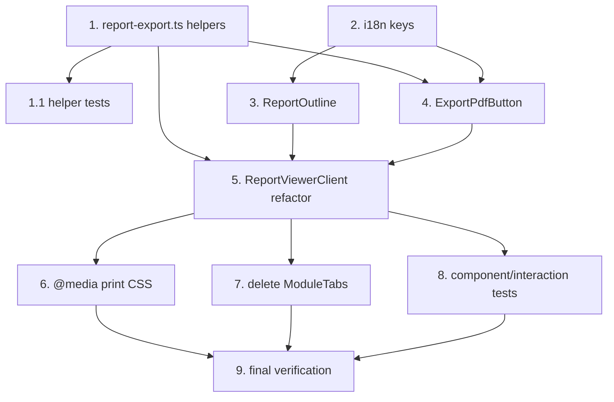

# Implementation Plan

## Overview

Presentational refactor of the report viewer at `/reports/[id]` from a tab-switch model
(one module mounted) to a Quip-style three-zone reading layout (sticky outline + all
modules mounted as anchored sections), plus a full-report Export PDF via `window.print()`.
Client-side only — no data layer, loader, Supabase, API, or schema changes.

Execution order respects dependencies: pure helpers + tests → i18n → components → viewer
wiring → print CSS → cleanup → final verification.

## Task Dependency Graph



Parallelizable: tasks 1 and 2 are independent; tasks 3 and 4 are independent of each other
(both depend only on task 2 / task 1).

```json
{
  "waves": [
    { "wave": 1, "tasks": ["1", "2"] },
    { "wave": 2, "tasks": ["1.1", "3", "4"] },
    { "wave": 3, "tasks": ["5"] },
    { "wave": 4, "tasks": ["6", "7", "8"] },
    { "wave": 5, "tasks": ["9"] }
  ]
}
```

## Tasks

- [ ] 1. Pure-helper lib (`src/lib/report-export.ts`)
  - Create `deriveSections(modules: { title: string }[]): Section[]` returning one
    `{ id: \`module-${i}\`, title }` per module in index order; export the `Section` type.
  - Create `deriveFilenameBase({ title, dateRange, reportId }): string` — strip
    Windows/macOS-illegal chars (`\ / : * ? " < > |` + ASCII control), collapse whitespace,
    trim, cap length; fall back to `reportId` when the title-derived result is empty.
  - Create `canExport(status: string, isAdmin: boolean): boolean` returning
    `status === 'published'` (draft/admin export out of scope — matches EmailReportButton).
  - _Requirements: 6.1, 9.1, 9.2, 9.3, 11.1_

- [ ] 1.1 Property + unit tests for the helpers (`src/lib/__tests__/report-export.test.ts`)
  - Property 1 (fast-check, ≥100 iters): for random module arrays (0–6, incl. empty/zh/unicode
    titles), `deriveSections` preserves length + order and yields `id === \`module-${i}\``.
    Tag: `// Feature: report-view-ui-and-pdf-export, Property 1: Section derivation is complete and order-preserving`
  - Property 2 (fast-check, ≥100 iters): for random `title`/`dateRange` + non-empty `reportId`,
    `deriveFilenameBase` is non-empty, contains none of `\ / : * ? " < > |` nor ASCII control
    chars, and a blank title yields an id-derived value.
    Tag: `// Feature: report-view-ui-and-pdf-export, Property 2: Derived filename base is cross-OS-safe and never empty`
  - `canExport` truth table: `{published, draft, other} × {isAdmin true/false}` → expected bool.
  - _Requirements: 6.1, 9.1, 9.2, 9.3, 11.1_

- [ ] 2. i18n keys (`src/locales/en.ts`, `src/locales/zh.ts`)
  - Add under the existing `report` group: `outline.label` (Sections / 目录),
    `export.button` (Export PDF / 导出 PDF), `export.preparing` (Preparing… / 准备中…),
    `export.error` (failure message, both languages).
  - _Requirements: 4.3, 5.2, 10.3_

- [ ] 3. `ReportOutline` component (`src/components/report/ReportOutline.tsx`)
  - Props `{ sections: Section[] }`. Desktop: sticky sidebar (`top-[76px]`,
    `max-h-[calc(100vh-96px)]`, `overflow-y-auto`), one clickable entry per section
    (rank number + title), `t('report.outline.label')` heading.
  - Active state = `border-l-2 border-primary` + `bg-primary-soft` (2px primary, carried from
    ModuleTabs). Click → `getElementById(id)?.scrollIntoView({ behavior: 'smooth' })`.
  - Scroll-spy: `IntersectionObserver` in `useEffect` (rootMargin `'-76px 0px -65% 0px'`,
    threshold 0), null-guard each target, set internal `activeId`, disconnect on unmount.
  - Mobile (`lg:hidden`): sticky `top-14` native `<select>` bound to `activeId`; `onChange`
    → scrollIntoView (native select self-collapses, satisfying R4.8).
  - _Requirements: 2.1, 2.4, 2.5, 4.1, 4.2, 4.3, 4.5, 4.6, 4.7, 4.8_

- [ ] 4. `ExportPdfButton` component (`src/components/report/ExportPdfButton.tsx`)
  - Props `{ filenameBase: string }`. Render design-system `outline` button (never `primary`),
    lucide `Printer` icon, label `t('report.export.button')`.
  - Click: if `isExporting` return; set busy; save `document.title`; set
    `document.title = filenameBase`; call `window.print()`. On throw: restore title, clear
    busy, show `t('report.export.error')`.
  - `useEffect` registers `afterprint` → restore title + clear busy (covers save AND cancel);
    `beforeprint` is a defensive no-op hook.
  - _Requirements: 5.1, 5.2, 5.3, 5.4, 9.1, 9.4, 10.1, 10.2, 10.3, 12.1, 12.2_

- [ ] 5. Refactor `ReportViewerClient.tsx` to the quip layout
  - Remove `activeTab`/`setActiveTab`/`activeModule` state and the `ModuleTabs` import/usage
    and the `void router` placeholder.
  - Derive `sections` once via `useMemo(() => deriveSections(modules), [modules])`.
  - Header (non-sticky): `h1` displayTitle, type `Badge`, dateRange, `<ExportPdfButton
    filenameBase={deriveFilenameBase(...)}/>` gated by `canExport(report.status, isAdmin)`,
    and the existing `<EmailReportButton/>`.
  - Render `{sections.length > 1 && <ReportOutline sections={sections} />}` and a `main`
    grid; body `modules.map((m,i) => <section id={\`module-${i}\`} className="scroll-mt-[76px]">`
    wrapping a per-section `ErrorBoundary` + `<ReportRenderer module={m} moduleIndex={i}
    categoryResolutionByModule={categoryResolutionByModule}/>`.
  - Append a closing `<DisclaimerBanner className="print-only mt-8" />` after the section list.
  - Preserve: `categoryResolutionByModule` memo, `parseTopTopicRank`, `ErrorBoundary` class,
    the outer `renderError` JSON fallback, and the 0-module raw-data fallback.
  - _Requirements: 1.1, 1.2, 1.3, 1.4, 1.5, 2.2, 2.3, 2.6, 3.1, 4.4, 6.1, 6.2, 6.3, 6.4, 6.5, 6.6, 6.7, 7.1, 7.2, 7.3, 7.4_

- [ ] 6. Extend the `@media print` block (`src/app/globals.css`)
  - Hide the sidebar outline + mobile dropdown (give them `.no-print` plus explicit selectors).
  - Collapse the two-column grid to one column; remove container `max-width`/padding so
    sections flow full-bleed top-to-bottom in document order.
  - `page-break-inside: avoid` on module section cards and on `tr` (TopTopics + GFM tables).
  - `print-color-adjust: exact` / `-webkit-print-color-adjust: exact` so badge + callout tinted
    backgrounds survive print.
  - Reset `scroll-margin-top: 0` in print; add a `.print-only` rule (hidden on screen, shown in
    print) for the closing `DisclaimerBanner`.
  - _Requirements: 6.6, 6.7, 8.1, 8.2, 8.3, 8.4, 8.5_

- [ ] 7. Delete `ModuleTabs` (`src/components/report/ModuleTabs.tsx`)
  - Verify no importer remains (only the viewer used it), then delete the file.
  - _Requirements: 2.1_

- [ ] 8. Component/interaction tests (`src/components/report/__tests__/`)
  - ExportPdfButton (window.print mocked): click sets busy + calls print once; second click
    during busy is ignored; `document.title` set on click and restored on `afterprint`; a
    throwing print shows error + restores title + re-enables.
  - Header presence: title, type badge, dateRange, outline-variant export button with Printer
    icon + `t('report.export.button')`, and no `primary` button.
  - Layout gating: 0 modules → empty fallback, no outline; 1 module → section but no outline;
    ≥2 modules → outline with one entry per module.
  - Closing disclaimer present in body and not `.no-print`.
  - Scroll-spy/scroll-jump wiring with mocked IntersectionObserver / scrollIntoView where RTL
    allows; full behavior verified manually.
  - _Requirements: 2.6, 5.1, 5.2, 5.4, 6.6, 10.1, 10.2, 10.3_

- [ ] 9. Final verification
  - Run `npm test`, `npm run build`, and `getDiagnostics` on all changed files — all green.
  - Walk the manual print checklist from design.md against a multi-module published report in
    both zh and en: all modules present + in order, TopTopics severity badges colored,
    callouts with icons + tinted bg, disclaimer present as closing notice, chrome hidden,
    table rows unbroken, Chinese line height preserved, filename reflects title+dateRange and
    tab title restored after the dialog.
  - _Requirements: 6.1, 6.2, 6.6, 6.7, 8.1, 8.3, 8.4, 8.5, 9.1, 9.4_

## Notes

- Scope is a client-side presentational refactor; no migration, API, or loader change.
- `canExport` is fixed to `status === 'published'` (R11 resolved — no draft/admin export).
- `ReportRenderer` / `MarkdownRenderer` / `TopTopicsTable` / `DisclaimerBanner` are reused
  unchanged; the refactor calls `ReportRenderer` once per module instead of once per tab.
- Property tests use fast-check (≥100 iterations) with the exact Feature/Property tags above.
