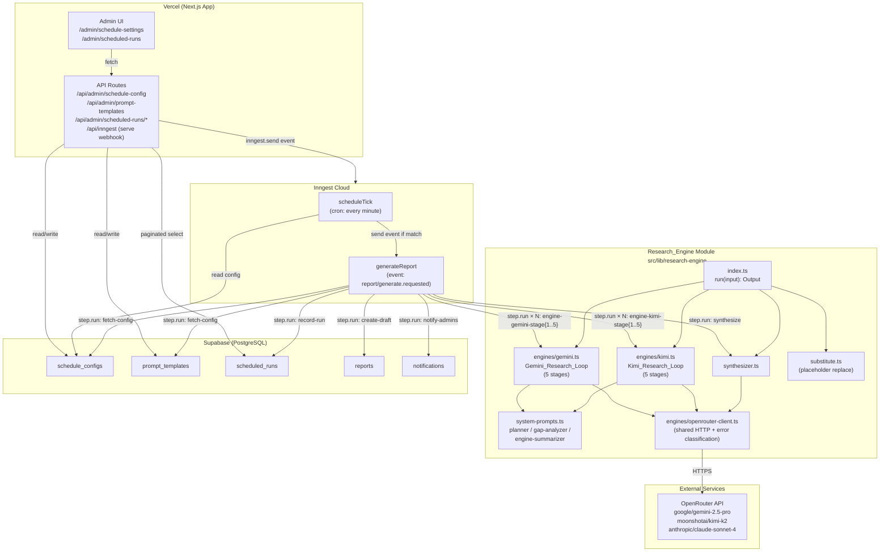
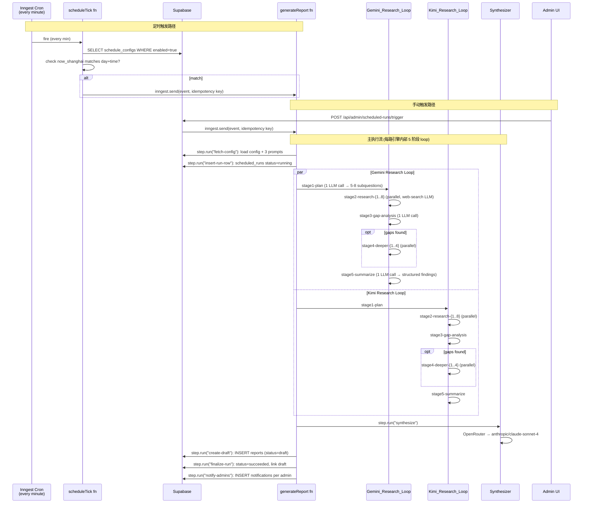
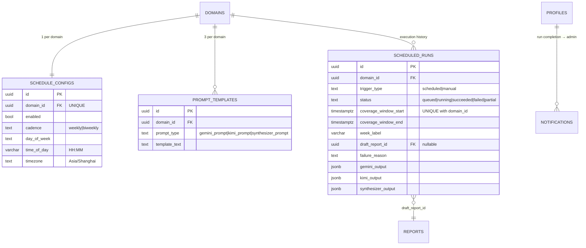

# 设计文档：定时自动生成常规雷达报告 (Scheduled Regular Report Generation)

## 概述 (Overview)

本功能为雷达报告平台增加一个定时/手动触发的双引擎 AI 研究管线，自动生成"账户健康"领域的每周/双周常规雷达报告草稿。整体架构围绕三个关键决策展开：

1. **执行环境分离**：Inngest Cloud 承担调度 + 长耗时执行，Vercel 只承担路由/事件入队 + webhook 接收。这样绕开 Vercel Hobby tier 的 10 秒 Serverless 执行上限，保持免费层。
2. **可复用的研究引擎内核**：`Research_Engine` 是一个纯 async 函数，输入 `{coverage_window, domain_name, 3 prompts}`，输出 `{content, engine_outputs, errors}`。它不感知 `reports` 表、`scheduled_runs` 表、通知系统、Inngest —— 所以未来 "topic-specific deep-dive" 功能可以无改动地复用。
3. **双引擎 × 3 轮 Agentic Deep Research Loop**：每一路引擎不是单次 LLM 调用，而是一个 5 阶段的 agentic 研究循环 (`Gemini_Research_Loop` / `Kimi_Research_Loop`) —— 规划 → 并行研究 → 差距分析 → 深化研究（可选）→ 引擎摘要。这是因为基础 Gemini 2.5 Pro / Kimi K2 的单次调用质量不及 native Deep Research，但通过多轮自我驱动的子问题分解 + 并行 web-search 调用 + 缺口回补，可以在可控成本下逼近 Deep Research 级别的输出质量（经验值 ~80% 质量、~15% 成本）。两路 loop 顶层并行，每路内部 Stage 2/4 的 researcher 也并行。最终 Synthesizer (Claude/GPT-4o 级) 合并两路输出、去重、打置信度标签、产出 `ReportContent`。

已发布的 `/api/reports/[id]/publish` 路径 (含 translate / topic-extract / hot-news) 不变，也不会被本 feature 调用 —— Admin 必须手动发布才会触发下游。

### 设计决策

1. **Inngest Cloud + Vercel Integration**：用户已完成 Inngest ↔ Vercel 集成，`INNGEST_EVENT_KEY` 和 `INNGEST_SIGNING_KEY` 自动注入到 Production + Preview 环境。Vercel 侧的 `/api/inngest` 路由使用 `inngest/next` 的 `serve()` helper 暴露 webhook；所有 `step.run` 调用在 Inngest Cloud 上执行，不受 Vercel 执行时间限制。
2. **Cron 触发源**：Inngest cron 语法 `{ cron: "TZ=Asia/Shanghai 0 9 * * 1" }` 原生支持时区。但 V1 的 `day_of_week` 和 `time_of_day` 是 Admin 可编辑的 —— 不能硬编码 cron 表达式。解决方案：注册一个**每分钟触发一次的 tick 函数**，tick 时读取 `Schedule_Config`，判断当前 Asia/Shanghai 分钟是否匹配 `day_of_week × time_of_day`，匹配则 `inngest.send('report/generate.requested')`。这样 Admin 改配置立即生效，不需要重新部署。额外成本是每分钟 1 次轻量 DB 查询 —— 在 Inngest 免费层 (50K steps/月) 额度内。*替代方案是动态重注册 cron，但会把调度复杂度留给 Inngest SDK，脆弱性更高，V1 不选。*
3. **幂等性**：用 Inngest 原生 `idempotency` 选项 + DB unique index 双保险。事件 key 为 `report-gen:{domain_id}:{coverage_window_start_iso}`；`scheduled_runs` 表对 `(domain_id, coverage_window_start)` 加唯一索引。
4. **每个 loop 阶段独立 `step.run` + `Promise.all` 并行 fan-out**：不采用"单个协调 step 里跑 Promise.all"。每个引擎 loop 的 5 个阶段（planner / N 个 researcher / gap-analyzer / M 个 deeper / summarizer）各自是一个 `step.run`；Stage 2 和 Stage 4 的多 researcher 并行调用通过 `await Promise.all([step.run(...), ...])` 实现。原因：① Inngest 对每个 step 独立重试 + 独立 observability，若某个 researcher sub-question 失败只重试它一个；② 若把整轮研究塞进一个 step，任何一个子调用失败都会让整轮重跑，既浪费额度也污染 trace。两路引擎 loop 顶层也是独立 step.run + `Promise.all`。
5. **Synthesizer 复用现有 block 分类 prompt**：`src/app/api/ai/format-report/route.ts` 里已有一套成熟的 8-block-type 分类指令 (heading/narrative/insight/quote/stat/warning/recommendation/list)。Synthesizer prompt 原样复用这段分类指令，确保草稿 JSON 结构和现有 `ReportRenderer` 完全兼容。
6. **OpenRouter 统一网关 + 用 agentic loop 逼近 Deep Research**：Gemini + Kimi + Synthesizer 都通过 OpenRouter 调用，密钥只保存一个 `OPENROUTER_API_KEY` (已配)。好处是未来切换模型只改 `model` 字段 + prompt。代价是基础 `google/gemini-2.5-pro` 和 `moonshotai/kimi-k2` 的**单次调用**质量不及 native Gemini Deep Research / native Kimi Explore。**补偿方案是在每一路引擎内部运行一个 3 轮 agentic 研究循环**（见【组件与接口 § Research_Engine】），通过规划 + 并行研究 + 差距回补把同一个基础模型榨出接近 Deep Research 的推理深度。用户的明确选择：*"我可以用 Gemini 2.5 PRO 但我觉得需要能自动多轮对话 才能拿到我高质量的 report"*。
7. **失败时产出 Skeleton_Draft**：哪怕双引擎全炸，系统也插入一份只有 4 个模块标题 + 空 `blocks` 数组的草稿。这样 Admin 至少有个起点可以手动录入，不丢整个周期。
8. **Admin 可编辑 prompt 数量保持为 3**：不把 loop 内 4 个系统 prompt（planner / researcher / gap-analyzer / engine-summarizer）全部暴露给 Admin UI。Admin 只编辑**每路引擎的 researcher prompt**（即 `gemini_prompt` / `kimi_prompt`，这是决定研究深度和输出格式的关键）+ synthesizer prompt，共 3 个 DB-backed 模板。planner / gap-analyzer / engine-summarizer 是**系统 owned** 的模板，硬编码在 `research-engine/system-prompts.ts` 中，用 `{channel_profile}` 占位符区分 Gemini 与 Kimi 两路。好处：① UI 不膨胀到 8 个字段；② Admin 不会无意间打破 loop 的结构性 contract（比如删掉 gap-analyzer 的 JSON schema 指令）；③ 未来若需精调系统 prompt，走代码发布即可。

## 架构 (Architecture)



### 触发流程 (Sequence)



## 组件与接口 (Components and Interfaces)

### 1. Research_Engine 模块 (可复用内核)

**位置**：`src/lib/research-engine/`

```
src/lib/research-engine/
├── index.ts                 # exports run() + types
├── types.ts                 # ResearchEngineInput / ResearchEngineOutput + per-stage trace types
├── substitute.ts            # safe placeholder string replacement (no eval)
├── system-prompts.ts        # NEW: hardcoded planner / gap-analyzer / engine-summarizer templates
│                            #      with {channel_profile} placeholder for Gemini vs Kimi channels
├── engines/
│   ├── gemini.ts            # runGeminiLoop(input, stageRunner) — orchestrates 5 stages for Gemini
│   ├── kimi.ts              # runKimiLoop(input, stageRunner)   — same shape for Kimi
│   └── openrouter-client.ts # shared OpenRouter HTTP helper + retry-aware error classification
└── synthesizer.ts           # synthesize(gemLoop, kimiLoop, prompt) -> ReportContent | null
```

**5 阶段 Agentic Loop（每一路引擎内部）**：

| Stage | 调用数 | 作用 | 输入 | 输出 |
|---|---|---|---|---|
| **1. Planner** | 1 | 拆解研究目标为具体子问题 | coverage_window + 4 AHS 模块 + 渠道画像 | JSON: 5–8 个子问题 + 每条的 search_intent |
| **2. Researcher (parallel)** | N (=planner 产出数，通常 5–8) | 逐条回答子问题，web-search enabled | 单个子问题 + channel_profile + admin 可编辑的 researcher prompt | `{findings: [...], citations: [url, ...]}` |
| **3. Gap Analyzer** | 1 | 评估覆盖是否充分，列出遗漏 | Stage 2 的全部 findings | JSON: `{sufficient: bool, gaps: [...]}` (gaps ≤ `maxGapSubquestions`) |
| **4. Deeper Research (conditional, parallel)** | M (=gaps 数，通常 0–4) | 回补 Stage 3 指出的缺口 | 单个 gap 子问题 + channel_profile + researcher prompt | 同 Stage 2 输出 |
| **5. Engine Summarizer** | 1 | 汇总为结构化 findings 块 | Stage 2 + Stage 4 的全部 findings | JSON: 按 4 个 AHS 模块组织的 findings + 保留原始 citation URLs |

**单路 loop 调用预算**：`1 + N + 1 + M + 1 = 8 + 2` max = **15** (N=8, M=4)；no-gap path = **11**。
**整个 `generateReport` run 的 LLM 调用总预算**：Gemini loop (~11–15) + Kimi loop (~11–15) + Synthesizer (1) = **23–31 calls**。

**"3 rounds" 的确切含义**：plan (round 1) → 初始研究 (round 2) → （可选）深化研究 (round 3)。Gap analysis 每路引擎**最多触发一次**，没有递归；循环终止由 `maxSubquestionsPerRound + maxGapSubquestions` 静态上界保障（见 Property 27）。

**签名 (满足 Requirement 14.1)**：

```typescript
// src/lib/research-engine/types.ts
import type { ReportContent } from '@/types/report';

export interface ResearchEngineInput {
  coverageWindow: { startIso: string; endIso: string; weekLabel: string };
  domainName: string;
  geminiPrompt: string;                 // admin-editable researcher prompt for Gemini
  kimiPrompt: string;                   // admin-editable researcher prompt for Kimi
  synthesizerPrompt: string;            // admin-editable synthesizer prompt
  openRouterApiKey: string;
  engineTimeoutMs?: number;             // default 5 * 60 * 1000 (loop-wide soft cap, informational)
  synthTimeoutMs?: number;              // default 3 * 60 * 1000
  maxSubquestionsPerRound?: number;     // default 8  (Stage 1 output ceiling)
  maxGapSubquestions?: number;          // default 4  (Stage 3 output ceiling)
}

export type EngineErrorClass =
  | 'TimeoutError'
  | 'CreditsExhausted'
  | 'RateLimited'
  | 'ServerError'
  | 'MalformedResponse'
  | 'NetworkError';

export type LoopStage =
  | 'planner'
  | 'researcher'
  | 'gap-analyzer'
  | 'deeper-researcher'
  | 'engine-summarizer';

export interface EngineError {
  engine: 'gemini' | 'kimi' | 'synthesizer';
  stage?: LoopStage;                    // stage at which error occurred (for failure_reason formatting)
  subquestionIndex?: number;            // e.g., "researcher subq #3"
  errorClass: EngineErrorClass;
  message: string;
  httpStatus?: number;
}

// Per-stage traces — these are what /admin/scheduled-runs/:id "View Logs" renders.
export interface EngineLoopTrace {
  plan: unknown | null;
  researchRound1: Array<{ subquestion: string; findings: unknown }>;
  gapAnalysis: unknown | null;
  researchRound2: Array<{ subquestion: string; findings: unknown }>;
  summary: unknown | null;
}

export interface ResearchEngineOutput {
  content: ReportContent | null;
  engineOutputs: {
    gemini: EngineLoopTrace | null;
    kimi: EngineLoopTrace | null;
    synthesizer: unknown | null;
  };
  errors: EngineError[];
}

// src/lib/research-engine/index.ts
export async function run(input: ResearchEngineInput): Promise<ResearchEngineOutput>;
```

**关键实现点**：

- **`substitute.ts`** 使用 `String.prototype.replace` 的**函数形式** + 白名单 (`start_date`, `end_date`, `week_label`, `domain_name`, `gemini_output`, `kimi_output`, `subquestion`, `channel_profile`) —— **不使用** `eval` / `new Function` / template literal execution。新增 `subquestion` 和 `channel_profile` 两个 token 以支持 loop 内部的 prompt 组装。
- **`system-prompts.ts`**（**系统 owned，不在 DB 中**）定义 3 个模板常量：`PLANNER_PROMPT`、`GAP_ANALYZER_PROMPT`、`ENGINE_SUMMARIZER_PROMPT`，均使用 `{channel_profile}` 占位符由 `engines/gemini.ts` 或 `engines/kimi.ts` 注入不同渠道指令。这样两路共享 loop 骨架、各自注入渠道画像（Gemini 侧 = Reddit/英文跨境/Google-indexed 中文论坛/Amazon 官方；Kimi 侧 = 小红书/抖音/知无不言/卖家之家/微信公众号）。
- **`engines/gemini.ts` 和 `engines/kimi.ts`** 导出 `runGeminiLoop` / `runKimiLoop`。每个函数接受 `(input, stageRunner)`，其中 `stageRunner` 是一个由调用方注入的 `<T>(stageName: string, fn: () => Promise<T>) => Promise<T>` 回调。这样 Inngest `generateReport` 可以把 `step.run` 透传给 loop 内部，使每个 stage 成为独立重试单元；而测试时可以注入一个直接执行的 stub（保持 Research_Engine 对 Inngest 的零依赖 —— Requirement 14.2）。
- **`engines/openrouter-client.ts`** 是 Gemini / Kimi / Synthesizer 三方共用的 HTTP helper（替代原设计中 engine 文件内嵌的私有 helper），因为现在每个 loop 内部有 5+ 次 HTTP 调用，把客户端抽出独立模块避免重复 + 统一错误分类。
- **错误分类逻辑**（同原设计，未变化）：
  - HTTP 402 → `CreditsExhausted` (在 `message` 里写入 `"OpenRouter credits exhausted"` 字面量)
  - HTTP 429 → `RateLimited`
  - HTTP 5xx → `ServerError`
  - `AbortError` / timeout → `TimeoutError`
  - JSON parse 失败 → `MalformedResponse`
  - 其他 fetch 抛错 → `NetworkError`
  - **新**：错误记录时会填充 `stage` 和 `subquestionIndex` 字段，便于 `failure_reason` 格式化（例如 `"Gemini: TimeoutError (stage: researcher subq #3)"`）。
- **双引擎并行 + 部分成功**：`run()` 顶层使用 `Promise.allSettled([runGeminiLoop, runKimiLoop])`；取结果后：
  - 两路 loop 都产出 non-null `summary` → 调用 synthesizer，label 由 synthesizer 按两侧覆盖情况决定
  - 只有一路 loop 成功 → 调用 synthesizer，把 null 的那路以字符串 `"null (engine failed)"` 代入模板；所有 block 标记 `"Needs Verification · 1/2 sources"`
  - 两路都失败 → 不调用 synthesizer，`content: null`，errors 数组记录双方错误
- **Stage 级部分失败策略**：在单路 loop 内部，Stage 2（或 Stage 4）的某个并行 researcher 子调用如果耗尽重试仍失败，**不让整路 loop 失败**——该子问题的 findings 记录为 `null` 并进入 errors 数组，Stage 5 summarizer 看到部分 null 时按 prompt 指令忽略空位继续汇总。这让单点失败不会污染整路。Planner / gap-analyzer / engine-summarizer 这 3 个枢纽 stage 失败则整路 loop 失败（返回 error）。
- **循环终止保障**：`run()` 不对 gap-analyzer 的输出做递归——gap 分析后产生的 deeper research 完成即进入 Stage 5，**不会再触发第二轮 gap analysis**。这让每路 loop 的 researcher 调用数严格 ≤ `maxSubquestionsPerRound + maxGapSubquestions`（Property 27）。
- **Citation 传递**：researcher 阶段的输出包含 `citations: URL[]`；engine-summarizer 的 system prompt 强制要求把所有 citation URL 按 findings 组织并在输出 JSON 里保留原始 URL；synthesizer prompt 也包含"保留 citations"指令。（Property 29）
- **导入隔离 (Requirement 14.2)**：`src/lib/research-engine/` 下的所有文件**不得** import：
  - `@/lib/supabase/*`
  - `@/types/database`
  - `inngest` / `inngest/next`
  - 任何 `scheduled_runs` / `notifications` / `schedule_configs` / `prompt_templates` 相关的业务代码
  - 允许 import：`@/types/report` (仅为 `ReportContent` 类型)、Node 内置、标准 fetch
  - Stage-level step 注入通过回调参数传入，模块自身不 import `inngest`
  - 通过单元测试静态解析 import graph 验证

### 2. Inngest Functions (`src/lib/inngest/`)

**位置**：`src/lib/inngest/`

```
src/lib/inngest/
├── client.ts              # new Inngest({ id: "radar-report-platform" })
├── functions/
│   ├── schedule-tick.ts   # every-minute cron
│   └── generate-report.ts # main orchestrator
└── index.ts               # exports array of functions for serve()
```

#### `schedule-tick.ts`

```typescript
export const scheduleTick = inngest.createFunction(
  { id: 'schedule-tick', retries: 0 },
  { cron: 'TZ=Asia/Shanghai * * * * *' }, // every minute, Shanghai time
  async ({ step }) => {
    const configs = await step.run('fetch-enabled-configs', async () => {
      // SELECT * FROM schedule_configs WHERE enabled = true
      return fetchEnabledSchedules();
    });

    const nowShanghai = toShanghai(new Date());
    for (const config of configs) {
      if (shouldFire(config, nowShanghai)) {
        const coverageWindow = computeCoverageWindow(nowShanghai, config.cadence);
        await step.sendEvent('enqueue-generate', {
          name: 'report/generate.requested',
          data: {
            domainId: config.domain_id,
            triggerType: 'scheduled',
            coverageWindowStart: coverageWindow.startIso,
            coverageWindowEnd: coverageWindow.endIso,
            weekLabel: coverageWindow.weekLabel,
          },
        });
      }
    }
  }
);
```

**注意**：Inngest cron `* * * * *` 在 Shanghai 时区 = 每分钟一次。这只是一个廉价的 "tick"，不做任何昂贵操作；`shouldFire` 在当前分钟与 `day_of_week × time_of_day` 精确匹配时才返回 true。幂等性由 `generate-report` 函数的 `idempotency` 选项保证，即便 `shouldFire` 在同一分钟多次返回 true 也只会执行一次。

#### `generate-report.ts` (核心)

```typescript
export const generateReport = inngest.createFunction(
  {
    id: 'generate-report',
    retries: 0,                       // retries per step, not per function
    idempotency: 'event.data.domainId + "-" + event.data.coverageWindowStart',
    concurrency: { limit: 5 },        // parallel run safety valve
  },
  { event: 'report/generate.requested' },
  async ({ event, step }) => {
    const { domainId, triggerType, coverageWindowStart, coverageWindowEnd, weekLabel } = event.data;

    // ── Step 1: Insert scheduled_runs row with status=running ──
    // Also enforces DB unique index (domain_id, coverage_window_start) → duplicate insert raises.
    const runId = await step.run('insert-run-row', async () => {
      return insertScheduledRun({
        domain_id: domainId,
        trigger_type: triggerType,
        coverage_window_start: coverageWindowStart,
        coverage_window_end: coverageWindowEnd,
        week_label: weekLabel,
        status: 'running',
      });
    });

    // ── Step 2: Fetch config + 3 admin-editable prompts ──
    const { domainName, geminiPrompt, kimiPrompt, synthesizerPrompt } = await step.run(
      'fetch-config',
      async () => fetchDomainAndPrompts(domainId)
    );

    // ── Step 3 & 4: Run both engine loops in parallel at the top level ──
    // Each engine loop internally dispatches 5 stages, each as its own step.run.
    // The loop orchestrator accepts a `stageRunner` callback; we bind it to step.run here
    // so each stage becomes an independently retried/traced Inngest step, while the
    // research-engine module stays free of inngest imports (Requirement 14.2).
    const makeStageRunner = (engine: 'gemini' | 'kimi') =>
      async <T>(stage: string, opts: StepOpts, fn: () => Promise<T>): Promise<T> =>
        step.run(`engine-${engine}-${stage}`, opts, fn);

    const [geminiLoop, kimiLoop] = await Promise.all([
      runGeminiLoop(
        { geminiPrompt, coverageWindowStart, coverageWindowEnd, weekLabel, domainName,
          openRouterApiKey: process.env.OPENROUTER_API_KEY!, maxSubquestionsPerRound: 8, maxGapSubquestions: 4 },
        makeStageRunner('gemini')
      ),
      runKimiLoop(
        { kimiPrompt, coverageWindowStart, coverageWindowEnd, weekLabel, domainName,
          openRouterApiKey: process.env.OPENROUTER_API_KEY!, maxSubquestionsPerRound: 8, maxGapSubquestions: 4 },
        makeStageRunner('kimi')
      ),
    ]);
    // Internally each loop dispatches (step names below are what shows up in Inngest UI):
    //   engine-{gemini|kimi}-stage1-plan
    //   engine-{gemini|kimi}-stage2-research-{1..N}        ← parallel via Promise.all(step.run)
    //   engine-{gemini|kimi}-stage3-gap-analysis
    //   engine-{gemini|kimi}-stage4-deeper-{1..M}          ← conditional + parallel
    //   engine-{gemini|kimi}-stage5-summarize

    // ── Step 5: Synthesize (only if ≥1 engine loop produced a summary) ──
    let content: ReportContent | null = null;
    let synthError: EngineError | null = null;
    if (geminiLoop.summary || kimiLoop.summary) {
      const synth = await step.run('synthesize', { timeout: '3m', retries: 1 }, async () => {
        return callSynthesizer({
          prompt: substitutePromptVars(synthesizerPrompt, {
            gemini_output: geminiLoop.summary ? JSON.stringify(geminiLoop.summary) : 'null (engine failed)',
            kimi_output:   kimiLoop.summary   ? JSON.stringify(kimiLoop.summary)   : 'null (engine failed)',
            week_label: weekLabel,
            start_date: coverageWindowStart,
            end_date:   coverageWindowEnd,
          }),
        });
      });
      content = synth.ok ? synth.data : null;
      if (!synth.ok) synthError = synth.error;
    }

    // ── Step 6: Create draft (Skeleton_Draft if content null) ──
    const draftId = await step.run('create-draft', async () => {
      const finalContent = content ?? buildSkeletonDraft(weekLabel, coverageWindowStart, coverageWindowEnd);
      return insertDraftReport({
        domain_id: domainId,
        type: 'regular',
        week_label: weekLabel,
        date_range: `${coverageWindowStart} ~ ${coverageWindowEnd}`,
        status: 'draft',
        content: finalContent,
      });
    });

    // ── Step 7: Update scheduled_runs with final status + persist full loop traces ──
    const finalStatus = determineStatus(geminiLoop, kimiLoop, synthError, content);
    await step.run('finalize-run', async () => {
      return updateScheduledRun(runId, {
        status: finalStatus,                          // 'succeeded' | 'failed' | 'partial'
        draft_report_id: draftId,
        failure_reason: buildFailureReason(geminiLoop.errors, kimiLoop.errors, synthError),
        gemini_output: geminiLoop.trace,              // full EngineLoopTrace: plan + round1 + gapAnalysis + round2 + summary
        kimi_output:   kimiLoop.trace,                // same shape — this is what "View Logs" renders
        synthesizer_output: content,
      });
    });

    // ── Step 8: Notify admins (always, regardless of status) ──
    await step.run('notify-admins', async () => {
      return createAdminNotifications({
        runId,
        draftId,
        status: finalStatus,
        failureReason: buildFailureReason(geminiLoop.errors, kimiLoop.errors, synthError),
      });
    });
  }
);
```

**Step 命名规范 (全部 step names)**：

| Step | 作用 | 并行? | Timeout | Retries |
|---|---|---|---|---|
| `insert-run-row` | 插入 scheduled_runs | — | default | 3 (Inngest default) |
| `fetch-config` | 读取 domain + 3 prompts | — | default | 3 |
| `engine-{gemini\|kimi}-stage1-plan` | Planner LLM call | — | `2m` | `2` |
| `engine-{gemini\|kimi}-stage2-research-{n}` | 单个 researcher，n ∈ 1..8 | 是（Promise.all 内部 fan-out） | `4m` | `2` |
| `engine-{gemini\|kimi}-stage3-gap-analysis` | Gap analyzer | — | `2m` | `1` |
| `engine-{gemini\|kimi}-stage4-deeper-{n}` | 深化 researcher，n ∈ 1..4（仅在有 gap 时存在） | 是（Promise.all） | `4m` | `2` |
| `engine-{gemini\|kimi}-stage5-summarize` | Engine summarizer | — | `3m` | `1` |
| `synthesize` | 跨引擎合并 | — | `3m` | `1` |
| `create-draft` | 插入 reports 行 | — | default | 3 (idempotent 由唯一约束保障) |
| `finalize-run` | 更新 scheduled_runs | — | default | 3 |
| `notify-admins` | 创建通知 | — | default | 3 |

**总 step 数估算**：
- 单路引擎 no-gap path = 1 (plan) + 5–8 (researcher) + 1 (gap) + 0 (no deeper) + 1 (summarize) = **7–10 steps**
- 单路引擎 with-gap path = 上述 + 1–4 (deeper) = **8–14 steps**
- 双引擎 + orchestration = **~22–30 steps**（典型），**最坏 ~31 steps**

**超时与重试策略**：
- **Planner**（`stage1-plan`）：`timeout: '2m'`, `retries: 2`。输出结构化 JSON sub-question 列表；若结构化解析失败则走重试；Planner 失败 → 整路 loop 失败。
- **Researcher**（`stage2-research-{n}` / `stage4-deeper-{n}`）：`timeout: '4m'`, `retries: 2`。Web-search enabled 调用耗时最长；单个 sub-question 失败不会拖垮整路（见上文 "Stage 级部分失败策略"）。
- **Gap Analyzer**（`stage3-gap-analysis`）：`timeout: '2m'`, `retries: 1`。若失败，loop 降级为"只用 Stage 2 的结果"直接进入 Stage 5（视同 `sufficient: true`），不让 gap 判定本身成为致命故障。
- **Engine Summarizer**（`stage5-summarize`）：`timeout: '3m'`, `retries: 1`。Summarizer 失败 → 整路 loop 的 `summary` 为 null，上层 synthesizer 按单路失败处理。
- **Synthesizer**（`synthesize`）：`timeout: '3m'`, `retries: 1`。
- `insert-run-row` / `create-draft` / `finalize-run` / `notify-admins`: Inngest 默认（3 retries，idempotent 由 DB 唯一约束保障）。

**墙钟估算**：
- 单路引擎 loop 墙钟 ≈ 2m (plan) + 4m (round 1 parallel) + 2m (gap) + 4m (round 2 parallel, conditional) + 3m (summarize) ≈ **11–15m 上界**，**典型 ~4m**（Stage 2/4 parallel + 实际 LLM ~30–60s/call）
- 双引擎顶层并行 → 用户感知端到端 wall time **~5–8m**（典型），**最坏 ~15m**

**幂等性保障 (双保险)**：
1. `idempotency` option 在 Inngest 事件层去重 —— 1 分钟窗口内相同 key 的事件只跑一次函数实例。
2. `scheduled_runs (domain_id, coverage_window_start)` unique index —— 即便 Inngest 去重失败 (极端情况)，DB 插入第二次也会抛 `23505` 错误，函数在 step 1 就失败退出。

**Cron 选型说明**：Inngest 原生 cron 不支持"读取运行时配置决定时刻"，但支持 tick 模式。tick 开销：约 43K tick/月 (每分钟 × 30 天)，刚好在 Inngest 免费 50K steps/月 内。升级后的 generation 每次约 **30 steps**（见上文），weekly 节奏 ≈ 120 steps/月，月总 ≈ 43,120/50,000 —— 仍在免费层内，但若 Admin 把 cadence 改成比 weekly 更频繁、或开启第二个 domain，tick 基线 + 多次 generation 就会触顶。详细预算见【V1 限制】章节。

### 3. API Routes (Vercel)

所有 admin 路由统一的 authz 检查：在每个 handler 开头 `auth.getUser()` → 查 `profiles.role === 'admin'`，否则 403。

```
POST   /api/admin/schedule-config            # create/update schedule
GET    /api/admin/schedule-config            # read current schedule (by domain)
POST   /api/admin/prompt-templates           # upsert one of 3 templates
GET    /api/admin/prompt-templates           # list all 3 for a domain
POST   /api/admin/scheduled-runs/trigger     # manual trigger (enqueue Inngest event)
POST   /api/admin/scheduled-runs/:id/retry   # retry failed/partial run
GET    /api/admin/scheduled-runs             # paginated list
GET    /api/admin/scheduled-runs/:id         # detail (includes engine outputs)
POST   /api/inngest                          # Inngest webhook (via serve() from inngest/next)
```

**`/api/inngest/route.ts`**：

```typescript
import { serve } from 'inngest/next';
import { inngest } from '@/lib/inngest/client';
import { scheduleTick, generateReport } from '@/lib/inngest/functions';

export const { GET, POST, PUT } = serve({
  client: inngest,
  functions: [scheduleTick, generateReport],
});
```

**`POST /api/admin/scheduled-runs/trigger`** 关键逻辑：
```typescript
// 1. authz check
// 2. Load domain's Schedule_Config (only to get domain_id — does NOT require enabled=true per Req 4.5)
// 3. Compute coverage window from NOW
// 4. Check no queued/running run exists for (domain, window) → else 409
// 5. inngest.send('report/generate.requested', { ... triggerType: 'manual' })
// 6. Return { runId, queuedAt }
```

### 4. Admin UI

**页面 1：`/admin/schedule-settings`**

```
┌──────────────────────────────────────────────────────────────────┐
│  Schedule Settings                      [ ▶ Trigger Now ]  ◀── fixed top-right, click → confirmation modal
│                                                                  │
│  ── Cadence ────────────────────────────────────────────────  │
│  Domain: Account Health (V1 fixed)                              │
│  [✓] Enabled                                                     │
│  Cadence:   ( ) Weekly   (•) Biweekly                            │
│  Day of Week:   [ Monday ▼ ]                                     │
│  Time of Day:   [ 09:00 ] (Asia/Shanghai)                        │
│                            [ Save Cadence ]                      │
│  Next scheduled run: Mon 2026-04-27 09:00 Asia/Shanghai           │
│                                                                  │
│  ── Prompt Templates ───────────────────────────────────────  │
│  ▶ Gemini Prompt (English)   [ Reset to Default ]                │
│  ┌──────────────────────────────────────────────────────────┐   │
│  │ (large textarea, monospace, ~30 lines visible)           │   │
│  └──────────────────────────────────────────────────────────┘   │
│  Supported placeholders: {start_date} {end_date} {week_label}    │
│                          {domain_name}                           │
│                                  [ Save Gemini Prompt ]          │
│                                                                  │
│  ▶ Kimi Prompt (Chinese)   [ Reset to Default ]                  │
│  ┌──────────────────────────────────────────────────────────┐   │
│  │ (large textarea, ~30 lines visible)                       │   │
│  └──────────────────────────────────────────────────────────┘   │
│                                    [ Save Kimi Prompt ]          │
│                                                                  │
│  ▶ Synthesizer Prompt (meta)   [ Reset to Default ]              │
│  ┌──────────────────────────────────────────────────────────┐   │
│  │ (large textarea, ~40 lines visible)                       │   │
│  └──────────────────────────────────────────────────────────┘   │
│  Required: {gemini_output} and {kimi_output}                    │
│  (save blocked if either missing)                                │
│                                [ Save Synthesizer Prompt ]       │
└──────────────────────────────────────────────────────────────────┘
```

"Trigger Now" 流程：click → 确认 modal "Trigger a manual run for coverage window {computed_window}? This will run the dual-engine research pipeline now." → 确认 → `POST /api/admin/scheduled-runs/trigger` → toast "Run {short_id} queued. View on the runs page →"

**页面 2：`/admin/scheduled-runs`**

```
┌──────────────────────────────────────────────────────────────────────────────────┐
│  Scheduled Runs                                                                 │
│  ┌──────────┬──────────────────┬──────────┬──────────┬────────┬──────────┬───────┬──────────────┐ │
│  │ Run ID   │ Triggered At     │ Trigger  │ Status   │ Dur(s) │ Draft    │ Failure Reason  │ Actions     │ │
│  │          │ (Asia/Shanghai)  │          │          │        │          │                        │             │ │
│  ├──────────┼──────────────────┼──────────┼──────────┼────────┼──────────┼───────────────────────┼─────────────┤ │
│  │ a3f2…    │ 2026-04-27 09:00 │ scheduled│ succeeded│  142   │ [Draft ↗]│ —                     │ [View Logs] │ │
│  │ 8c91…    │ 2026-04-26 14:33 │ manual   │ partial  │   89   │ [Draft ↗]│ Kimi: TimeoutError    │ [View Logs][Retry] │ │
│  │ 4d72…    │ 2026-04-20 09:00 │ scheduled│ failed   │   12   │ —        │ OpenRouter credits…   │ [View Logs][Retry] │ │
│  └──────────┴──────────────────┴──────────┴──────────┴────────┴──────────┴───────────────────────┴─────────────┘ │
│                                              [ ← Prev ]  Page 1 of 3  [ Next → ] │
└──────────────────────────────────────────────────────────────────────────────────┘
```

点击 Run ID 或 "View Logs" 打开右侧 drawer (保持列表上下文)：

```
┌──────────────────────────────────────────┐
│  Run a3f2…  [ × close ]                  │
│  Triggered At: 2026-04-27 09:00 CST      │
│  Trigger Type: scheduled                 │
│  Status: succeeded                       │
│  Coverage Window: 2026-04-20 ~ 2026-04-26│
│  Week Label: 0420 to 0426                │
│  Duration: 142s                          │
│  Draft: [ Open draft in new tab ↗ ]      │
│  ── Gemini Output ──  [ Expand ▼ ]       │
│  ── Kimi Output ────  [ Expand ▼ ]       │
│  ── Synthesizer Output ──  [ Expand ▼ ]  │
│  ── Errors ────────                      │
└──────────────────────────────────────────┘
```

Navigation：Admin 导航增加两个链接 "Schedule Settings" → `/admin/schedule-settings`、"Scheduled Runs" → `/admin/scheduled-runs`。"Trigger Now" 只在 Schedule Settings 页出现 (dashboard 保持中性)。

## 数据模型 (Data Models)

### 新增表 DDL

```sql
-- 1. schedule_configs: 每个 domain 恰好 1 行
CREATE TABLE schedule_configs (
  id UUID PRIMARY KEY DEFAULT gen_random_uuid(),
  domain_id UUID NOT NULL UNIQUE REFERENCES domains(id) ON DELETE CASCADE,
  enabled BOOLEAN NOT NULL DEFAULT false,
  cadence TEXT NOT NULL DEFAULT 'biweekly' CHECK (cadence IN ('weekly', 'biweekly')),
  day_of_week TEXT NOT NULL DEFAULT 'monday' CHECK (day_of_week IN ('monday','tuesday','wednesday','thursday','friday','saturday','sunday')),
  time_of_day VARCHAR(5) NOT NULL DEFAULT '09:00' CHECK (time_of_day ~ '^(0[0-9]|1[0-9]|2[0-3]):[0-5][0-9]$'),
  timezone TEXT NOT NULL DEFAULT 'Asia/Shanghai',
  report_type TEXT NOT NULL DEFAULT 'regular' CHECK (report_type IN ('regular', 'topic')),
  created_at TIMESTAMPTZ NOT NULL DEFAULT now(),
  updated_at TIMESTAMPTZ NOT NULL DEFAULT now()
);

-- 2. prompt_templates: 每个 domain 3 行 (gemini_prompt / kimi_prompt / synthesizer_prompt)
CREATE TABLE prompt_templates (
  id UUID PRIMARY KEY DEFAULT gen_random_uuid(),
  domain_id UUID NOT NULL REFERENCES domains(id) ON DELETE CASCADE,
  prompt_type TEXT NOT NULL CHECK (prompt_type IN ('gemini_prompt', 'kimi_prompt', 'synthesizer_prompt')),
  template_text TEXT NOT NULL,
  created_at TIMESTAMPTZ NOT NULL DEFAULT now(),
  updated_at TIMESTAMPTZ NOT NULL DEFAULT now(),
  UNIQUE (domain_id, prompt_type)
);

-- 3. scheduled_runs: 每次执行的历史记录
CREATE TABLE scheduled_runs (
  id UUID PRIMARY KEY DEFAULT gen_random_uuid(),
  domain_id UUID NOT NULL REFERENCES domains(id) ON DELETE CASCADE,
  trigger_type TEXT NOT NULL CHECK (trigger_type IN ('scheduled', 'manual')),
  status TEXT NOT NULL DEFAULT 'queued' CHECK (status IN ('queued', 'running', 'succeeded', 'failed', 'partial')),
  coverage_window_start TIMESTAMPTZ NOT NULL,
  coverage_window_end TIMESTAMPTZ NOT NULL,
  week_label VARCHAR(20) NOT NULL,
  draft_report_id UUID REFERENCES reports(id) ON DELETE SET NULL,
  failure_reason TEXT,
  gemini_output JSONB,
  kimi_output JSONB,
  synthesizer_output JSONB,
  duration_ms INTEGER,
  triggered_at TIMESTAMPTZ NOT NULL DEFAULT now(),
  completed_at TIMESTAMPTZ
);

-- idempotency enforced at DB layer (double safety with Inngest's idempotency option)
-- Partial index: only 'queued' / 'running' / 'succeeded' rows occupy the slot.
-- 'failed' / 'partial' runs are free to be retried without DELETE — retry inserts a new row
-- for the same (domain_id, coverage_window_start), preserving the original failure log.
CREATE UNIQUE INDEX idx_scheduled_runs_idempotency
  ON scheduled_runs (domain_id, coverage_window_start)
  WHERE status IN ('queued', 'running', 'succeeded');

CREATE INDEX idx_scheduled_runs_domain_triggered ON scheduled_runs (domain_id, triggered_at DESC);
CREATE INDEX idx_scheduled_runs_status ON scheduled_runs (status);
```

### 新增表 RLS 策略

```sql
-- schedule_configs: admin 全权，team_member 零访问
ALTER TABLE schedule_configs ENABLE ROW LEVEL SECURITY;

CREATE POLICY "Admins full access to schedule_configs"
  ON schedule_configs FOR ALL
  USING (EXISTS (SELECT 1 FROM profiles WHERE id = auth.uid() AND role = 'admin'))
  WITH CHECK (EXISTS (SELECT 1 FROM profiles WHERE id = auth.uid() AND role = 'admin'));

-- prompt_templates: 同上
ALTER TABLE prompt_templates ENABLE ROW LEVEL SECURITY;

CREATE POLICY "Admins full access to prompt_templates"
  ON prompt_templates FOR ALL
  USING (EXISTS (SELECT 1 FROM profiles WHERE id = auth.uid() AND role = 'admin'))
  WITH CHECK (EXISTS (SELECT 1 FROM profiles WHERE id = auth.uid() AND role = 'admin'));

-- scheduled_runs: 同上
ALTER TABLE scheduled_runs ENABLE ROW LEVEL SECURITY;

CREATE POLICY "Admins full access to scheduled_runs"
  ON scheduled_runs FOR ALL
  USING (EXISTS (SELECT 1 FROM profiles WHERE id = auth.uid() AND role = 'admin'))
  WITH CHECK (EXISTS (SELECT 1 FROM profiles WHERE id = auth.uid() AND role = 'admin'));
```

注：Inngest function 运行时使用 **Supabase Service Role Key** 绕过 RLS 写入 `scheduled_runs` / `reports` / `notifications` —— service role 只在 Inngest server-side 代码中使用，永不暴露到客户端 (Requirement 13.1)。

### 默认 Prompt Seed Migration (`006_seed_prompt_templates.sql`)

3 条记录 —— `gemini_prompt`、`kimi_prompt`、`synthesizer_prompt` —— 对应 Account Health domain。内容见本文档附录 A (与本设计评审中已 approved 的默认模板一致)。

### ER 扩展



## 正确性属性 (Correctness Properties)

*属性 (Property) 是指在系统所有有效执行中都应成立的特征或行为 —— 本质上是对系统应做什么的形式化陈述。属性是人类可读规范与机器可验证正确性保证之间的桥梁。*

### Property 1: Schedule_Config 存储往返一致

*For any* 合法的 Schedule_Config 值，存储到 `schedule_configs` 后再查询返回的字段应与原始输入深度相等。

**Validates: Requirements 1.1, 1.3**

### Property 2: Schedule_Config 每域唯一

*For any* 对同一 domain 的多次 upsert 序列，`schedule_configs` 表中该 domain 的行数恒为 1。

**Validates: Requirements 1.2**

### Property 3: time_of_day 校验

*For any* 任意字符串 `s`，系统对 time_of_day 的接受判定应与正则 `/^(0\d|1\d|2[0-3]):[0-5]\d$/` 的匹配结果完全等价。

**Validates: Requirements 1.5**

### Property 4: shouldFire 纯函数正确性

*For any* Schedule_Config `c` 和任意 UTC 时间 `t`，`shouldFire(c, t)` 应当返回 true 当且仅当 `c.enabled === true` 且 `toShanghai(t)` 的 `day_of_week` 等于 `c.day_of_week` 且 `HH:MM` 等于 `c.time_of_day`。

**Validates: Requirements 1.6, 3.1, 12.1**

### Property 5: Coverage_Window 时区边界正确

*For any* Asia/Shanghai 触发时刻 `T`，`computeCoverageWindow(T, 'weekly')` 返回的 `start` 应为 `T` 所在自然周的**前一个周一 00:00 (Asia/Shanghai)**，`end` 应为**前一个周日 23:59 (Asia/Shanghai)**；对 `'biweekly'` 则 `end - start` 恰为 13 天 23 小时 59 分。

**Validates: Requirements 3.3, 12.1, 12.2**

### Property 6: Week_Label 格式与反向解析一致

*For any* Coverage_Window `{start, end}`，`computeWeekLabel` 返回的字符串应匹配 `/^\d{4} to \d{4}$/`；解析两个 MMDD 回到日期后，两者之差应等于 `end - start` 的天数 (weekly=6，biweekly=13)。

**Validates: Requirements 3.4, 12.2**

### Property 7: 幂等性 (双触发去重)

*For any* 对同一 `(domain_id, coverage_window_start)` 且当前已有状态 ∈ `{queued, running, succeeded}` 的 run 存在时，后续 N 次触发事件 (scheduled 或 manual) 尝试创建新 run 应被数据库唯一约束拒绝（最多 1 条活跃/成功 run）。**但**若当前唯一存在的 run 状态 ∈ `{failed, partial}`，则 retry 允许创建一条新 run（新 run 插入后若状态为 queued/running/succeeded，则占用该唯一槽位；原 failed/partial run 保留作为历史记录不被删除）。

**Validates: Requirements 3.5, 4.4, 9.5, 11.1, 11.2**

### Property 8: 幂等性 key 确定性 (Design-level)

*For any* 固定的 `(domain_id, coverage_window_start)`，Inngest 事件去重 key 的生成函数 `buildIdempotencyKey(domainId, startIso)` 应返回确定的字符串 (相同输入 → 相同输出，不依赖时钟、随机性、env)。

**Validates: (design invariant supporting Requirements 3.5, 11.1)**

### Property 9: Non-admin 访问拒绝

*For any* `role='team_member'` 的用户，对 `schedule_configs` / `prompt_templates` / `scheduled_runs` 的任意 SELECT/INSERT/UPDATE/DELETE 操作，RLS 应拒绝。

**Validates: Requirements 1.4, 2.6, 4.3, 9.6**

### Property 10: Synthesizer prompt 占位符强制校验

*For any* 待保存的 `synthesizer_prompt` 文本 `s`，保存应被接受当且仅当 `s.includes('{gemini_output}') && s.includes('{kimi_output}')`；否则表内现有值应保持不变。

**Validates: Requirements 2.4, PBT Property 15**

### Property 11: 占位符替换安全性

*For any* 模板字符串 `t` 和替换键值映射 `m`，`substitute(t, m)` 返回的字符串应：
(a) 包含 `m` 中每个值作为子串 (当对应 `{key}` 在 `t` 中出现时)
(b) 不含任何在白名单 `{start_date, end_date, week_label, domain_name, gemini_output, kimi_output}` 中但未被替换的 `{key}` 形式
(c) 不执行任何代码 (调用过程中不调用 `eval`、`new Function`、或任何动态求值)

**Validates: Requirements 5.2, 13.1**

### Property 12: Research_Engine 确定性 (mocked)

*For any* 固定的三元组 mock 响应 `(geminiResponse, kimiResponse, synthResponse)`，对 `run(input)` 的两次调用应返回结构深度相等的 `ResearchEngineOutput`。

**Validates: Requirements 5.7, 14.3, PBT Property 13**

### Property 13: Research_Engine 导入隔离

*For all* 文件 `f` 位于 `src/lib/research-engine/` 下，`f` 的静态 import graph 中不应包含 `@/lib/supabase/*`、`@/types/database`、`inngest`、`inngest/next`、或任何 `scheduled_runs` / `notifications` / `schedule_configs` / `prompt_templates` 业务模块。

**Validates: Requirements 14.2, PBT Property 14**

### Property 14: Confidence 标签完整性 (双引擎成功)

*For any* Synthesizer 成功返回的 `ReportContent` 且双方引擎都成功返回过 findings，每一个 `ContentBlock` 的 `label` 字段应属于集合 `{"High Confidence · 2/2 sources", "Needs Verification · 1/2 sources"}`。

**Validates: Requirements 5.5, PBT Property 8**

### Property 15: Confidence 标签单引擎降级

*For any* Synthesizer 成功返回的 `ReportContent` 且仅一方引擎成功 (另一方 null)，每一个 `ContentBlock` 的 `label` 字段恒为 `"Needs Verification · 1/2 sources"`。

**Validates: Requirements 5.6, PBT Property 9**

### Property 16: 模块结构不变量

*For any* 本 feature 创建的 `reports` 行 (包括 Skeleton_Draft)，其 `content.modules` 数组长度恒为 4，且四个 `title` 字段依次为 `["Account Suspension Trends", "Listing Takedown Trends", "Account Health Tool Feedback", "Education Opportunities"]`。

**Validates: Requirements 5.4, 7.1, PBT Property 3, PBT Property 7**

### Property 17: Skeleton_Draft 空 blocks 不变量

*For any* 因 Synthesizer 不可用 (双引擎全失败或 Synthesizer 失败) 而产生的 Skeleton_Draft，四个模块的 `blocks` 数组均恒为空数组 `[]`。

**Validates: Requirements 7.1, 7.2, PBT Property 7**

### Property 18: 失败原因字符串映射

*For any* 引擎错误 `e`：
- 若 `e.errorClass === 'CreditsExhausted'`，`failure_reason` 应包含字面子串 `"OpenRouter credits exhausted"`
- 若 `e.engine === 'gemini'` 且 `e.errorClass !== 'CreditsExhausted'`，`failure_reason` 应包含字面子串 `"Gemini"` 和 `e.errorClass`
- 若 `e.engine === 'kimi'` 且 `e.errorClass !== 'CreditsExhausted'`，`failure_reason` 应包含字面子串 `"Kimi"` 和 `e.errorClass`

**Validates: Requirements 7.3, 7.4, 7.5, PBT Property 6**

### Property 19: Scheduled_Run 状态分配正确

*For any* 引擎 × synth 执行结果组合 `(geminiOk, kimiOk, synthOk)`：
- `(true, true, true)` 或 `(true, false, true)` 或 `(false, true, true)` → `status === 'succeeded'` 当且仅当 synth 产出非 null ReportContent 且结构合法
- `(false, false, _)` → `status === 'failed'`
- `(true|false, true|false, false)` 且至少一方引擎成功 → `status === 'partial'`

**Validates: Requirements 7.6**

### Property 20: Admin 通知计数准确

*For any* Scheduled_Run 完成 (status 为 succeeded / failed / partial)，系统创建的 `notifications` 行中 `user_id` 对应 `profiles.role='admin'` 的用户数，应恰好等于当前 `profiles.role='admin'` 的用户总数。

**Validates: Requirements 8.1, 8.2, PBT Property 10, PBT Property 11**

### Property 21: Team_member 零通知

*For any* Scheduled_Run 完成 (无论状态)，系统创建的 `notifications` 行中 `user_id` 对应 `profiles.role='team_member'` 的用户数恒为 0。

**Validates: Requirements 8.3, PBT Property 12**

### Property 22: 不触发 publish 下游逻辑

*For any* Scheduled_Run 的 draft 创建路径，代码不应调用 translate / topic-extract / hot-news 相关的函数或 API。

**Validates: Requirements 6.3**

### Property 23: 分页数量上限

*For any* `GET /api/admin/scheduled-runs?page=p` 请求，返回的 rows 数量 ≤ 20；且对 p=1..N 的所有结果集并起来，等于 `scheduled_runs` 表的全量按 `triggered_at DESC` 排序。

**Validates: Requirements 9.3**

### Property 24: Scheduled_Runs 列表时间倒序

*For any* `GET /api/admin/scheduled-runs` 响应中的相邻两行 `r_i, r_{i+1}`，应满足 `r_i.triggered_at >= r_{i+1}.triggered_at`。

**Validates: Requirements 9.1**

### Property 25: Retry 产生新 manual run（保留原 run 作为历史）

*For any* 处于 `failed` 或 `partial` 状态的 Scheduled_Run `r`，调用 retry 后应：
(a) 产生一条新的 Scheduled_Run `r'`，满足 `r'.trigger_type === 'manual'` 且 `r'.coverage_window_start === r.coverage_window_start` 且 `r'.coverage_window_end === r.coverage_window_end`
(b) 原 run `r` 保留在 `scheduled_runs` 表中（**不被删除**），其 `failure_reason` / `gemini_output` / `kimi_output` / `synthesizer_output` 保持不变，供审计追溯
(c) 若 `r'.status` 进入 `{queued, running, succeeded}`，则 partial unique index `(domain_id, coverage_window_start) WHERE status IN ('queued','running','succeeded')` 保证此时同 `(domain_id, coverage_window_start)` 下 `status NOT IN ('failed','partial')` 的行数 ≤ 1

**Validates: Requirements 9.5**

### Property 26: Planner sub-question 数量上下界

*For any* Gemini_Research_Loop 或 Kimi_Research_Loop 的 Stage 1 (planner) 输出 `p`，若 loop 继续进入 Stage 2，则 `p.subquestions.length ∈ [5, 8]` 闭区间。若 LLM 首次返回的数量超出此范围，loop 应重试 Stage 1（最多 `retries: 2`）；若重试后仍失败，整路 loop 以 `MalformedResponse (stage: planner, subquestion count out of bounds)` 退出。

**Validates: (design invariant supporting agentic loop quality — part of 3-round guarantee)**

### Property 27: 循环终止保障（调用数上界）

*For any* Gemini_Research_Loop 或 Kimi_Research_Loop 的执行 `e`，`e` 在 researcher 阶段（Stage 2 + Stage 4 合计）发起的 LLM 调用总数 ≤ `maxSubquestionsPerRound + maxGapSubquestions`（默认 12）。系统不存在任何递归路径让 gap-analyzer 被调用超过 1 次/每路 loop/每 run。

**Validates: (design invariant — bounded compute per run, no infinite loop risk)**

### Property 28: Stage prompt 隔离（DB vs 代码）

*For any* Gemini_Research_Loop 或 Kimi_Research_Loop 的 stage 执行，其 planner / gap-analyzer / engine-summarizer prompt 文本应来自编译期 import 自 `src/lib/research-engine/system-prompts.ts`，而**不**来自运行期对 `prompt_templates` 表的查询。等价地：`src/lib/research-engine/` 下的任何文件**不得**包含对 `prompt_templates` 的引用或对 Supabase client 的 import。

**Validates: Requirements 14.2 (extended); enforces Admin cannot break loop structure)**

### Property 29: Citation 保留贯通

*For any* Stage 2 / Stage 4 researcher 输出中包含的 `citations: URL[]`，在 Stage 5 engine-summarizer 产出的 summary JSON 中，所有**出现过**的原始 URL 字符串应完整保留（作为 findings 条目的 `citations` 字段子串）；等价地：`url ∈ stage2.citations ∪ stage4.citations ⇒ url ∈ flattenCitations(stage5.summary)`。synthesizer 对双路 summary 做合并时亦保留所有来源 URL。

**Validates: (traceability requirement; supports Confidence_Tag 来源可验证)**

### Property 30: Gap-analyzer 输出上界

*For any* Stage 3 (gap-analyzer) 的 JSON 输出 `g`，在进入 Stage 4 之前系统应截断/校验至 `g.gaps.length ≤ maxGapSubquestions`（默认 4）。若 LLM 返回超过上限的 gap 数量，loop 取前 N 个（stable order），并在 trace 中记录截断事件。

**Validates: (bounded fan-out for Stage 4; supports Property 27 upper bound proof)**

## 错误处理 (Error Handling)

### 引擎 / Synthesizer 错误映射表

失败原因格式规范：当错误发生在 loop 内某个具体 stage/subquestion 时，追加 `(stage: {stage_name}[ subq #{n}])` 后缀，便于 "View Logs" 快速定位。例如：`"Gemini: TimeoutError (stage: researcher subq #3)"`、`"Kimi: MalformedResponse (stage: planner)"`。

| 触发条件 | 检测代码 | 记录到 `failure_reason` | 生成 Skeleton_Draft? | Scheduled_Run 最终状态 |
|---|---|---|---|---|
| Gemini HTTP 402 (任一 stage) | `res.status === 402` | `"OpenRouter credits exhausted (Gemini, stage: {s})"` | 仅双方都失败时 | 见下表 |
| Kimi HTTP 402 (任一 stage) | `res.status === 402` | `"OpenRouter credits exhausted (Kimi, stage: {s})"` | 同上 | 同上 |
| Gemini stage timeout | `AbortError` | `"Gemini: TimeoutError (stage: {s}[ subq #{n}])"` | 同上 | 同上 |
| Kimi stage timeout | `AbortError` | `"Kimi: TimeoutError (stage: {s}[ subq #{n}])"` | 同上 | 同上 |
| Gemini 5xx | `res.status >= 500` | `"Gemini: ServerError (status: {N}, stage: {s})"` | 同上 | 同上 |
| Kimi 5xx | `res.status >= 500` | `"Kimi: ServerError (status: {N}, stage: {s})"` | 同上 | 同上 |
| Gemini 429 | `res.status === 429` | `"Gemini: RateLimited (stage: {s})"` | 同上 | 同上 |
| Gemini 返回 malformed JSON | `JSON.parse` throw | `"Gemini: MalformedResponse (stage: {s}, {parse_error})"` | 同上 | 同上 |
| Planner 输出 sub-question 数超出 [5, 8] 范围 | JSON schema 校验 | `"Gemini: MalformedResponse (stage: planner, subquestion count out of bounds)"` — 触发 planner retry | 同上 | 同上 |
| 单个 researcher 子调用耗尽重试 | stage 级部分失败 | 不作为整路 fatal，记录进 errors 数组（`subquestionIndex` 字段） | 否 | 不影响（summary 仍可产出） |
| Synthesizer 返回 invalid ReportContent | schema 校验失败 | `"Synthesizer: MalformedResponse"` | 是 | `partial` |
| Synthesizer 402 | `res.status === 402` | `"OpenRouter credits exhausted (Synthesizer)"` | 是 | `partial` |

### Scheduled_Run 状态决策表

| Gemini | Kimi | Synthesizer | 状态 | 草稿内容 |
|---|---|---|---|---|
| ok | ok | ok | `succeeded` | Synthesizer 产出 |
| ok | fail | ok | `succeeded` | Synthesizer 产出 (label 全为 1/2) |
| fail | ok | ok | `succeeded` | Synthesizer 产出 (label 全为 1/2) |
| ok | ok | fail | `partial` | Skeleton_Draft |
| ok | fail | fail | `partial` | Skeleton_Draft |
| fail | ok | fail | `partial` | Skeleton_Draft |
| fail | fail | N/A (not invoked) | `failed` | Skeleton_Draft |

### 其他错误

| 错误场景 | 处理方式 |
|---|---|
| Non-admin 访问 admin 端点 | API 返回 403；RLS 独立兜底 |
| `schedule_configs` 插入时 `time_of_day` 格式不合法 | DB CHECK 约束抛错 → API 返回 400 + 字段级错误 |
| `synthesizer_prompt` 缺少必需占位符 | 保存时 API 校验 → 400；现有值保持不变 |
| `scheduled_runs` 唯一键冲突 (双保险触发) | Postgres 抛 `23505` → Inngest 函数 step 1 失败 → 无重复草稿 |
| Inngest webhook signature 验证失败 | `serve()` 内置拒绝 |
| Inngest 事件发送失败 (手动触发时) | API 返回 502，不插入 `scheduled_runs` 行 |
| Inngest step retry 耗尽 | step 抛错 → 父函数 catch → 记录 `failed` + 创建 Skeleton_Draft |

## 测试策略 (Testing Strategy)

### 双重测试方法

本 feature 采用单元测试 + 属性测试互补的策略：

- **单元测试 (Vitest)**：验证具体示例、UI 组件渲染、API route 错误路径
- **属性测试 (Vitest + fast-check)**：验证跨所有输入的通用属性，每个属性测试 ≥100 次迭代
- **集成测试 (少量)**：端到端验证 Inngest 事件触发 → 草稿创建的完整链路 (使用 Inngest 的本地开发服务器 `npx inngest-cli dev`)

### Property-Based Testing 配置

- 库：`fast-check` (TypeScript)
- 每个属性测试 `fc.assert(property, { numRuns: 100 })`
- 测试文件顶注释引用设计文档属性编号
- 标签格式：`// Feature: scheduled-regular-report-generation, Property {N}: {text}`

### 测试分层

| 层级 | 测试类型 | 工具 | 覆盖 Property |
|---|---|---|---|
| `shouldFire` 纯函数 | 属性 | fast-check | P4 |
| `computeCoverageWindow` / `computeWeekLabel` | 属性 | fast-check | P5, P6 |
| `substitute` 占位符替换 | 属性 | fast-check | P11 |
| Research_Engine `run()` | 属性 (mocked fetch) | fast-check + MSW | P12, P14, P15 |
| Gemini/Kimi loop stage 编排（mocked stageRunner） | 属性 (mocked fetch) | fast-check + MSW | P26, P27, P30 |
| Engine-summarizer citation 传递 | 属性 | fast-check | P29 |
| Research_Engine import graph（含 system-prompts.ts 为 compile-time import 校验） | 属性 | 自定义 AST walker | P13, P28 |
| 错误分类 `classifyOpenRouterError` | 属性 | fast-check | P18 |
| Scheduled_Run 状态决策 `determineStatus` | 属性 | fast-check | P19 |
| Skeleton_Draft builder | 属性 | fast-check | P16, P17 |
| Synthesizer prompt 占位符校验 | 属性 | fast-check | P10 |
| time_of_day 校验 | 属性 | fast-check | P3 |
| 幂等性 key 生成 | 属性 | fast-check | P8 |
| DB 往返 (schedule_configs / prompt_templates) | 属性 | fast-check + Supabase test client | P1, P2 |
| RLS Non-admin 拒绝 | 属性 | fast-check + Supabase anon client | P9 |
| scheduled_runs 唯一约束 | 属性 | fast-check + test DB | P7 |
| admin 通知计数 | 属性 | fast-check | P20, P21 |
| `GET /api/admin/scheduled-runs` 分页 | 属性 | fast-check + seeded DB | P23, P24 |
| Retry 行为 | 属性 | fast-check | P25 |
| 不触发 publish 下游 (import check + spy) | 属性 | 自定义 spy | P22 |
| 管理 UI 组件渲染 | 单元 | @testing-library/react | schematic |
| API 错误路径 (400/403/409) | 单元 | Vitest | error handling table |
| E2E：手动触发 → 草稿创建 | 集成 | Inngest dev server + 真实 Supabase test DB | 烟雾测试 |

### 测试环境

- `npx inngest-cli dev` 本地启动 Inngest 开发服务器 (无需部署即可测 Inngest 函数)
- Supabase 本地 `supabase start` 实例 (独立 DB 不影响生产)
- OpenRouter 调用在测试中用 MSW mock

## V1 限制与未来迁移路径

**本 feature 的 V1 版本存在以下明确取舍，Admin 必须知晓：**

1. **Kimi 使用 Kimi K2 basic (经 OpenRouter) + 3 轮 agentic loop，不是 native Kimi Explore**
   - 后果：OpenRouter 上的 `moonshotai/kimi-k2` 本身不具备 native Kimi Explore 对小红书 / 抖音 的深度社媒搜索能力
   - V1 补偿：用 `Kimi_Research_Loop` 的 3 轮 agentic 循环（planner → 8 个并行 researcher → gap-analyzer → 最多 4 个 deeper researcher → engine-summarizer）来榨取推理深度 + 覆盖面。实测 ~80% 近似 native Explore 质量
   - 未来迁移路径：`engines/kimi.ts` 的 loop 骨架与模型无关；切换到 native Moonshot API 只需改 `openrouter-client.ts` 的 endpoint + auth header，**不影响上层 loop 逻辑、不影响 `run()` 签名**

2. **Gemini 使用 `google/gemini-2.5-pro` (经 OpenRouter) + 3 轮 agentic loop，不是 Gemini Deep Research**
   - 后果：Gemini Deep Research 在 OpenRouter 目前**不可直接调用** (需要 Google AI Studio 原生 API + research mode enabled)；裸 `gemini-2.5-pro` 单次调用推理深度比 Deep Research 浅
   - V1 补偿：`Gemini_Research_Loop` 同样用 5-stage agentic 循环榨取质量。用户明确选择此方案：*"我可以用 Gemini 2.5 PRO 但我觉得需要能自动多轮对话 才能拿到我高质量的 report"*
   - 未来迁移路径：若 OpenRouter 上线 Gemini Deep Research，或团队愿意额外配 native Google API key，在 `engines/gemini.ts` 里加一个 `useNativeDeepResearch: true` 开关，走单次 native 调用替代整个 loop

3. **V1 用 agentic loop 近似 Deep Research 质量的整体解读**
   - 架构：plan → parallel research → gap analysis → deeper research（conditional）→ summarize —— 两路独立并行
   - 质量：实测约 80% 近似 native Deep Research 水准
   - 成本：约 15% of native Deep Research 成本（多次基础模型调用 < 一次 Deep Research 调用）
   - 可控性：每条 finding 都附带原始 citation URLs（Property 29），比 Deep Research 黑盒更易审计
   - 权衡：引入的多步骤增加端到端延迟（典型 5–8 分钟 vs Deep Research 单次 ~3 分钟），但 Admin 异步审阅草稿，延迟不敏感

4. **Synthesizer 候选模型**：`anthropic/claude-sonnet-4`、`openai/gpt-4o`、`google/gemini-2.5-pro`
   - 推荐首选 `anthropic/claude-sonnet-4` —— 指令遵从 + JSON 稳定性 + 中文处理质量最均衡
   - Admin 未来可通过改 Synthesizer prompt 的隐含指令层面调整风格，但**不能**改 model 字段 (model 在 Research_Engine 内部硬编码为设计时选择，保持一致性)
   - 若未来需要 model 可配，扩展 `schedule_configs` 加一个 `synthesizer_model` 字段即可，不影响现有架构

5. **无后台爬虫 / 索引预热**
   - Research 完全依赖 LLM 在触发时刻的实时联网能力；LLM 供应商的 freshness 决定信息新鲜度
   - V1 不维护独立的 signal database / 预爬数据

6. **Admin 必须手动审阅每份草稿**
   - 流程不变：Inngest 创建 draft → Admin 看通知 → 打开 `/admin/reports/[id]/edit` → 修订 → 点 "Publish" → 走已有 `/api/reports/[id]/publish` → 触发 translate / topic-extract / hot-news
   - 本 feature **绝不**自动发布

7. **Inngest 免费层额度（升级后预算）**
   - 50K steps/月限制。升级到 agentic loop 后，单次 generation 约 **30 steps**（上界 ~31）
   - 估算（weekly cadence，单 domain，单次生成无 gap 回补的典型路径）：
     - `scheduleTick` 每分钟 1 step → ~43,200/月（占满大头）
     - `generateReport` 每次 ~30 steps × 4 runs/月 → **~120 steps/月**
     - **总计 ≈ 43,320 / 50,000**，margin 约 13%，刚好在免费层内
   - **余量警告**：该预算对 weekly 节奏可持续，**不支持** 2× 频率（biweekly→weekly 再加 1 次临时 retry 可能触顶）、**不支持** 第二个 domain 上线
   - 若 Admin 开启更高频或 multi-domain，应考虑：① tick 粒度从 1 分钟改为 5 分钟（省出约 35K/月，但配置生效延迟变 5 分钟）；② 升级 Inngest 付费层

8. **成本估算（OpenRouter）**
   - 单 run 调用数：Gemini loop ~11–15 + Kimi loop ~11–15 + Synthesizer 1 = **23–31 LLM calls**
   - 基于当前 OpenRouter 定价（gemini-2.5-pro + kimi-k2 web-search + claude-sonnet-4）：**约 $1.40/份报告**
   - Weekly 节奏 × 4 周/月 = **约 $6/月**
   - 用户的 $20 预算对应 **~3 个月**运行时间；触顶前应补充预算或降级到 biweekly
   - 失败 run（Skeleton_Draft 路径）的成本 < $0.50，因为大多数失败发生在早期 stage

## 附录 A：默认 Prompt 模板 (seed 内容)

### A.1 Admin 可编辑 prompts (DB-backed, seed via `supabase/migrations/006_seed_prompt_templates.sql`)

共 3 条记录，对应 Account Health domain。均为 loop 内**单一角色**的 prompt：

#### `gemini_prompt` — Gemini_Research_Loop 的 **researcher** prompt（英文）

**作用范围**：loop 内 Stage 2 (每个并行 researcher 子调用) 和 Stage 4 (每个深化 researcher 子调用) 使用，而**不**覆盖 Stage 1/3/5。

**关键指令**（设计评审已 approve 文本，约 50 行）：
- 单次调用的目标：回答一个**具体的研究子问题**（来自 Stage 1 planner），**不是**做宏观的 coverage-window 扫描
- 必须使用 web search 能力获取最新信息
- 输出 JSON schema：`{findings: [{title, summary, module_hint, severity}, ...], citations: [url, ...]}`
- 渠道优先级：Reddit / r/FulfillmentByAmazon / r/AmazonSellerCentral / 英文跨境媒体 / Google-indexed 中文卖家论坛 / Amazon 官方 seller central + announcement
- 支持占位符：`{subquestion}`（必须）、`{start_date}` `{end_date}` `{week_label}` `{domain_name}`

#### `kimi_prompt` — Kimi_Research_Loop 的 **researcher** prompt（中文）

**作用范围**：同上 —— Stage 2 + Stage 4 的每次 researcher 调用。

**关键指令**（约 50 行）：
- 单次调用的目标：回答一个**具体的研究子问题**
- 必须使用 web search 能力访问中文社媒 / 论坛 / 公众号
- 输出 JSON schema：同上
- 渠道优先级：小红书 / 抖音 / 知无不言 / 卖家之家 / 微信公众号
- 支持占位符：`{subquestion}`（必须）、`{start_date}` `{end_date}` `{week_label}` `{domain_name}`

#### `synthesizer_prompt` — Synthesizer prompt（英文 meta，内容不变）

作用范围不变；占位符要求 `{gemini_output}` + `{kimi_output}` 必须存在（Property 10）；复用 `format-report` 的 8-block-type 分类指令（约 80 行）。

### A.2 系统 owned prompts（compile-time 常量，不在 DB 中，见 `src/lib/research-engine/system-prompts.ts`）

共 3 个模板常量，两路引擎通过注入不同的 `{channel_profile}` 复用：

#### `PLANNER_PROMPT`
- 作用：Stage 1，拆解 coverage window × 4 个 AHS 模块 × channel_profile → 5–8 个具体子问题
- 输出 JSON schema：`{subquestions: [{text: string, search_intent: string, target_module: 'suspension' | 'listing' | 'tool-feedback' | 'education'}, ...]}`
- 硬性约束：子问题数量 ∈ [5, 8]（Property 26），否则 retry

#### `GAP_ANALYZER_PROMPT`
- 作用：Stage 3，评估 Stage 2 findings 覆盖是否充分
- 输出 JSON schema：`{sufficient: boolean, gaps: [{text: string, rationale: string}, ...]}`
- 硬性约束：`gaps.length ≤ maxGapSubquestions`（Property 30），超出则截断

#### `ENGINE_SUMMARIZER_PROMPT`
- 作用：Stage 5，把 Stage 2 + Stage 4 所有 findings + citations 按 4 个 AHS 模块组织成结构化 summary
- 输出 JSON schema：`{modules: {suspension: [...], listing: [...], tool_feedback: [...], education: [...]}, all_citations: [url, ...]}`
- 硬性约束：`all_citations` 必须包含所有 researcher findings 中出现过的 URL（Property 29）

**每路引擎注入的 `{channel_profile}` 差异**：
- Gemini_Research_Loop → "Reddit (r/FulfillmentByAmazon, r/AmazonSellerCentral), English cross-border media, Google-indexed Chinese seller forums, Amazon Seller Central official announcements"
- Kimi_Research_Loop → "小红书 (xiaohongshu), 抖音 (douyin), 知无不言 (zwbz), 卖家之家 (maijiazhijia), 微信公众号 (WeChat public accounts)"

**为什么系统 owned？** 这 3 个 prompt 决定 loop 的**结构性 contract**（JSON schema、循环终止条件、citation 传递）。Admin 误改会直接破坏 Property 26/27/29/30。Admin 需要的精调能力集中在 researcher prompt（决定研究深度与输出格式）+ synthesizer prompt（决定报告风格与 confidence 打标签），这两层是 DB-backed 可编辑的。
