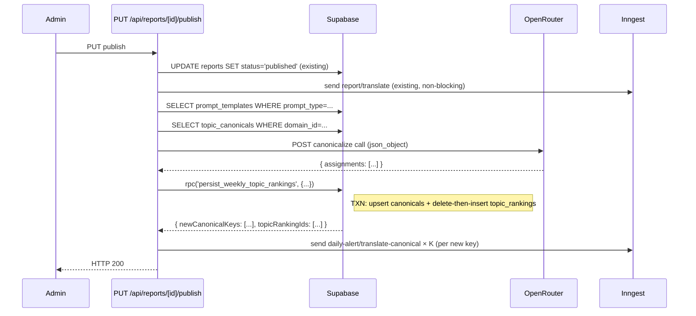

# 设计文档：统一话题字典跨管线 (Unify Topic Dictionary Across Pipelines)

## Overview

This design replaces the weekly publish path's ad-hoc, in-prompt topic-canonicalization with the same shared dictionary the daily-alert pipeline already writes to. After this change, both pipelines load the same `prompt_templates` row (`prompt_type='daily_canonicalization_prompt'`), validate against the same Zod `CanonicalizeResponseSchema`, and write into the same `topic_canonicals` table — but they keep their existing wire-level providers untouched (Daily uses Z.AI / GLM-4.6 via `zai-client.ts`; Weekly uses OpenRouter via `fetch`). What's shared is the prompt body and the response contract; what's per-pipeline is the LLM client, the failure-reason prefixes, and the Inngest fan-out shape.

The dashboard's cross-week join key migrates from the unstable LLM-minted `topic_label` string to the FK-protected `canonical_topic_key`, scoped per `domain_id`. A new `"类别 / Category"` column appears immediately to the right of the existing Topic column in dashboard summary tables and in `/reports/[id]` module tables; canonical title resolution follows `i18n.language` with the same Chinese-fallback `(Chinese original)` indicator daily already uses.

What this design deliberately does NOT do: it does not introduce a separate `weekly_canonicalization_prompt` row, does not mutate `reports.content` at any stage, does not merge the two LLM providers, does not seed `topic_canonicals` for new domains, and does not add a draft / approval gate for new canonicals (Spec ref: Req 6 / Out-of-scope list).

The rollout is a 7-step ordered sequence (Spec ref: Req 9.1) with one migration per logical group, designed so the dashboard never reads from a half-migrated state.

## Architecture

### Per-pipeline flow

```
┌─────────────────────────────────────────────────────────────────┐
│  Weekly Publish Pipeline   (PUT /api/reports/[id]/publish)       │
│                                                                  │
│  admin click → status='published' (existing) → enqueue           │
│      report-translate → loadCanonicalizePrompt(domainId)         │
│      → loadAllTopicCanonicalsForDomain(domainId) →               │
│      runWeeklyCanonicalize(OpenRouter, prompt, scanned, dict)    │
│      → persistWeeklyCanonicalize (RPC: persist_weekly_topic_    │
│         rankings — single TXN: upsert canonicals + delete-then- │
│         insert topic_rankings) → enqueue translate-canonical fan │
│      → return HTTP 200                                          │
│                                                                  │
│  Provider:  OpenRouter (openrouter/auto)                         │
│  Failure-reason prefix:  "weekly canonicalize: ..."              │
└─────────────────────────────────────────────────────────────────┘

┌─────────────────────────────────────────────────────────────────┐
│  Daily Alert Pipeline     (Inngest: daily-alert-run)             │
│                                                                  │
│  cron tick → resolve config + 2 prompts → scan (Z.AI) →          │
│      loadAllTopicCanonicalsForDomain(domainId) →                 │
│      runDailyCanonicalize(Z.AI, prompt, scanned, dict)           │
│      → persistDailyAlertTransaction (RPC: persist_daily_alert)   │
│      → enqueue translate-topic + translate-canonical fan         │
│                                                                  │
│  Provider:  Z.AI / GLM-4.6 (zai-client.ts)                       │
│  Failure-reason prefix:  "Canonicalization failed: ..."          │
└─────────────────────────────────────────────────────────────────┘
```

### Shared vs per-pipeline pieces

| Piece | Status | Notes |
|---|---|---|
| `prompt_templates` row `prompt_type='daily_canonicalization_prompt'` | **Shared** | One row per domain. Edited once; both pipelines pick up next run (Spec ref: Req 1.3). |
| `CanonicalizeResponseSchema` Zod schema | **Shared** | Re-exported by `topic-rankings/zod-schemas.ts` from `daily-alert/zod-schemas.ts` (Spec ref: Req 1.4). |
| `topic_canonicals` table | **Shared** | `(domain_id, canonical_topic_key)` UNIQUE; `origin` widened to `{'daily_alert', 'weekly_report'}` (Spec ref: Req 3). |
| `normalizeCanonicalKey` helper | **Shared** | Re-exported from `daily-alert/zod-schemas.ts`. Both pipelines call it the same way (Spec ref: Req 5.5). |
| LLM provider client | **Per-pipeline** | Daily: `zai-client.ts`. Weekly: `fetch('https://openrouter.ai/...')`. Not merged in this spec. |
| `failure_reason` string prefix | **Per-pipeline** | Daily: `"Canonicalization failed: ..."`. Weekly: `"weekly canonicalize: ..."` (Spec ref: Req 13). |
| Persist RPC | **Per-pipeline** | Daily: `persist_daily_alert` (existing). Weekly: `persist_weekly_topic_rankings` (new, modeled on daily) (Spec ref: Req 14.3). |
| Translate fan-out function | **Shared** | Both pipelines enqueue the same `daily-alert/translate-canonical` Inngest event for new canonicals (Spec ref: Req 16.1). |

### Sequence — Weekly publish, success path



## Components and Interfaces

Each module below carries a status (NEW / REFACTOR / DELETE) and a Spec ref to the requirement that drives the change.

### `src/lib/topic-rankings/canonicalize.ts` — NEW

Mirrors `src/lib/daily-alert/canonicalize.ts` shape; swaps the provider client for an OpenRouter `fetch` call. Imports the shared Zod schema from `daily-alert/zod-schemas.ts` rather than re-declaring it (Spec ref: Req 1.4, Req 5.5).

```typescript
import {
  CanonicalizeResponseSchema,
  type CanonicalAssignment,
  type ScanTopic,
  normalizeCanonicalKey,
} from '@/lib/daily-alert/zod-schemas';
import type { TopicCanonicalRow } from '@/types/daily-alert';
import { substitute } from '@/lib/daily-alert/substitute';

export interface WeeklyCanonicalizeInput {
  canonPrompt: string;
  scannedTopics: ScanTopic[];      // shape borrowed from daily ScanTopic — see §4
  existingCanonicals: TopicCanonicalRow[];
  domainName: string;
  openRouterApiKey: string;
  reportId: string;                // for log breadcrumb
}

export type WeeklyCanonicalizeResult =
  | {
      ok: true;
      keptAssignments: CanonicalAssignment[];
      droppedAssignments: CanonicalAssignment[];
      rawContent: string;
    }
  | { ok: false; failureReason: string; rawOutput: string };

export async function runWeeklyCanonicalize(
  input: WeeklyCanonicalizeInput
): Promise<WeeklyCanonicalizeResult>;
```

Behavior:
1. Fail fast with `failureReason: 'weekly canonicalize: provider API key missing OPENROUTER_API_KEY'` when `openRouterApiKey` is empty (Spec ref: Req 13.4).
2. `substitute()` the prompt with `{scanned_topics_json}`, `{existing_canonicals_json}`, `{domain_name}` — using the SAME whitelist substituter from `daily-alert/substitute.ts` (Spec ref: Req 1.4).
3. POST to `https://openrouter.ai/api/v1/chat/completions` with `model: 'openrouter/auto'`, `response_format: { type: 'json_object' }`, no `tools` array (canonicalization is pure reasoning).
4. Map HTTP 402 → `'weekly canonicalize: provider credits exhausted'` (Spec ref: Req 13.1). Retry HTTP 5xx / timeout up to 2× with exponential backoff (500ms, 1000ms) → on exhaustion, `'weekly canonicalize: provider unreachable'` (Spec ref: Req 13.2).
5. Run `CanonicalizeResponseSchema.safeParse(...)`. Invalid → after retries-exhausted → `'weekly canonicalize: malformed response'` with truncated raw body in `rawOutput` (Spec ref: Req 13.3).
6. For each `decision='keep'` assignment, call `normalizeCanonicalKey(...)`. On a single key that fails normalization, that topic alone is dropped (with a logged `'weekly canonicalize: malformed key'` warning) and the run continues — partial success is preferred (Spec ref: Req 5.5).
7. Return `{ ok: true, keptAssignments, droppedAssignments, rawContent }`.

Dependencies: `daily-alert/zod-schemas.ts`, `daily-alert/substitute.ts`. Removes nothing.

### `src/lib/topic-rankings/persist.ts` — MAJOR REFACTOR

Replaces the existing `extractAndPersistTopicRankings` with a thin wrapper over a new `persist_weekly_topic_rankings` PL/pgSQL RPC. Removes the inline LLM call (it now lives in `canonicalize.ts`). Removes the `replaceExisting` parameter — re-publish always replaces (Spec ref: Req 7.4).

```typescript
import { createServiceRoleClient } from '@/lib/supabase/service-role';
import type { CanonicalAssignment, ScanTopic } from '@/lib/daily-alert/zod-schemas';

export interface WeeklyPersistInput {
  reportId: string;
  domainId: string;
  weekLabel: string | null;
  scannedTopicsByModule: Record<number, ScanTopic[]>;        // module_index → topics
  assignmentsByModule: Record<number, CanonicalAssignment[]>; // same length as scannedTopicsByModule[k]
  existingCanonicalKeys: Set<string>;
}

export interface WeeklyPersistOutput {
  /** total rows inserted into topic_rankings */
  inserted: number;
  perModule: Record<number, number>;
  /** keys actually minted (after ON CONFLICT DO NOTHING filter) — for translate fan-out */
  newCanonicalKeys: string[];
  /** keys reused from the existing dictionary — for telemetry only */
  reusedCanonicalKeys: string[];
}

export async function persistWeeklyTopicRankings(
  input: WeeklyPersistInput
): Promise<WeeklyPersistOutput>;
```

Behavior:
1. Calls `supabase.rpc('persist_weekly_topic_rankings', { p_report_id, p_domain_id, p_week_label, p_assignments_by_module, p_topics_by_module, p_existing_canonical_keys })`.
2. The RPC (see §4.4) wraps the full canonical-upsert + topic_rankings-delete-then-insert sequence in one transaction (Spec ref: Req 14.3, Req 15.2).
3. On RPC error, throws `Error('weekly canonicalize: persistence failed: <pg_message>')` so the route handler can pattern-match per Req 11.6.

Dependencies: `@supabase/supabase-js` service-role client, `daily-alert/zod-schemas.ts`. Removes the entire LLM-call pathway (now in `canonicalize.ts`), the `existingLabels` bootstrapping logic, the per-module fallback to raw Chinese labels, and the `--force` / `replaceExisting` branch (re-publish always replaces per Req 7.4).

### `src/lib/topic-rankings/extract.ts` — DELETE

The entire ad-hoc OpenRouter LLM call (`extractTopicsForModule`, `stabilizeLabelsV4`, `pickFirstArray`, `TopicEntry` type) is removed. Its single caller (`persist.ts`) no longer needs it; its other caller (the publish route) goes through `canonicalize.ts` + `persist.ts`. The `TopicEntry` type is deleted; downstream code uses `CanonicalAssignment` from the shared Zod schema.

(Spec ref: Req 1.2 — no in-code prompt strings allowed in the weekly path.)

### `src/lib/topic-rankings/zod-schemas.ts` — NEW

Pure re-export module. Lets `topic-rankings/*` import from a topic-rankings-local namespace rather than reaching into `daily-alert`. Keeps the shared-but-not-coupled boundary visible in the dependency graph.

```typescript
export {
  CANONICAL_KEY_REGEX,
  CanonicalizeResponseSchema,
  CanonicalAssignmentSchema,
  ScanTopicSchema,
  normalizeCanonicalKey,
} from '@/lib/daily-alert/zod-schemas';

export type {
  CanonicalAssignment,
  ScanTopic,
  CanonicalizeResponse,
} from '@/lib/daily-alert/zod-schemas';
```

(Spec ref: Req 1.4 — same prompt placeholders + same response schema as daily.)

### `src/lib/topic-rankings/scan.ts` — NEW (helper, no LLM call)

Builds `ScanTopic[]` payloads from `report.content.modules[moduleIndex].topTopics` for the canonicalize call. NO LLM is invoked here — the weekly synthesizer already produced structured `topTopics`; this module just transforms them into the shape the shared canonicalize prompt expects.

```typescript
import type { ReportContent, TopTopic } from '@/types/report';
import type { ScanTopic } from '@/lib/daily-alert/zod-schemas';

/**
 * Convert a module's `topTopics[]` into the `ScanTopic[]` shape the shared
 * canonicalization engine expects. Synthesizer output is the source of
 * truth — no extra LLM call required to "stabilize labels" (the whole
 * point of this spec is that label stabilization happens via the
 * canonical dictionary, not via a separate LLM call).
 *
 * Returns [] when the module has no `topTopics`.
 */
export function buildScannedTopicsFromModule(
  content: ReportContent,
  moduleIndex: number
): ScanTopic[];
```

Dependencies: `@/types/report` for `TopTopic`. Pure function; no side effects.

### `src/app/api/reports/[id]/publish/route.ts` — REFACTOR

The current `try { ... extractAndPersistTopicRankings ... }` block is replaced with the new flow. Keeps the existing HTTP 200 + `data: report` response contract on success and the existing reports-translate enqueue. Adds loud Vercel logs at every step boundary per Req 11.

Pseudo-code shape:

```typescript
// 1. Auth + status update + enqueue report-translate — UNCHANGED.

// 2. Topic-rankings flow — NEW SHAPE.
console.log(`[publish ${id}] canonicalize starting reportId=${id} domainId=${report.domain_id}`);

try {
  const apiKey = process.env.OPENROUTER_API_KEY ?? '';
  if (!apiKey) {
    console.error(`[publish ${id}] failure_reason="weekly canonicalize: provider API key missing OPENROUTER_API_KEY"`);
    return NextResponse.json({ data: report }); // HTTP 200 — Req 13.5
  }

  const promptRow = await loadCanonicalizePrompt(supabase, report.domain_id);
  if (!promptRow) {
    console.error(`[publish ${id}] failure_reason="daily_canonicalization_prompt missing for domain ${report.domain_id}"`);
    return NextResponse.json({ data: report }); // HTTP 200 — Req 1.5 + Req 13.5
  }

  console.log(`[publish ${id}] prompt_template_id=${promptRow.id} scanned_topics_count=${totalTopics}`);

  const existingCanonicals = await loadAllTopicCanonicalsForDomain(report.domain_id);

  // Per module, run canonicalize.
  const perModuleResults = await Promise.all([0, 1].map(async (moduleIndex) => {
    const scanned = buildScannedTopicsFromModule(report.content, moduleIndex);
    if (scanned.length === 0) return { moduleIndex, scanned: [], assignments: [] };
    const result = await runWeeklyCanonicalize({
      canonPrompt: promptRow.template_text,
      scannedTopics: scanned,
      existingCanonicals,
      domainName: report.domain_name ?? '',
      openRouterApiKey: apiKey,
      reportId: id,
    });
    if (!result.ok) {
      console.error(`[publish ${id}] failure_reason="${result.failureReason}" raw_output="${result.rawOutput}"`);
      throw new Error(result.failureReason);
    }
    // Drop logging — Req 11.4.
    if (result.droppedAssignments.length > 0) {
      console.warn(`[publish ${id}] module ${moduleIndex} dropped ${result.droppedAssignments.length} of ${scanned.length} topics`);
      for (const drop of result.droppedAssignments) {
        const t = scanned[drop.scanned_topic_index];
        console.info(`[publish ${id}] dropped topic_name="${t.topic_name_zh}" drop_reason="${drop.drop_reason}"`);
      }
    }
    return { moduleIndex, scanned, assignments: result.keptAssignments };
  }));

  // Single transaction across both modules.
  const persistResult = await persistWeeklyTopicRankings({
    reportId: id,
    domainId: report.domain_id,
    weekLabel: report.week_label,
    scannedTopicsByModule: Object.fromEntries(perModuleResults.map(r => [r.moduleIndex, r.scanned])),
    assignmentsByModule:   Object.fromEntries(perModuleResults.map(r => [r.moduleIndex, r.assignments])),
    existingCanonicalKeys: new Set(existingCanonicals.map(c => c.canonical_topic_key)),
  });

  console.log(
    `[publish ${id}] inserted=${persistResult.inserted} dropped=${totalDropped} ` +
    `newCanonicals=${persistResult.newCanonicalKeys.length} reusedCanonicals=${persistResult.reusedCanonicalKeys.length} reportId=${id}`
  );

  // Translate fan-out for new canonicals (Req 16.1).
  for (const key of persistResult.newCanonicalKeys) {
    try {
      await inngest.send({
        name: 'daily-alert/translate-canonical',
        data: { domainId: report.domain_id, canonicalTopicKey: key },
      });
    } catch (err) {
      console.warn(`[publish ${id}] translate enqueue failed for ${key}: ${(err as Error).message}`);
    }
  }
} catch (err) {
  console.error(`[publish ${id}] canonicalize block failed (non-blocking): ${(err as Error).message}`);
  // Try to tag failure — best-effort. If logging itself fails, swallow inner.
  try { /* extra structured log */ } catch { /* Req 7.3 inner-catch */ }
}

// 3. AI Insight news block (existing) — keeps reading topic_rankings via the new join shape.
//    Replace `select('topic_label')` with `select('canonical_topic_key, topic_canonicals!inner(canonical_title_zh, canonical_title_en)')`.

// 4. Notifications — UNCHANGED.

return NextResponse.json({ data: report }); // HTTP 200 always — Req 7.3 / Req 13.5
```

What changes vs current code:
- `extractAndPersistTopicRankings(...)` call is replaced with the canonicalize → persist sequence above.
- The AI Insight news block's `select('topic_label')` becomes `select('canonical_topic_key')` joined with `topic_canonicals` for the title.
- Logging follows the format `[publish ${id}] <event> ...` for every event in Req 11.x.

Dependencies added: `@/lib/topic-rankings/canonicalize`, `@/lib/topic-rankings/persist`, `@/lib/topic-rankings/scan`, `@/lib/daily-alert/persist` (for `loadAllTopicCanonicalsForDomain`). Existing `@/lib/topic-rankings/persist` import keeps its name; its body changes per §3.2.

### `src/app/(main)/dashboard/page.tsx` — REFACTOR

Three changes in this file (all driven by Req 10):

**A.** Trend chart `useMemo` block — replace `r.topic_label` grouping with `r.canonical_topic_key`. During the rollout window (between step c and step f of Req 9.1), prefer `canonical_topic_key` when non-null, fall back to `topic_label` for legacy rows (Spec ref: Req 10.8).

**B.** Legend label resolution — load `topic_canonicals.canonical_title_zh` / `_en` for the keys present in the chart data. Use the bilingual fallback helper:

```typescript
const localizedLegend = useMemo(() => {
  // For each key in trendData, resolve to canonical_title in the active language.
  // Apply the (Chinese original) indicator for null _en in English mode.
  const lookup = new Map<string, { zh: string; en: string | null }>();
  topicCanonicals.forEach(c => lookup.set(c.canonical_topic_key, {
    zh: c.canonical_title_zh, en: c.canonical_title_en,
  }));
  return (key: string) => {
    const c = lookup.get(key);
    if (!c) return key; // transition fallback
    if (i18n.language === 'zh') return c.zh;
    if (c.en && c.en.trim().length > 0) return c.en;
    return `${c.zh} (Chinese original)`; // Req 10.3 inline indicator
  };
}, [topicCanonicals, i18n.language]);
```

**C.** Module1 / Module2 summary tables — call `<TopTopicsTable topics={...} categoryByTopicIndex={...} />` (new prop) so the new Category_Column can render alongside the existing columns. Source the per-row category from the same `topic_rankings` query rows joined to `topic_canonicals` by `(domain_id, canonical_topic_key)`.

`fetchData` adds one parallel query: `supabase.from('topic_canonicals').select('*').eq('domain_id', currentDomainId)`.

### `src/components/report/ReportRenderer.tsx` and `TopTopicsTable.tsx` — MODIFY

Both files render module tables; both need the new Category_Column. The simplest design: extend `TopTopicsTable` with an optional `category` prop on each row's resolved data, plus an i18n-aware header.

Updated `TopTopicsTable` props:

```typescript
export interface TopTopicsTableProps {
  topics: TopTopic[];
  caption?: string;
  /**
   * Per-row category resolution. Index aligned with `topics`. When omitted
   * (e.g. legacy reports loaded before this spec rolls out), the column
   * still renders as "—" — the column is unconditional per Req 17.1.
   */
  categoryResolution?: Array<CategoryCellState>;
}

type CategoryCellState =
  | { kind: 'canonical'; titleZh: string; titleEn: string | null }   // Req 17.4(a)
  | { kind: 'dropped'; dropReason: string }                          // Req 17.4(b)
  | { kind: 'unmapped' };                                            // Req 17.4(c)
```

JSX shape (inserted between Topic and Voice Volume columns):

```tsx
<th scope="col" className="...muted column header...">
  {i18n.language === 'zh' ? '类别' : 'Category'}
</th>
...
<td className="border-b border-border px-4 py-3 text-sm">
  <CategoryCell
    state={categoryResolution?.[i] ?? { kind: 'unmapped' }}
    lang={i18n.language as 'zh' | 'en'}
  />
</td>
```

```tsx
function CategoryCell({ state, lang }: { state: CategoryCellState; lang: 'zh' | 'en' }) {
  if (state.kind === 'canonical') {
    if (lang === 'zh') return <span className="text-foreground">{state.titleZh}</span>;
    if (state.titleEn && state.titleEn.trim().length > 0)
      return <span className="text-foreground">{state.titleEn}</span>;
    return <span className="text-foreground">{state.titleZh} <span className="text-foreground-muted">(Chinese original)</span></span>;
  }
  if (state.kind === 'dropped') {
    return <span className="text-foreground-muted" title={state.dropReason}>—</span>;
  }
  return <span className="text-foreground-muted">—</span>; // unmapped — no tooltip (Req 17.4(c))
}
```

Priority-resolution for inconsistent rows (canonical_topic_key non-null AND drop_reason non-null): canonical wins (Spec ref: Req 17.4 last sentence).

`ReportRenderer.tsx` passes `categoryResolution` through from a prop owned by the caller — so the page-level component (e.g. `/reports/[id]/page.tsx`) is responsible for fetching and stitching.

### `scripts/backfill-topic-rankings.ts` — REFACTOR

Drops the existing OpenRouter ad-hoc invocation. Calls the new `canonicalize.ts` + `persist.ts` flow per report. New CLI shape:

```bash
npm run backfill:topic-rankings -- --report=b0c05dae-… --report=f8b2ea58-…
```

Behavior per `--report`:
1. SELECT the report row.
2. DELETE existing `topic_rankings` WHERE `report_id = <id>`.
3. Run `buildScannedTopicsFromModule(...)` for module 0 and module 1.
4. Call `runWeeklyCanonicalize(...)` for each module.
5. Call `persistWeeklyTopicRankings(...)` to atomically write the new shape.
6. Log inserted / dropped / new / reused counts.

Idempotence (Spec ref: Req 12.5): a second run produces the same `topic_rankings` row content because `delete-then-insert` always wipes first, and `topic_canonicals` is protected by `(domain_id, canonical_topic_key)` UNIQUE + `ON CONFLICT DO NOTHING`. The script does not modify `reports.status` / `reports.content` / `reports.published_at` (Spec ref: Req 12.2).

The legacy `--force` and `--domain` flags are removed — `--report` is the only operating mode.

## Data Models

### Updated `topic_rankings` Row / Insert / Update (post-migration 027)

After step (g) of Req 9.1 completes:

```typescript
topic_rankings: {
  Row: {
    id: string;
    report_id: string;
    domain_id: string;
    module_index: number;
    canonical_topic_key: string;       // NOT NULL, FK to topic_canonicals
    rank: number;
    week_label: string | null;
    raw_reason: string | null;
    raw_keywords: string | null;
    created_at: string;
    // topic_label and topic_label_zh REMOVED.
  };
  Insert: {
    id?: string;
    report_id: string;
    domain_id: string;
    module_index?: number;
    canonical_topic_key: string;       // required
    rank: number;
    week_label?: string | null;
    raw_reason?: string | null;
    raw_keywords?: string | null;
    created_at?: string;
  };
  Update: {
    id?: string;
    report_id?: string;
    domain_id?: string;
    module_index?: number;
    canonical_topic_key?: string;
    rank?: number;
    week_label?: string | null;
    raw_reason?: string | null;
    raw_keywords?: string | null;
    created_at?: string;
  };
};
```

(Spec ref: Req 8.6 — old type with `topic_label` removed in same commit as migration 027.)

### Shared Zod schema — re-export

`src/lib/topic-rankings/zod-schemas.ts` re-exports the existing `CanonicalizeResponseSchema` from `daily-alert/zod-schemas.ts`. No fork. Identical Zod tree. The `ScanTopic` shape used by weekly is the existing daily one minus the search-specific fields the daily scan engine produces — but since weekly doesn't run a scan (it transforms `topTopics` directly), the canonicalize input only uses `topic_name_zh`, `summary_zh`, `keywords` (the three fields the prompt's `scanned_topics_json` placeholder consumes). Other `ScanTopic` fields (e.g. `voice_volume`, `channel_counts`) are not validated for weekly — `buildScannedTopicsFromModule` populates only the canonicalize-relevant subset.

### Migration files

The 7-step rollout from Req 9.1 maps to three concrete migration files:

#### `migrations/025_widen_topic_canonicals_origin.sql`

Step (a). Drops + re-adds the CHECK constraint.

```sql
-- ============================================================
-- 025_widen_topic_canonicals_origin.sql
--
-- Cross-file invariant (per Req 9.3 verification):
--   AFTER apply: SELECT pg_get_constraintdef(oid) FROM pg_constraint
--    WHERE conrelid = 'topic_canonicals'::regclass AND conname LIKE '%origin%';
--   Expected: result includes BOTH 'daily_alert' AND 'weekly_report'.
--
-- Rollback if reverted:
--   ALTER TABLE topic_canonicals DROP CONSTRAINT topic_canonicals_origin_check;
--   ALTER TABLE topic_canonicals
--     ADD CONSTRAINT topic_canonicals_origin_check
--     CHECK (origin IN ('daily_alert'));
-- ============================================================

ALTER TABLE topic_canonicals
  DROP CONSTRAINT IF EXISTS topic_canonicals_origin_check;

ALTER TABLE topic_canonicals
  ADD CONSTRAINT topic_canonicals_origin_check
  CHECK (origin IN ('daily_alert', 'weekly_report'));

COMMENT ON COLUMN topic_canonicals.origin IS
  'Which platform product first created this canonical. Active values: '
  '''daily_alert'' (created by daily-alert pipeline), ''weekly_report'' '
  '(created by weekly publish pipeline). Immutable post-creation. '
  'Both pipelines now share this dictionary (Spec: unify-topic-dictionary-across-pipelines, Req 3).';
```

(Spec ref: Req 3.1, 3.3, 3.4, 3.6.)

#### `migrations/026_add_topic_rankings_canonical_topic_key_nullable.sql`

Step (b). Adds nullable column + composite FK + index.

```sql
-- ============================================================
-- 026_add_topic_rankings_canonical_topic_key_nullable.sql
--
-- Cross-file invariant (per Req 9.4 verification):
--   AFTER apply: SELECT column_name, is_nullable, data_type
--     FROM information_schema.columns
--    WHERE table_name='topic_rankings' AND column_name='canonical_topic_key';
--   Expected: is_nullable='YES', data_type='character varying'.
--
-- Rollback if reverted:
--   ALTER TABLE topic_rankings DROP CONSTRAINT topic_rankings_canonical_fk;
--   DROP INDEX idx_topic_rankings_domain_canonical;
--   ALTER TABLE topic_rankings DROP COLUMN canonical_topic_key;
-- ============================================================

ALTER TABLE topic_rankings
  ADD COLUMN IF NOT EXISTS canonical_topic_key VARCHAR(120) NULL;

ALTER TABLE topic_rankings
  ADD CONSTRAINT topic_rankings_canonical_fk
  FOREIGN KEY (domain_id, canonical_topic_key)
  REFERENCES topic_canonicals (domain_id, canonical_topic_key)
  ON DELETE RESTRICT;

CREATE INDEX IF NOT EXISTS idx_topic_rankings_domain_canonical
  ON topic_rankings (domain_id, canonical_topic_key);

COMMENT ON COLUMN topic_rankings.canonical_topic_key IS
  'Composite FK ref into topic_canonicals via (domain_id, canonical_topic_key). '
  'Nullable during the rollout window (steps b-f of Req 9.1); set NOT NULL '
  'by migration 027 after backfill completes.';
```

(Spec ref: Req 8.1, 8.2.)

#### `migrations/027_drop_topic_rankings_legacy_label_columns.sql`

Step (g). Runs AFTER backfill completes (Req 9.1 step (d) verification = `count(*) WHERE canonical_topic_key IS NULL = 0`).

```sql
-- ============================================================
-- 027_drop_topic_rankings_legacy_label_columns.sql
--
-- Cross-file invariant (per Req 9.6 verification):
--   AFTER apply: SELECT column_name FROM information_schema.columns
--    WHERE table_name='topic_rankings' AND column_name IN ('topic_label','topic_label_zh');
--   Expected: zero rows.
--
-- Pre-condition (per Req 9.5):
--   SELECT count(*) FROM topic_rankings WHERE canonical_topic_key IS NULL;
--   Must be 0 before applying this migration.
--
-- Rollback if reverted:
--   ALTER TABLE topic_rankings ADD COLUMN topic_label VARCHAR(120);
--   ALTER TABLE topic_rankings ADD COLUMN topic_label_zh TEXT;
--   ALTER TABLE topic_rankings ALTER COLUMN canonical_topic_key DROP NOT NULL;
--   -- topic_label re-population requires running the legacy extract.ts path,
--   -- which has been deleted by this spec's code-deploy. Realistic rollback
--   -- is to revert step (g) and live with three nullable columns until next
--   -- attempt; do NOT attempt to re-populate topic_label.
-- ============================================================

ALTER TABLE topic_rankings ALTER COLUMN canonical_topic_key SET NOT NULL;

ALTER TABLE topic_rankings DROP COLUMN IF EXISTS topic_label;
ALTER TABLE topic_rankings DROP COLUMN IF EXISTS topic_label_zh;
```

(Spec ref: Req 8.3, 8.4, 9.6.)

### New RPC: `persist_weekly_topic_rankings`

Modeled on `persist_daily_alert` (migration 015). Lives in the same migration as step (c) code-deploy or in a separate `migrations/026b_persist_weekly_rpc.sql` — Tasks phase decides. Signature:

```sql
CREATE OR REPLACE FUNCTION persist_weekly_topic_rankings(
  p_report_id UUID,
  p_domain_id UUID,
  p_week_label TEXT,
  p_topics_by_module JSONB,        -- { "0": [...ScanTopic], "1": [...] }
  p_assignments_by_module JSONB,   -- { "0": [...CanonicalAssignment], "1": [...] }
  p_existing_canonical_keys TEXT[] DEFAULT ARRAY[]::TEXT[]
) RETURNS JSONB                    -- { inserted, perModule, newCanonicalKeys, reusedCanonicalKeys }
```

Body (PL/pgSQL, single transaction):

1. Validate `jsonb_object_keys(p_topics_by_module) = jsonb_object_keys(p_assignments_by_module)` and per-module `jsonb_array_length` matches.
2. **DELETE FROM topic_rankings WHERE report_id = p_report_id** (Spec ref: Req 7.4).
3. For each module's assignments:
   - Loop over `is_new_canonical=true` AND `canonical_topic_key NOT IN p_existing_canonical_keys`:
     ```sql
     INSERT INTO topic_canonicals (...) VALUES (...)
     ON CONFLICT (domain_id, canonical_topic_key) DO NOTHING
     RETURNING canonical_topic_key INTO v_inserted_key;
     ```
     Append `v_inserted_key` to `v_new_canonical_keys` only when not NULL (Spec ref: Req 6.2, 6.3, 15.3).
   - UPDATE `last_seen_date = today_shanghai()`, `seen_count = seen_count + reuse_count_in_this_run` for every key referenced (Spec ref: Req 2.4).
4. INSERT into `topic_rankings` (now with `canonical_topic_key` non-null):
   ```sql
   INSERT INTO topic_rankings (
     report_id, domain_id, module_index, rank, week_label,
     canonical_topic_key, raw_reason, raw_keywords
   ) VALUES (...);
   ```
5. Return `{ inserted, perModule: { "0": N0, "1": N1 }, newCanonicalKeys: [...], reusedCanonicalKeys: [...] }`.

`EXCEPTION WHEN OTHERS THEN RAISE EXCEPTION 'persist_weekly_topic_rankings failed: %', SQLERRM` — rolls back all inserts in the transaction (Spec ref: Req 14.3, 15.2).

`GRANT EXECUTE ... TO service_role` only.

## Cross-Pipeline Mechanics

### Side-by-side `runCanonicalize()` calls

```typescript
// DAILY (existing, unchanged):
const result = await callZai<unknown>({
  model: 'glm-4.6',
  messages: [{ role: 'user', content: substitute(canonPrompt, vars) }],
  apiKey: zaiApiKey,
  timeoutMs: 90_000,
  jsonMode: true,
  enableWebSearch: false,
  errorContext: { engine: 'kimi', stage: 'hot-radar-scan' },
});
const parsed = CanonicalizeResponseSchema.safeParse(result.data);

// WEEKLY (new):
const res = await fetch('https://openrouter.ai/api/v1/chat/completions', {
  method: 'POST',
  headers: { 'Content-Type': 'application/json', Authorization: `Bearer ${apiKey}` },
  body: JSON.stringify({
    model: 'openrouter/auto',
    messages: [{ role: 'user', content: substitute(canonPrompt, vars) }],
    response_format: { type: 'json_object' },
  }),
});
const data = await res.json();
const raw = data?.choices?.[0]?.message?.content ?? '';
const parsed = CanonicalizeResponseSchema.safeParse(JSON.parse(raw));
```

Same `canonPrompt`, same `vars` whitelist, same Zod schema. Different transport. Both feed the same downstream pipeline (key normalization → persist RPC) (Spec ref: Req 1, Req 5.5).

### ON CONFLICT DO NOTHING + re-fetch dance

Concurrent new-canonical proposal handling (Spec ref: Req 6.3, Req 15.3). Inside the RPC:

```sql
INSERT INTO topic_canonicals (
  domain_id, canonical_topic_key, canonical_title_zh, canonical_description_zh,
  category_slug, secondary_axis_type, secondary_axis_value,
  first_seen_date, last_seen_date, seen_count, origin
) VALUES (
  p_domain_id,
  v_assignment ->> 'canonical_topic_key',
  v_assignment ->> 'canonical_title_zh',
  v_assignment ->> 'canonical_description_zh',
  v_assignment ->> 'category_slug',
  v_assignment ->> 'secondary_axis_type',
  v_assignment ->> 'secondary_axis_value',
  CURRENT_DATE AT TIME ZONE 'Asia/Shanghai',
  CURRENT_DATE AT TIME ZONE 'Asia/Shanghai',
  1,
  'weekly_report'                                  -- ← origin (Spec ref: Req 2.3)
)
ON CONFLICT (domain_id, canonical_topic_key) DO NOTHING
RETURNING canonical_topic_key INTO v_inserted_key;

-- v_inserted_key is NULL when ON CONFLICT no-opped (concurrent run won the race).
-- The TS layer treats this as a "reuse" branch automatically: the topic_rankings
-- row's FK still resolves because the row physically exists; this run just
-- doesn't claim ownership of the mint and doesn't enqueue translate.
IF v_inserted_key IS NOT NULL THEN
  v_new_canonical_keys := array_append(v_new_canonical_keys, v_inserted_key);
END IF;
```

The RETURNING approach avoids an extra SELECT. The existing FK on `topic_rankings.(domain_id, canonical_topic_key)` guarantees the topic-rankings INSERT in the same transaction will succeed regardless of which run won the canonical-mint race.

## UI Layer

### Category_Column rendering rules (concrete pseudo-code)

```tsx
// Position: immediately right of Topic_Column (Spec ref: Req 17.2).
// Header: i18n-aware (Spec ref: Req 17.3).
// Cell content: three exhaustive cases (Spec ref: Req 17.4).
// Styling: existing tokens only (Spec ref: Req 17.5, 17.6).

<th scope="col" className="border-b border-border px-4 py-2.5 text-left text-xs font-semibold uppercase tracking-wide text-foreground-muted">
  {i18n.language === 'zh' ? '类别' : 'Category'}
</th>

// per-row:
<td className="border-b border-border px-4 py-3 text-sm">
  {(() => {
    const r = categoryResolution[i];
    // Priority resolution (Spec ref: Req 17.4): canonical wins over drop_reason
    // when both somehow exist — handled at the data-stitching layer, not the
    // renderer. Renderer just inspects which case state.kind reports.
    if (r.kind === 'canonical') {
      if (i18n.language === 'zh') return <span className="text-foreground">{r.titleZh}</span>;
      if (r.titleEn?.trim()) return <span className="text-foreground">{r.titleEn}</span>;
      return <span className="text-foreground">{r.titleZh} <span className="text-foreground-muted">(Chinese original)</span></span>;
    }
    if (r.kind === 'dropped') {
      return <span className="text-foreground-muted" title={r.dropReason}>—</span>;
    }
    return <span className="text-foreground-muted">—</span>; // unmapped (Spec ref: Req 17.4(c))
  })()}
</td>
```

Data-stitching layer (in the page component that owns the data) builds `categoryResolution[i]` per row by consulting (in order):

```typescript
function resolveCategoryCell(
  rankingRow: TopicRankingRow | null,
  canonicalLookup: Map<string, TopicCanonicalRow>,
  dropMap: Map<string, string>          // raw_reason → drop_reason from logs (transitional)
): CategoryCellState {
  // Priority 1 — canonical assignment exists.
  if (rankingRow?.canonical_topic_key) {
    const c = canonicalLookup.get(rankingRow.canonical_topic_key);
    if (c) return { kind: 'canonical', titleZh: c.canonical_title_zh, titleEn: c.canonical_title_en };
  }
  // Priority 2 — topic was dropped (no ranking row, but drop_reason recorded).
  // V1: drop_reason is logged, not stored — so this case practically only
  // returns 'dropped' in tests / future extension. In V1 this branch falls
  // through to 'unmapped'. Documented for the rollout transition.
  // Priority 3 — unmapped (no canonical, no drop reason).
  return { kind: 'unmapped' };
}
```

(Note: in V1, `drop_reason` is logged to Vercel only — not persisted anywhere queryable from the UI render path. Req 17.4(b) describes the UI contract; the V1 implementation falls through to case (c) for dropped topics, with a follow-up spec to persist drop_reason if the team needs the tooltip live. This is documented here so the renderer code matches the data reality.)

### Trend_Chart legend resolution

```typescript
// Group by canonical_topic_key (Spec ref: Req 10.1).
const trendByKey = new Map<string, Record<string, number>>();
for (const row of topicRankings) {
  const week = row.week_label ?? 'Unknown';
  const key = row.canonical_topic_key ?? row.topic_label;  // Req 10.8 transitional fallback
  if (!trendByKey.has(week)) trendByKey.set(week, {});
  trendByKey.get(week)![key] = row.rank;
}

// Resolve legend label (Spec ref: Req 10.2, 10.3).
function resolveLegendLabel(key: string): string {
  const c = canonicalLookup.get(key);
  if (!c) return key; // legacy row, key is already a topic_label string
  if (i18n.language === 'zh') return c.canonical_title_zh;
  if (c.canonical_title_en && c.canonical_title_en.trim()) return c.canonical_title_en;
  return `${c.canonical_title_zh} (Chinese original)`;
}
```

After step (f) of Req 9.1 (the dashboard read-path swap), the `r.canonical_topic_key ?? r.topic_label` fallback line collapses to `r.canonical_topic_key` and the file picks up the unconditional simpler form.

## Correctness Properties

*A property is a characteristic or behavior that should hold true across all valid executions of a system — essentially, a formal statement about what the system should do. Properties serve as the bridge between human-readable specifications and machine-verifiable correctness guarantees.*

The authoritative list of correctness properties for this feature is the **22-item numbered list in `requirements.md` § "Cross-Pipeline Correctness Properties (for Property-Based Testing)"**. The prework pass (run via the `prework` tool before writing this section) confirmed:

- All 22 properties are PROPERTY-classified (PBT-suitable, pure-or-DB-mockable, cost-effective to iterate ≥ 30 times).
- 0 are EXAMPLE-, EDGE_CASE-, INTEGRATION-, or SMOKE-classified at the property level. The migration verification SQL of Req 9.3-9.6 is SMOKE — it lives in the migration unit tests of §"Testing Strategy", not as a numbered correctness property.

### Reflection — no consolidation

Three pairs were considered for merger and rejected; each tests a distinct code path:

- **P15 vs P16** (`reports.content` byte-stable across publish vs across re-publish) — different code paths exercised: the first publish hits the canonicalize-then-persist branch once; re-publish additionally exercises the delete-then-insert path of Req 7.4. Merging would lose coverage of the latter.
- **P19 vs P20** (one translate event per new canonical vs zero events for full-reuse) — symmetric on the surface, but different generator distributions. Keeping them separate makes a regression that drops translate calls visible even if the generator only produces "all-reuse" cases.
- **P9 vs P11** (drop count = persisted count vs `drop_reason` non-empty) — same engine-output generator, different assertion targets. Each is independently traceable to a distinct requirement (Req 4.2 vs Req 4.3), so they stay separate per the traceability rule.

### Properties (verbatim from requirements.md, with property numbers preserved)

#### Cross-pipeline convergence

### Property 1: Same key for semantically-identical topics across pipelines

*For any* pair `(daily_topic_text, weekly_topic_text)` describing the same problem class in the same sub-area (driven by a generator that perturbs phrasing while preserving slug-determining keywords), running the shared Canonicalization_Engine on each produces the same `canonical_topic_key`.

**Validates: Requirements 1, 2**

### Property 2: `origin` doesn't leak into matching

*For any* topic, the Canonicalization_Engine's resolution to an existing canonical is independent of that canonical's `origin` value.

**Validates: Requirements 2.1**

### Property 3: Reuse over creation

*For any* existing canonical whose `category_slug` + `secondary_axis_*` matches a topic's resolution, the pipeline reuses it rather than minting a near-identical new key.

**Validates: Requirements 2.2, 5**

#### Schema and data shape

### Property 4: Canonical key format

*For any* persisted `topic_canonicals.canonical_topic_key` (regardless of `origin`), the value matches `^[a-z0-9-]+(::[A-Za-z0-9-]+)?$`.

**Validates: Requirements 5.5**

### Property 5: Axis consistency

*For any* persisted `topic_canonicals` row, `(secondary_axis_type IS NULL) ↔ (secondary_axis_value IS NULL)`.

**Validates: Requirements 5.2**

### Property 6: `topic_rankings.canonical_topic_key` non-null after migration

*For any* persisted `topic_rankings` row after Req 9.1 step (g) completes, `canonical_topic_key` is non-NULL.

**Validates: Requirements 8.4**

### Property 7: FK integrity

*For any* persisted `topic_rankings` row, there exists a `topic_canonicals` row with matching `(domain_id, canonical_topic_key)`.

**Validates: Requirements 8.2, 14.1**

### Property 8: Round-trip — extract → persist → read

*For any* well-formed `report.content.modules[*].topTopics` array fed into the Weekly_Publish_Pipeline, the resulting set of `topic_rankings` rows joined to `topic_canonicals` produces a list of `(rank, canonical_title_zh)` pairs equivalent to the engine's keep-decisions output.

**Validates: Requirements 4, 8**

#### Bucket gating

### Property 9: Drop topics never produce `topic_rankings` rows

*For any* Canonicalization_Engine output mixing keep/drop assignments, the count of persisted `topic_rankings` rows equals the count of `decision='keep'` assignments.

**Validates: Requirements 4.2**

### Property 10: `bucket` field consistency

*For any* assignment with `decision='keep'`, `bucket` is one of `'account_suspension'` or `'listing_takedown'`; for every assignment with `decision='drop'`, `bucket` is `null`.

**Validates: Requirements 4.1**

### Property 11: `drop_reason` presence

*For any* assignment with `decision='drop'`, `drop_reason` is a non-empty string.

**Validates: Requirements 4.3**

#### Idempotence and concurrency

### Property 12: Re-publish idempotence

*For any* report `R` already published once, running the Weekly_Publish_Pipeline a second time on `R` produces the same set of `topic_rankings` rows (same `canonical_topic_key`s, same ranks) given identical engine output, and does not duplicate `topic_canonicals` rows.

**Validates: Requirements 7.4, 6.2**

### Property 13: Backfill idempotence

*For any* report fixture, running the W17/W19 backfill script twice produces identical `topic_rankings` row content and does not increase the `topic_canonicals` row count on the second run.

**Validates: Requirements 12.5**

### Property 14: Concurrent new-canonical proposal

*For any* pair of pipeline runs (daily + weekly, or weekly + weekly) simultaneously proposing the same brand-new `canonical_topic_key`, exactly one `topic_canonicals` row exists after both runs complete; both runs' downstream rows link to it.

**Validates: Requirements 6.2, 15.1, 15.3**

#### Immutability of `reports.content`

### Property 15: `reports.content` byte-stable across publish

*For any* report `R`, the SHA-256 hash of `reports.content` BEFORE the canonicalization step equals the SHA-256 hash AFTER the step (regardless of canonicalize success / drop / failure).

**Validates: Requirements 7.1, 7.2, 7.3**

### Property 16: `reports.content` byte-stable across re-publish

*For any* report `R`, running the Weekly_Publish_Pipeline twice on `R` leaves `reports.content` byte-identical to its pre-first-run value.

**Validates: Requirements 7.1, 7.4**

#### Telemetry

### Property 17: No silent canonicalize failure

*For any* simulated canonicalize failure (HTTP 4xx, 5xx, timeout, malformed JSON, FK violation), the Weekly_Publish_Pipeline emits at least one `console.error` log line referencing the report id.

**Validates: Requirements 11.6**

### Property 18: Drop counts logged

*For any* publish where ≥ 1 topic is dropped, the Vercel logs for that publish contain at least one `console.warn` line whose text includes the substring `"dropped"` AND the count of dropped topics.

**Validates: Requirements 11.4**

#### Translation fan-out

### Property 19: One translate event per new weekly canonical

*For any* publish that mints `K` brand-new canonicals, exactly `K` Inngest events are enqueued targeting the `daily-alert/translate-canonical` function.

**Validates: Requirements 16.1**

### Property 20: No translate event for reuse

*For any* publish where every topic resolves to a pre-existing canonical, zero Inngest events are enqueued targeting the translate function.

**Validates: Requirements 16.3**

#### Bilingual UI

### Property 21: Category column null fallback

*For any* dashboard render with `i18n.language === 'en'` AND a `canonical_title_en IS NULL` row, the rendered Category_Column cell contains the Chinese title AND a `(Chinese original)` indicator.

**Validates: Requirements 10.3, 17**

### Property 22: Category column drop tooltip

*For any* rendered row with no `topic_rankings` row but a stored `drop_reason`, the Category_Column cell renders `"—"` AND a `title` attribute equal to `drop_reason`.

**Validates: Requirements 10.6, 17.4**

## Error Handling

The 13.x failure ladder folded into the publish route's `try` block. Each named `failure_reason` is set at exactly one site.

```typescript
async function runCanonicalizeBlock(report, supabase, id) {
  const apiKey = process.env.OPENROUTER_API_KEY ?? '';
  if (!apiKey) {
    log_error(id, 'weekly canonicalize: provider API key missing OPENROUTER_API_KEY');
    return; // HTTP 200 still — Req 13.5
  }

  const promptRow = await loadCanonicalizePrompt(supabase, report.domain_id);
  if (!promptRow) {
    log_error(id, `daily_canonicalization_prompt missing for domain ${report.domain_id}`);
    return; // Req 1.5
  }

  let existingCanonicals;
  try {
    existingCanonicals = await loadAllTopicCanonicalsForDomain(report.domain_id);
  } catch (err) {
    log_error(id, `weekly canonicalize: dictionary load failed: ${err.message}`);
    return;
  }

  const moduleResults = [];
  for (const moduleIndex of [0, 1]) {
    const scanned = buildScannedTopicsFromModule(report.content, moduleIndex);
    if (scanned.length === 0) { moduleResults.push({moduleIndex, scanned: [], assignments: []}); continue; }

    const result = await runWeeklyCanonicalize({...});
    if (!result.ok) {
      // Failure-reason already prefixed by canonicalize.ts:
      //   - 'weekly canonicalize: provider credits exhausted'   (HTTP 402, Req 13.1)
      //   - 'weekly canonicalize: provider unreachable'         (HTTP 5xx/timeout × 3, Req 13.2)
      //   - 'weekly canonicalize: malformed response'           (Zod fail × 3, Req 13.3)
      //   - 'weekly canonicalize: malformed key (...)'          (single-topic key fail bubbles up only if all keys fail, Req 5.5)
      log_error(id, `${result.failureReason}`, result.rawOutput);
      return; // bail — do NOT half-persist (Spec ref: Req 14.1)
    }

    if (result.droppedAssignments.length > 0) {
      log_warn(id, `module ${moduleIndex} dropped ${result.droppedAssignments.length} of ${scanned.length} topics`); // Req 11.4
      result.droppedAssignments.forEach(d => log_info(id, `dropped topic_name="${scanned[d.scanned_topic_index].topic_name_zh}" drop_reason="${d.drop_reason}"`));
    }
    moduleResults.push({moduleIndex, scanned, assignments: result.keptAssignments});
  }

  // Persist — single transaction across both modules.
  let persistResult;
  try {
    persistResult = await persistWeeklyTopicRankings({...});
  } catch (err) {
    if (/foreign key/i.test(err.message)) {
      // FK violation (concurrent canonical prune) — retry once (Req 14.2).
      try {
        const refreshed = await loadAllTopicCanonicalsForDomain(report.domain_id);
        persistResult = await persistWeeklyTopicRankings({..., existingCanonicalKeys: new Set(refreshed.map(c => c.canonical_topic_key))});
      } catch (err2) {
        log_error(id, `weekly canonicalize: FK violation on insert: ${err2.message}`);
        return;
      }
    } else {
      // TXN rollback path (Req 15.2): nothing persisted, prior rows untouched.
      log_error(id, `weekly canonicalize: persistence failed: ${err.message}`);
      return;
    }
  }

  // Telemetry: Req 11.5 success line.
  log_info(id, `inserted=${persistResult.inserted} dropped=${totalDropped} newCanonicals=${persistResult.newCanonicalKeys.length} reusedCanonicals=${persistResult.reusedCanonicalKeys.length} reportId=${id}`);

  // Translate fan-out (Req 16.1, 16.4).
  for (const key of persistResult.newCanonicalKeys) {
    try {
      await inngest.send({ name: 'daily-alert/translate-canonical', data: { domainId: report.domain_id, canonicalTopicKey: key } });
    } catch (err) {
      log_warn(id, `translate enqueue failed for ${key}: ${err.message}`); // Req 16.4: do NOT abort
    }
  }
}

// Best-effort logging — if the logger itself fails (Spec ref: Req 7.3 last sentence):
function log_error(id, msg, raw) {
  try { console.error(`[publish ${id}] failure_reason="${msg}" raw_output="${truncate(raw, 500)}"`); }
  catch { /* swallow — never block publish on logging failure */ }
}
```

The function is called wrapped in `try { await runCanonicalizeBlock(...) } catch { /* unreachable in practice; outer net per Req 11.6 */ }`. The route always returns HTTP 200 with `data: report` (Spec ref: Req 13.5).

## Backfill Strategy

### Script signature

```bash
npm run backfill:topic-rankings -- --report=b0c05dae-0161-4af3-a8d7-53a3c18baf2c --report=f8b2ea58-2d91-4b0d-87fc-7cdd8c309937
```

### Per-report flow

```typescript
for (const reportId of args.reportIds) {
  const report = await loadReportRow(reportId);  // SELECT id, domain_id, week_label, content
  console.log(`[backfill ${reportId}] starting weekLabel=${report.week_label}`);

  // 1. DELETE existing rows for this report (Req 12.1).
  const { error: delErr } = await supabase
    .from('topic_rankings')
    .delete()
    .eq('report_id', reportId);
  if (delErr) { console.error(...); failed++; continue; }

  // 2. Run new shared canonicalize flow over each module's topTopics.
  const promptRow = await loadCanonicalizePrompt(supabase, report.domain_id);
  const existingCanonicals = await loadAllTopicCanonicalsForDomain(report.domain_id);

  const moduleResults = await Promise.all([0, 1].map(async (moduleIndex) => {
    const scanned = buildScannedTopicsFromModule(report.content, moduleIndex);
    if (scanned.length === 0) return { moduleIndex, scanned: [], assignments: [] };
    const result = await runWeeklyCanonicalize({
      canonPrompt: promptRow.template_text,
      scannedTopics: scanned,
      existingCanonicals,
      domainName: '',  // optional placeholder
      openRouterApiKey: process.env.OPENROUTER_API_KEY!,
      reportId,
    });
    if (!result.ok) throw new Error(result.failureReason);
    return { moduleIndex, scanned, assignments: result.keptAssignments };
  }));

  // 3. Persist via the same RPC the publish route uses.
  const persistResult = await persistWeeklyTopicRankings({...});
  console.log(`[backfill ${reportId}] inserted=${persistResult.inserted} new=${persistResult.newCanonicalKeys.length}`);

  // 4. Translate fan-out for any newly-minted weekly canonicals.
  for (const key of persistResult.newCanonicalKeys) {
    await inngest.send({ name: 'daily-alert/translate-canonical', data: { domainId: report.domain_id, canonicalTopicKey: key } });
  }
}
```

### Idempotence (Spec ref: Req 12.5)

A second run of the same `--report` flag produces identical row content because:
- Step 1 always DELETEs rows for the report — re-inserts can never collide with prior rows.
- The shared canonicalize prompt + Zod schema is deterministic enough at the slug-resolution level that a second run resolves to the same `canonical_topic_key` for the same `topTopics[i].topic` (the LLM is non-deterministic but the dictionary now contains the keys minted on the first run, so the engine reuses them — Spec ref: Req 2.2 / PBT 3 reuse-over-creation).
- `topic_canonicals` `(domain_id, canonical_topic_key)` UNIQUE + `ON CONFLICT DO NOTHING` guarantees no duplicate dictionary rows.
- `reports.status` / `reports.content` / `reports.published_at` are never touched (Spec ref: Req 12.2).

## Telemetry Discipline

Every Req 11.x event has exactly one log site, formatted as `[publish ${id}] <event> ...`.

| Req | Log line shape | Site |
|---|---|---|
| 11.1 | `[publish ${id}] canonicalize starting reportId=${id} domainId=${domainId} promptTemplateId=${promptId} scannedTopicsCount=${n}` | start of `runCanonicalizeBlock` |
| 11.2 | `[publish ${id}] failure_reason="weekly canonicalize: provider unreachable" http_status=${status} raw_output="${truncate(body, 500)}"` | `canonicalize.ts` HTTP error path |
| 11.3 | `[publish ${id}] failure_reason="weekly canonicalize: malformed response" zod_path="${err.path}" zod_message="${err.message}"` | `canonicalize.ts` Zod-fail path |
| 11.4 | `[publish ${id}] module ${i} dropped ${k} of ${n} topics` (warn) + `[publish ${id}] dropped topic_name="..." drop_reason="..."` (info per drop) | `runCanonicalizeBlock` after canonicalize success |
| 11.5 | `[publish ${id}] inserted=${N} dropped=${M} newCanonicals=${K} reusedCanonicals=${R} reportId=${id}` | end of successful persist |
| 11.6 | (no log line — the requirement says "no silent canonicalize failure". Every error path above terminates at one of 11.2 / 11.3 / 11.4 / a custom error log. There is no `catch {}`.) | invariant across the file |

The independent `report-translate` enqueue and the AI-Insight-news block have their own existing log lines and are not coupled to the canonicalize block's outcome (Spec ref: Req 11.2 last sentence).

## Testing Strategy

PBT applies for this feature: most properties test pure (or DB-mockable) functions over a large input space. The exceptions (migration verification, Vercel log assertions for production) become integration / smoke tests.

Library: `fast-check` + Vitest (already in repo). Default 100 iterations except where noted.

### Property → test mapping

All tests live under `src/lib/topic-rankings/__tests__/` unless noted.

| # | Property (req.md cross-pipeline correctness) | Generator | SUT entry point | Assertion | Stub engine? | Iter |
|---|---|---|---|---|---|---|
| 1 | Same key for semantically-identical topics across pipelines | `arbitrary.scannedTopicWithKeywordSet()` × 2 paraphrase variants | `runWeeklyCanonicalize` + `runDailyCanonicalize` (both stubbed at the LLM transport layer) | both runs return same `canonical_topic_key` | yes — stubbed `callZai` + `fetch` returning a deterministic resolver based on keyword sets | 100 |
| 2 | `origin` doesn't leak into matching | `arbitrary.canonicalRow({origin: 'daily_alert' \| 'weekly_report'})` | engine stub that resolves keyword → key | resolution identical across `origin` flips | yes | 100 |
| 3 | Reuse over creation | `arbitrary.dictionaryWithSlug()` + `arbitrary.paraphrasedTopic()` | full canonicalize → persist flow with mocked Supabase | per-domain canonical row count grows by ≤ 1 per distinct slug | yes | 100 |
| 4 | Canonical key format | `fc.string()` + valid + invalid keys via arbitrary | `normalizeCanonicalKey` | output matches `CANONICAL_KEY_REGEX` or throws | n/a (pure) | 100 |
| 5 | Axis consistency | `arbitrary.axisCombo()` (both null \| both non-null \| one null) | `topic_canonicals` INSERT (real DB or mocked PG) | one-null combo rejected by CHECK | n/a (DB CHECK) | 100 |
| 6 | `canonical_topic_key` non-null after migration | post-migration DB fixture | direct `SELECT canonical_topic_key FROM topic_rankings` | every row non-null | n/a (DB) | 100 (or single full-table assertion) |
| 7 | FK integrity | `arbitrary.persistedRankingRow()` | `SELECT ... LEFT JOIN topic_canonicals` | left-join produces zero null right sides | n/a (DB) | 100 |
| 8 | Round-trip extract → persist → read | `arbitrary.reportContentWithTopTopics()` | `runWeeklyCanonicalize` → `persistWeeklyTopicRankings` → SELECT topic_rankings JOIN topic_canonicals | `(rank, canonical_title_zh)` pairs match `keptAssignments` ordering | yes — engine stub returns canonical assignments based on input shape | 100 |
| 9 | Drop topics never produce rankings rows | `arbitrary.engineOutput({mixedKeepDrop: true})` | persist call | `SELECT count(*) FROM topic_rankings = count(decision='keep')` | yes | 100 |
| 10 | `bucket` field consistency | `arbitrary.canonicalAssignment()` | Zod schema parse | invariant holds for all decision/bucket combos | n/a (Zod) | 100 |
| 11 | `drop_reason` presence | `arbitrary.dropAssignment()` | Zod schema parse | drop branch always carries non-empty `drop_reason` | n/a (Zod) | 100 |
| 12 | Re-publish idempotence | `arbitrary.reportContent()` | run publish flow twice with identical engine stub | identical `topic_rankings` row sets, no `topic_canonicals` duplication | yes | 100 |
| 13 | Backfill idempotence | `arbitrary.reportContent()` | run backfill script twice on same report fixture | identical row sets, dictionary count unchanged | yes | 100 |
| 14 | Concurrent new-canonical proposal | two parallel persist calls with same engine output | RPC-level concurrency test | exactly one `topic_canonicals` row, both runs link to it | yes (Supabase test client, real txns) | 100 |
| 15 | `reports.content` byte-stable across publish | `arbitrary.reportContent()` | full publish flow with engine stub success / drop / fail variants | `sha256(content)` before == after | yes | **30** (SHA-256 byte-stability is deterministic; cost is the publish flow per iter) |
| 16 | `reports.content` byte-stable across re-publish | `arbitrary.reportContent()` | publish twice | hash before-first == after-second | yes | **30** |
| 17 | No silent canonicalize failure | `arbitrary.failureMode()` (HTTP 4xx, 5xx, timeout, malformed JSON, FK violation) | run publish with stubbed failure | `console.error` spy called ≥ 1× with `[publish ${id}]` and the report id | yes — error injection in `canonicalize.ts` and `persist.ts` | 100 |
| 18 | Drop counts logged | `arbitrary.engineOutput({drops: ≥1})` | publish flow with `console.warn` spy | spy called with text containing `dropped` AND drop count | yes | 100 |
| 19 | One translate event per new weekly canonical | `arbitrary.engineOutput({newCount: K})` | publish flow with `inngest.send` spy | exactly K calls with `daily-alert/translate-canonical` | yes | 100 |
| 20 | No translate event for reuse | `arbitrary.engineOutput({allReuse: true})` | publish flow | zero translate-canonical calls | yes | 100 |
| 21 | Category column null fallback | `arbitrary.canonicalRow({title_en: null})` × `i18n.language='en'` | RTL render of `<TopTopicsTable categoryResolution=... />` | rendered text contains zh title AND `(Chinese original)` | n/a (UI) | 100 |
| 22 | Category column drop tooltip | `arbitrary.dropState()` (kind='dropped' with drop_reason) | RTL render | `td[title]` equals drop_reason, content is `—` | n/a (UI) | 100 |

### Migration unit tests

A single `migrations.test.ts` (under `src/__tests__/`) runs the three migration files in order against a local Supabase test DB and asserts each step's verification SQL (Spec ref: Req 9.3-9.6):

```typescript
test('025: origin CHECK accepts both literals', async () => {
  await runMigration('025_widen_topic_canonicals_origin.sql');
  const def = await rawSql(`SELECT pg_get_constraintdef(oid) FROM pg_constraint WHERE conrelid = 'topic_canonicals'::regclass AND conname LIKE '%origin%'`);
  expect(def).toMatch(/'daily_alert'/);
  expect(def).toMatch(/'weekly_report'/);
});

test('026: canonical_topic_key column nullable', async () => {
  await runMigration('026_add_topic_rankings_canonical_topic_key_nullable.sql');
  const col = await rawSql(`SELECT is_nullable, data_type FROM information_schema.columns WHERE table_name='topic_rankings' AND column_name='canonical_topic_key'`);
  expect(col.is_nullable).toBe('YES');
  expect(col.data_type).toBe('character varying');
});

test('027: legacy columns dropped, canonical_topic_key NOT NULL', async () => {
  // Pre-condition: every row has canonical_topic_key.
  await rawSql(`UPDATE topic_rankings SET canonical_topic_key = 'temp-key' WHERE canonical_topic_key IS NULL`);
  await runMigration('027_drop_topic_rankings_legacy_label_columns.sql');
  const cols = await rawSql(`SELECT column_name FROM information_schema.columns WHERE table_name='topic_rankings' AND column_name IN ('topic_label','topic_label_zh')`);
  expect(cols).toHaveLength(0);
});
```

### Integration tests for the publish route

The four existing publish tests (`401 unauthenticated`, `403 non-admin`, `404 missing report`, `200 success`) MUST keep passing — the route still returns HTTP 200 on success and the same error codes for auth.

New cases added (each ~30 LoC, mocked Supabase + mocked OpenRouter `fetch`):

1. **canonicalize-failure-but-publish-succeeds**: stub `fetch` to return HTTP 502. Assert response body has `data: report`, status code 200, and `console.error` called with `weekly canonicalize: provider unreachable`. (Spec ref: Req 7.3 + Req 13.5.)
2. **drop-all-topics-but-publish-succeeds**: stub `fetch` to return assignments with all `decision='drop'`. Assert response body has `data: report`, status 200, `topic_rankings` insert call count is zero. (Spec ref: Req 4.5 + Req 7.3.)
3. **brand-new-canonical**: stub `fetch` to return one new + zero existing. Assert `topic_canonicals` INSERT executed with `origin='weekly_report'`, and `inngest.send` called once with `daily-alert/translate-canonical`. (Spec ref: Req 6.1 + Req 16.1.)
4. **reuse-existing-canonical**: pre-seed `topic_canonicals` with one row. Stub `fetch` to return assignments referencing it (`is_new_canonical=false`). Assert no INSERT into `topic_canonicals`, zero `inngest.send` calls for translate-canonical, `topic_rankings` row's FK resolves. (Spec ref: Req 2.2 + Req 16.3.)

## Rollout and Reversibility

The 7-step rollout from Req 9.1 maps to PRs as follows. Each PR is independently reviewable / revertible.

| Step | What | PR # | Rollback |
|---|---|---|---|
| (a) | `migrations/025_widen_topic_canonicals_origin.sql` | PR-A | `git revert PR-A`, then in Supabase SQL Editor: `ALTER TABLE topic_canonicals DROP CONSTRAINT topic_canonicals_origin_check; ADD CONSTRAINT ... CHECK (origin IN ('daily_alert'));` (no data change needed; no `'weekly_report'` rows exist yet) |
| (b) | `migrations/026_add_topic_rankings_canonical_topic_key_nullable.sql` + `persist_weekly_topic_rankings` RPC | PR-B | `git revert PR-B`, then DROP CONSTRAINT, DROP INDEX, DROP COLUMN, DROP FUNCTION (rollback SQL is in the migration file's header comment) |
| (c) | Code: new `canonicalize.ts` + `persist.ts` + `scan.ts` + `zod-schemas.ts`. Refactor publish route to dual-write (`canonical_topic_key` AND legacy `topic_label`). RPC takes both columns. | PR-C | `git revert PR-C`. New code paths gone; old `extract.ts` is restored by the revert. DB still has the new column nullable — harmless. |
| (d) | Run backfill: `npm run backfill:topic-rankings -- --report=b0c05dae-… --report=f8b2ea58-…` | (no PR, operational step) | Re-run backfill after fixing the underlying issue — script is idempotent (Spec ref: Req 12.5). The Req 9.1 step (d) verification SQL gates progression. |
| (e) | Code: dashboard read-path swap to `canonical_topic_key`. `TopTopicsTable` gains `categoryResolution` prop. `ReportRenderer` plumbs it through. | PR-E | `git revert PR-E`. Dashboard goes back to grouping by `topic_label` — works because step (c) is still dual-writing. |
| (f) | Code: stop writing `topic_label` / `topic_label_zh` from publish route + RPC. Drop the transitional fallback in dashboard. | PR-F | `git revert PR-F`. Restores dual-write. |
| (g) | `migrations/027_drop_topic_rankings_legacy_label_columns.sql`. Update `src/types/database.ts` to remove `topic_label` / `topic_label_zh`. | PR-G | `git revert PR-G`, then in SQL Editor add the columns back as nullable text and drop the NOT NULL on `canonical_topic_key` (rollback SQL in migration header). The dashboard will continue to render correctly because nothing reads `topic_label` after PR-F — the columns are dead weight until step (f) is also reverted. |

(Spec ref: Req 9.7 — every step is `git revert`-able; migrations carry inline rollback SQL.)

## Out-of-Scope Confirmations

Echoed verbatim from `requirements.md` § "Scope → Out of scope (V1)":

- Changes to the daily-alert pipeline — daily already runs the shared flow; this spec only **adds** weekly as a second writer
- Admin-editable `daily_canonicalization_prompt` UI changes (same admin surface as today; only the prompt's body is now used by two callers)
- A separate `weekly_canonicalization_prompt` — explicitly rejected
- Mutation of `reports.content` or any change to weekly synthesizer prompts
- Rewriting historical weekly reports prior to W17 (none exist for the only domain currently using weekly publish)
- Multi-domain rollout planning beyond `Account Health` — the per-domain `(domain_id, canonical_topic_key)` UNIQUE constraint already isolates dictionaries per domain
- Concurrency control beyond what the existing FK + UNIQUE constraints provide (the publish path is admin-triggered and not high-concurrency in practice)

In addition (per the Provider note in `requirements.md` § "Provider choice — separate from prompt"):

- This spec does NOT propose merging Z.AI and OpenRouter — that's a separate technical decision flagged out-of-scope.

Design decisions are locked. Ready for Tasks phase.
